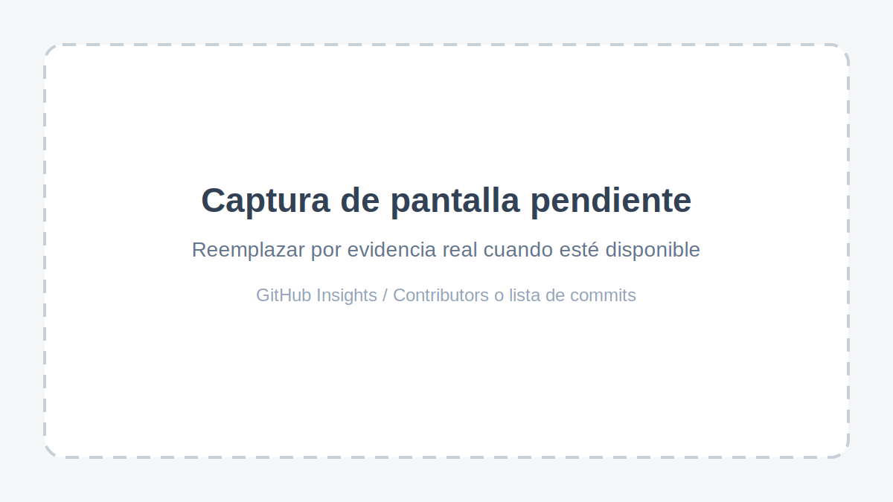

# { style="margin-top: 0; margin-bottom: 10px;" }

 

**Universidad Peruana de Ciencias Aplicadas**
Carrera: Ingeniería de Software
Ciclo: 7mo  

Curso: 1ASI0572 - Desarrollo de Soluciones IOT

NRC: 6766

Nombre del profesor: Marco Antonio Leon Baca

**INFORME DE TRABAJO FINAL**

 

Nombre del startup: -

Nombre del producto: -

 

**Integrantes**

| Código | Apellidos y Nombres |
| --- | --- |
| (u20XXXXXXX) | Arevalo Meza, John Telesforo |
| (u20XXXXXXX) | Asmad Padilla, Fatima Andrea |
| (u20XXXXXXX) | Cabrera Buitrón, Diego Ivan |
| (u202310680) | Castro Sanchez, Amir Gabriel |
| (u20XXXXXXX) | Prado Vargas, Mario Benjamin |

 

Lima, Abril 2026

# Registro de Versiones del Informe

| Versión | Fecha | Autor | Descripción de modificación |
| --- | --- | --- | --- |
| 1 | Abril, 2026 | Todos | Se realizó el esqueleto del informe |

# Project Report Collaboration Insights

Repositorio del Informe: [https://github.com/Grupo2IOT/report](#)

## Entrega AV1 (Semana 4)

Para esta primera entrega, el equipo distribuyó el trabajo para asegurar que todos los integrantes participaran activamente en la elaboración del informe. Cada miembro asumió responsabilidades específicas en la redacción inicial y en la revisión del contenido, de modo que el documento avanzara de manera coordinada desde el esqueleto base hasta una versión revisada por todo el grupo.

Además de la redacción, todos los integrantes colaboraron en la validación de la estructura general, la coherencia de las secciones y la preparación de evidencias de trabajo conjunto en el repositorio. Esta organización permitió mantener una participación equilibrada y trazable en el desarrollo del informe, cumpliendo con el requisito de participación de todo el equipo.

## Evidencias de Colaboración

