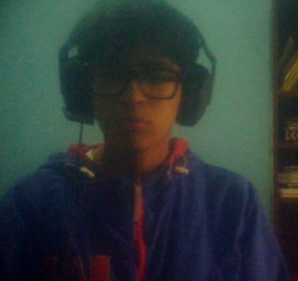

# Capítulo I: Introducción

## 1.1. Startup Profile

### 1.1.1. Descripción de la Startup

**AquaEdge** es una solución tecnológica orientada a optimizar el uso del agua en la agricultura mediante un sistema inteligente de riego basado en tecnologías IoT, Edge Computing y conectividad de largo alcance (LoRaWAN). Su propuesta se centra en resolver los problemas de ineficiencia hídrica y falta de conectividad en zonas rurales, permitiendo a los agricultores gestionar sus cultivos de manera precisa, autónoma y sin depender de internet.

Para los pequeños y medianos agricultores, **AquaEdge** ofrece la capacidad de monitorear en tiempo real la humedad del suelo a través de Sensor Nodes, recibir alertas ante condiciones críticas de Water Stress y automatizar el riego mediante un sistema de Autonomous Irrigation. Gracias a la implementación de TinyML en dispositivos de bajo consumo, el sistema toma decisiones directamente en el campo, eliminando la necesidad de intervención manual constante y reduciendo significativamente el desperdicio de agua.

Por otro lado, para las instituciones como juntas de usuarios o entidades de financiamiento agrícola, la solución proporciona un Dashboard centralizado que permite el Remote Monitoring de múltiples parcelas, la generación de reportes de uso de agua y la auditoría del cumplimiento de cuotas hídricas. Esto facilita la toma de decisiones estratégicas, mejora la gestión del recurso y reduce los riesgos asociados al financiamiento agrícola.

**AquaEdge** se posiciona como una respuesta innovadora y realista frente a la crisis hídrica en la agricultura peruana, enfocándose en la eficiencia del riego y la resiliencia tecnológica en entornos con baja conectividad. Su enfoque especializado permite una implementación escalable, accesible y de alto impacto, tanto para agricultores como para instituciones.

**Misión**

Brindar una solución tecnológica eficiente y accesible para la optimización del uso del agua en la agricultura, mediante sistemas de riego inteligente basados en IoT, Edge Computing y conectividad de largo alcance, permitiendo a los agricultores mejorar su productividad y sostenibilidad.

**Visión**

Consolidarse como la solución líder en el Perú y Latinoamérica en gestión hídrica inteligente para la agricultura, promoviendo el uso eficiente del agua a través de tecnologías descentralizadas, accesibles y adaptadas a entornos rurales con baja conectividad.

### 1.1.2. Perfiles de integrantes del equipo

---
#### **xxx – Ingeniería de Software – xxx**  

xxx

---
#### **Fatima Andrea Asmad Padilla – Ingeniería de Software – U20221B490**  

Mi perfil se caracteriza por la responsabilidad, disciplina y compromiso en cada tarea que realizo, buscando siempre dar lo mejor de mí en cualquier proyecto o actividad asignada. Actualmente curso el sexto ciclo de la carrera de Ingeniería de Software, lo cual me ha permitido adquirir una base sólida en distintas áreas del desarrollo tecnológico.

---
#### **Amir Gabriel Castro Sanchez – Ingeniería de Software – u202310680**  

Estudiante de Ingeniería de Software orientado a resultados, responsable y perseverante. Cuento con una base sólida en tecnologías actuales y un alto entusiasmo por el desarrollo tecnológico y el cumplimiento de objetivos.

---
#### **Diego Ivan Cabrera Buitron – Ingeniería de Software – U20211B293**  

Estudiante de la carrera de Ingeniería de Softare, me caracterizo por ser responsable, entusiaste, perseverante y alineado al cumplimiento de los objetivos.Poseo una base de conocimientos sólidos con respecto a las tecnologías actuales.

---
#### **xxx – Ingeniería de Software – xxx**  

xxx

---

## 1.2. Solution Profile

### 1.2.1 Antecedentes y problemática

A continuación, se expone el análisis del contexto actual que enmarca la crisis hídrica en la pequeña agricultura de la costa norte del Perú, específicamente en la región Piura. Para comprender a profundidad la magnitud de este desafío, identificar a los actores afectados y establecer las bases justificables de nuestra propuesta tecnológica, se ha aplicado la técnica de análisis de problemas de las 5 'W's y 2 'H's (Who, What, Where, When, Why, How & How Much)

1. **What (Cuál es el problema real):** Existe un déficit hídrico extremo y una latente amenaza de sequía que pone en peligro la campaña agrícola 2024-2025. Este problema natural se agrava drásticamente por una ineficiencia humana: en el Perú, el 80% del agua disponible se destina al sector agrícola, pero solo el 30% de este recurso se distribuye y utiliza correctamente. Además, el uso de sistemas de riego tradicionales por gravedad o inundación desperdicia agua y lava los nutrientes esenciales del suelo.
2. **Why (Por qué ocurre y por qué es necesario resolverlo)** Ocurre porque el clima se ha vuelto impredecible y los agricultores carecen de herramientas tecnológicas para optimizar el poco recurso hídrico que tienen. Es necesario resolverlo porque la falta de agua o su mala gestión frena el desarrollo rural. La actual infraestructura de comunicación en el campo suele ser inestable y de alto costo operativo, lo que impide un monitoreo confiable y vuelve lenta la toma de decisiones.
3. **Who (Quiénes están involucrados / afectados):** El problema afecta directamente a los pequeños y medianos productores agrícolas de la costa norte, específicamente de la región Piura, cuyas familias dependen de esta actividad como principal fuente de ingresos y subsistencia. La crisis también impacta a las juntas de usuarios y asociaciones agrícolas que no cuentan con la tecnología o el capital para soportar la escasez del recurso.
4. **Where (Dónde ocurre):** El problema se concentra en el departamento de Piura y los valles agrícolas del norte peruano, los cuales dependen críticamente de las lluvias y de las reservas de agua almacenadas en reservorios vitales, como Poechos y San Lorenzo, que actualmente se encuentran amenazados. A esto se suma que son zonas rurales con deficiente cobertura celular y escasa infraestructura eléctrica.
5. **When (Cuándo ocurre):** La situación es una crisis actual y urgente que amenaza la presente campaña agrícola 2024-2025. Se agudiza severamente durante los meses de estiaje y por los constantes cambios en los patrones de precipitación provocados por el cambio climático y fenómenos como El Niño/La Niña, que hacen imposible predecir el clima de forma tradicional.
6. **How (Cómo se resolverá el problema):** Se resolverá mediante el diseño de un sistema de riego de precisión automatizado que no dependa de la conectividad a internet tradicional.

    - Se utilizarán sensores de suelo para medir con exactitud variables críticas como la humedad y los niveles de macronutrientes (NPK), evitando el exceso o déficit de agua y fertilizantes.

    - Para superar la falta de señal celular en el campo, la transmisión de datos utilizará la tecnología de conectividad LoRaWAN, que permite enviar información a largas distancias (hasta 15 km en campo abierto) con un consumo de batería mínimo.

    - La "inteligencia" del sistema aplicará una arquitectura Edge AI o TinyML, permitiendo que el microcontrolador local procese los datos de los sensores y decida accionar las válvulas de riego de manera autónoma, resolviendo el problema de la falta de internet rural.

7. **How Much (Cuánto es el impacto / magnitud del problema):** El costo de no actuar ya se está cuantificando en pérdidas reales: la sequía pone en riesgo cientos de hectáreas, como las 100 hectáreas de banano orgánico amenazadas en Piura. Incluso, medianas empresas agrícolas se han visto obligadas a comprar agua de cisternas a costos elevadísimos o sacrificar y suspender el riego hasta en un 20% de sus lotes cosechados para intentar salvar la fruta en maduración. Tu solución busca reducir estas pérdidas millonarias y aumentar la eficiencia del riego hasta en un 30%.

Como se ha evidenciado, la ineficiencia en la distribución del recurso hídrico y la falta de conectividad en zonas rurales exigen una solución tecnológica que sea autónoma e inteligente. Sin embargo, para asegurar que el diseño de este sistema de riego IoT basado en Edge Computing realmente resuelva los problemas reales de los agricultores y tenga viabilidad como modelo de negocio, es necesario centrarse en el usuario. Por ello, a continuación se aplicará el Lean UX Process, una metodología que nos permitirá alinear las necesidades urgentes del sector agrícola con la visión y estrategia de nuestra startup, definiendo claramente el problema del negocio, nuestras suposiciones e hipótesis.

### 1.2.2 Lean UX Process

#### 1.2.2.1. Lean UX Problem Statements

Para definir el problema de nuestra startup, analizamos el contexto actual basándonos en los siguientes aspectos:

- **Domain:** El sector agrícola en el Perú, específicamente la gestión y optimización de recursos hídricos frente a escenarios de sequía, donde actualmente del 80% del agua destinada al sector, solo el 30% se distribuye de manera eficiente por métodos tradicionales.

- **Customer Segments e Initial Segment:** Contamos con dos segmentos clave. Nuestro segmento inicial (Usuario Final) son los pequeños y medianos productores agrícolas de la región Piura cuyas parcelas sufren estrés hídrico. Nuestro segundo segmento (Cliente Patrocinador/B2B) son las Juntas de Usuarios de Agua e instituciones estatales de financiamiento agrario (como Agrobanco y Agroideas)

- **Pain Points (Puntos de dolor):**
  - Para el agricultor: Se enfrentan a un déficit hídrico crítico originado por el bajo nivel del reservorio Poechos, regando por inundación sin herramientas para medir la humedad, lo que pone en riesgo su campaña agrícola.
  - Para las instituciones (Juntas/Bancos): Reparten el agua o financian créditos agrícolas sin tener un sistema de monitoreo remoto para auditar si el agricultor está usando el agua eficientemente, arriesgándose a que el recurso se agote o el agricultor no pueda pagar el préstamo por pérdida de cosecha.

- **Gap (Brecha tecnológica):** Los sistemas IoT de riego inteligente actuales en el mercado dependen de plataformas en la nube (Cloud), lo que los hace inoperativos en las zonas rurales agrícolas del Perú donde la conectividad a internet es inestable o nula.

- **Vision / Strategy (Visión y Estrategia):** Proveer un ecosistema de gestión hídrica descentralizado mediante arquitectura Edge Computing que tome decisiones localmente en el campo sin internet, y un Dashboard web centralizado que permita a las instituciones monitorear el uso eficiente del agua a larga distancia vía LoRaWAN.

> [!NOTE] Problem Statement:
> *"Nuestra startup ha observado que los pequeños productores agrícolas de Piura están sufriendo graves pérdidas económicas debido al estrés hídrico y a la ineficiencia de sus métodos tradicionales de riego. Las soluciones de agricultura inteligente existentes en el mercado no logran escalar en el campo porque dependen de una conexión constante a la nube, la cual es inexistente en zonas rurales. ==**¿Cómo podríamos diseñar e implementar un sistema de riego de precisión basado en Edge Computing (para la toma de decisiones locales) y conectividad de largo alcance (LoRaWAN), para que los agricultores puedan automatizar su riego de forma autónoma sin depender de internet, logrando reducir el consumo de agua y asegurando la supervivencia de sus cultivos durante las sequías?**=="*

#### 1.2.2.2. Lean UX Assumptions

**Business Assumptions:**

- **Creemos que nuestros clientes son:** Pequeños y medianos productores agrícolas de la región Piura y juntas de usuarios de agua que se ven amenazados por las sequías.

- **Creemos que sus necesidades o problemas son:** La escasez de agua para riego debido al bajo nivel de reservorios (como Poechos), la pérdida de sus cosechas por estrés hídrico, y la imposibilidad de usar tecnología moderna por la falta de conectividad a internet en sus parcelas rurales.
  
- **Creemos que el valor que entregamos a nuestros clientes es:** Un sistema de riego de precisión automatizado que toma decisiones de forma autónoma a nivel local (Edge Computing) y reporta el estado del cultivo a largas distancias mediante tecnología LoRaWAN, garantizando el ahorro del agua y la supervivencia de los cultivos sin depender de WiFi o datos móviles.
  
- **Creemos que adquiriremos a la mayoría de nuestros clientes a través de:** Alianzas con municipalidades locales, juntas de usuarios de riego, y programas de financiamiento agrícola del Estado (como Agrobanco o Agroideas).
  
- **Creemos que nuestro principal competidor es:** Los métodos tradicionales de riego por gravedad o inundación arraigados en la costumbre, y en menor medida, los sistemas IoT comerciales que requieren conexión constante a la nube (Cloud) e infraestructura costosa.

**User Assumptions:**

- **¿Quién es el usuario?** El agricultor costeño de la región Piura que conduce parcelas (generalmente menores a 10 hectáreas) y cuya economía familiar depende íntegramente de la cosecha.

- **¿Dónde encaja nuestro producto** en su trabajo o vida? Se integra directamente en su rutina diaria de campo, liberándolo de la tarea de abrir y cerrar compuertas manualmente y eliminando la necesidad de regar "al cálculo".

- **¿Qué problemas tiene nuestro producto que resolver?** Debe evitar que la planta sufra estrés por falta de agua y, al mismo tiempo, evitar que el agricultor desperdicie su cuota de agua asignada, permitiéndole monitorear la humedad de su tierra sin estar físicamente en cada metro del terreno.

- **¿Cuándo y cómo es usado nuestro producto?** El sistema (sensores y Edge API) funciona 24/7 de manera autónoma en la tierra. El usuario interactúa con la información recibiendo alertas en un dispositivo móvil solo cuando se requiere recargar el tanque, hacer mantenimiento o verificar que el riego automático se completó con éxito.

#### 1.2.2.3. Lean UX Hypothesis Statements

Para formular nuestras hipótesis, combinaremos las suposiciones del negocio y del usuario.

- **Hipótesis 1 (Eficiencia Hídrica y Edge Computing):** Creemos que lograremos reducir el consumo y desperdicio de agua en el campo en hasta un 30% si los pequeños agricultores de Piura utilizan nuestro sistema de riego automatizado con procesamiento Edge Computing para regar sus cultivos de forma precisa y autónoma sin depender de una conexión a internet estable.

- **Hipótesis 2 (Conectividad y Monitoreo a Larga Distancia):** Creemos que lograremos una alta tasa de adopción tecnológica en zonas rurales si los productores agrícolas familiares utilizan nuestra arquitectura de red basada en LoRaWAN para monitorear el estado de la humedad de su tierra y recibir reportes a larga distancia, superando la total falta de cobertura celular en sus parcelas.

- **Hipótesis 3 (Mitigación de la Crisis y Viabilidad Económica):** Creemos que demostraremos la viabilidad del modelo de negocio y un rápido retorno de inversión si las familias agrícolas afectadas por el déficit hídrico del reservorio Poechos logran evitar la pérdida total de sus cosechas al implementar nuestros sensores de bajo costo (TinyML) que priorizan el riego solo cuando la planta realmente lo necesita.

- **Hipótesis 4 (Escalabilidad Institucional):** Creemos que podremos escalar el proyecto mediante alianzas con entidades gubernamentales (como Agrobanco o Agroideas) si las Juntas de Usuarios de Agua en la costa norte utilizan nuestra plataforma descentralizada de gestión hídrica para asegurar y demostrar que el poco recurso hídrico asignado se está distribuyendo eficientemente durante la emergencia por sequía.

#### 1.2.2.4. Lean UX Canvas

**Lean UX Canvas**
 

<table border="2" width="100%" cellpadding="10">

<!-- Fila 1 -->
<tr height="150">

<td width="33%">
<b>Business Problem</b> 
Los pequeños y medianos agricultores de Piura enfrentan pérdidas económicas críticas debido al uso ineficiente del agua en un contexto de sequía extrema. Las soluciones tecnológicas existentes no son viables en zonas rurales por su dependencia de internet, lo que impide optimizar el riego y tomar decisiones oportunas.
</td>

<td width="34%" rowspan="2">
<b>Solutions</b> 
- Sistema IoT de riego con sensores de humedad y NPK
- Procesamiento local con Edge AI / TinyML para decisiones autónomas
- Red LoRaWAN para transmisión de տվյալ a larga distancia sin internet
- Dashboard web para monitoreo institucional (Juntas/Estado)
- Alertas móviles para mantenimiento y eventos críticos
</td>

<td width="33%">
<b>Business Outcomes</b> 
- Reducir hasta en 30% el consumo de agua en parcelas intervenidas
- Disminuir pérdidas de cultivos por estrés hídrico en al menos 25%
- Lograr adopción del sistema en 50+ agricultores en fase inicial
- Establecer 3+ alianzas con Juntas de Usuarios o programas estatales (Agrobanco/Agroideas)
- Validar un modelo B2B2C escalable en el sector agrícola
</td>

</tr>

<!-- Fila 2 -->
<tr height="150">

<td>
<b>Users</b> 
- Usuarios finales: Pequeños y medianos agricultores de Piura (parcelas ≤10 ha)
- Clientes pagadores (B2B): Juntas de Usuarios de Agua, Agrobanco, Agroideas y entidades estatales que financian tecnología agrícola
</td>

<td>
<b>User Outcomes & Benefits</b> 
- Automatización del riego sin necesidad de internet
- Reducción del desperdicio de agua y fertilizantes
- Monitoreo remoto de humedad del suelo y estado del cultivo
- Disminución del esfuerzo manual (abrir/cerrar compuertas)
- Mayor seguridad en la producción agrícola ante sequías
</td>

</tr>

<!-- Fila 3 -->
<tr height="150">

<td>
<b>Hypotheses</b> 
1. El uso de Edge Computing reducirá el desperdicio de agua en al menos 30%
2. La conectividad LoRaWAN permitirá adopción en zonas sin cobertura celular
3. Los agricultores evitarán pérdidas significativas de cosechas usando riego automatizado
4. Las instituciones adoptarán la solución para monitorear y auditar el uso del agua
</td>

<td>
<b>What's the most important thing we need to learn first?</b> 
- Si los agricultores confían en un sistema automatizado sin intervención manual
- Qué tan precisa debe ser la medición de humedad/NPK para impactar decisiones reales
- Si LoRaWAN funciona de manera confiable en condiciones reales de campo en Piura
- Disposición de pago o adopción vía financiamiento institucional
</td>

<td>
<b>What's the least amount of work we need to do?</b> 
- Prototipo funcional básico con sensor de humedad + microcontrolador (MVP)
- Prueba piloto en 1–2 parcelas reales en Piura
- Entrevistas con agricultores para validar usabilidad y confianza
- Prueba de transmisión LoRaWAN en campo abierto
- Demo simple del dashboard para instituciones
</td>

</tr>

</table>

## 1.3. Segmentos objetivo

**Segmento Objetivo 1: Pequeños y medianos productores de la agricultura familiar ubicados en la región Piura:**
Este segmento presenta las siguientes características demográficas y estadísticas de sustento:

1. **Características Demográficas y Sociales:**
   - **Población y subsistencia:** Pertenecen al sector de la agricultura familiar de subsistencia, una actividad de la cual dependen más de 7 millones de personas en el país.
   - **Vulnerabilidad alimentaria:** Es una población altamente vulnerable. Las estadísticas revelan que más del 70% de la población rural en el Perú se encuentra en una situación de alta inseguridad alimentaria.
   - **Niveles de pobreza:** La incidencia de pobreza en los hogares agrarios sufrió un incremento abrupto en los últimos años, pasando del 42% al 48%.
   - **Enfoque de género (Dato clave):** Un rasgo demográfico crítico es que los hogares agrarios con jefatura femenina son los más afectados por la crisis agrícola e hídrica, mostrando una tendencia más pronunciada al incremento de la pobreza y mayores dificultades para acceder a capital y tecnología.
2. **Características Productivas y Tecnológicas:**
   - **Tamaño de las parcelas:** Operan unidades agropecuarias fragmentadas y pequeñas. Generalmente conducen parcelas de hasta 10 hectáreas, aunque la gran mayoría (alrededor del 86% a nivel nacional) opera micro parcelas de entre 0 y 2 hectáreas.
   - **Ineficiencia en el uso del recurso:** A pesar de que el sector agrícola consume el 80% del agua disponible en el país, apenas el 30% de este recurso se distribuye y utiliza de manera eficiente, debido a la dependencia del riego por gravedad o inundación.
   - **El impacto directo de la crisis en Piura:** Este segmento depende de reservorios que actualmente están colapsados. El reservorio de Poechos (Piura) llegó a operar a un nivel crítico del 21.5% de su capacidad. Esta sequía extrema pone en riesgo inminente a unas 50,000 hectáreas de cultivos y amenaza alrededor de 280,000 puestos de trabajo formales e informales vinculados al agro en la región.

**Segmento Objetivo 2: Juntas de Usuarios de Agua e Instituciones Agrícolas:**
Este segundo segmento está conformado por las organizaciones que administran el agua y las entidades gubernamentales que financian la tecnología en el campo.

1. **Características y Rol en el negocio:**
   - **Juntas de Usuarios:** Son las organizaciones responsables de la administración y distribución del agua en los valles agrícolas. Ellas están sumamente interesadas en que el agua de los reservorios (como Poechos) no se desperdicie, por lo que pueden adquirir tu sistema en volumen para sus asociados.
   - **Instituciones del Estado (E.g.: Agrobanco / Agroideas):** Entidades que otorgan créditos o cofinancian planes de negocio para la adopción de tecnología agrícola a favor de los pequeños productores. Tu startup les vende la solución tecnológica para que ellos la implementen en las comunidades.

Existe un fuerte respaldo económico para este segmento institucional. Por ejemplo, para el año 2025, el Ministerio de Desarrollo Agrario y Riego (MIDAGRI) cuenta con un presupuesto histórico proyectado de 3,369 millones de soles, destinado precisamente a fortalecer la infraestructura hidráulica y el apoyo tecnológico en el campo mediante programas como Agroideas.

Además, programas como el de Agrobanco ofrecen tasas preferenciales (hasta 3.5% TEA) para que agrupaciones de agricultores puedan instalar infraestructura productiva.
