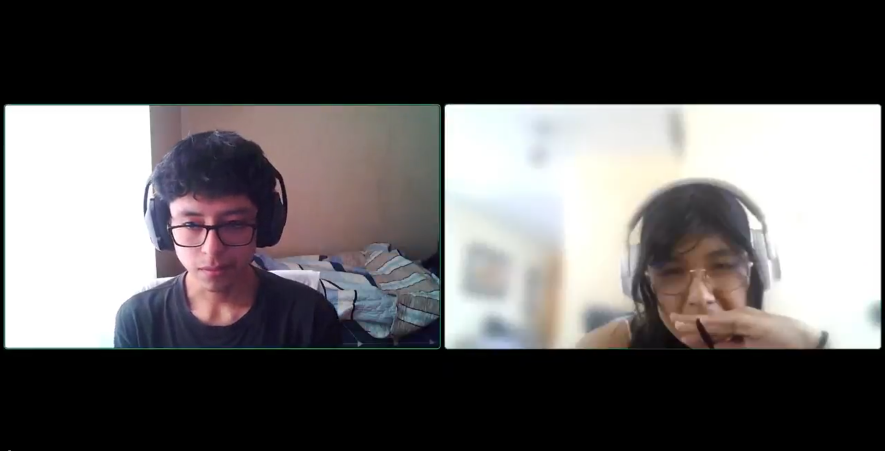
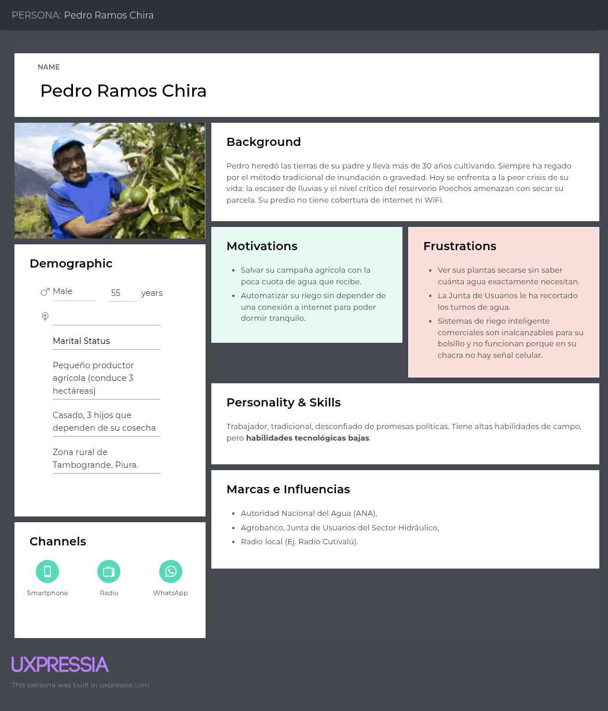
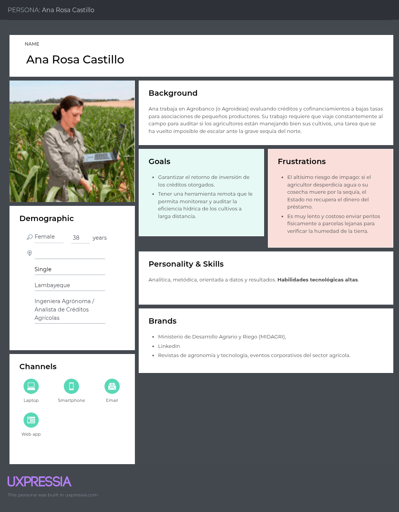
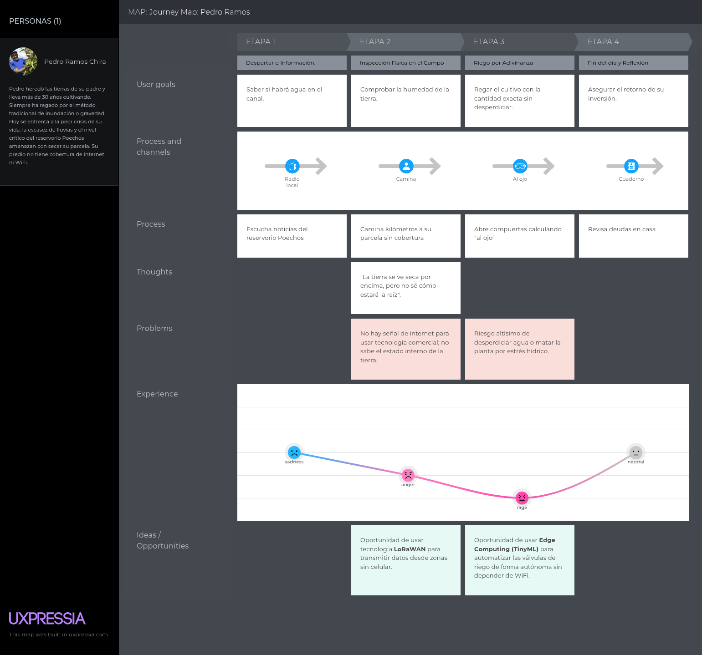
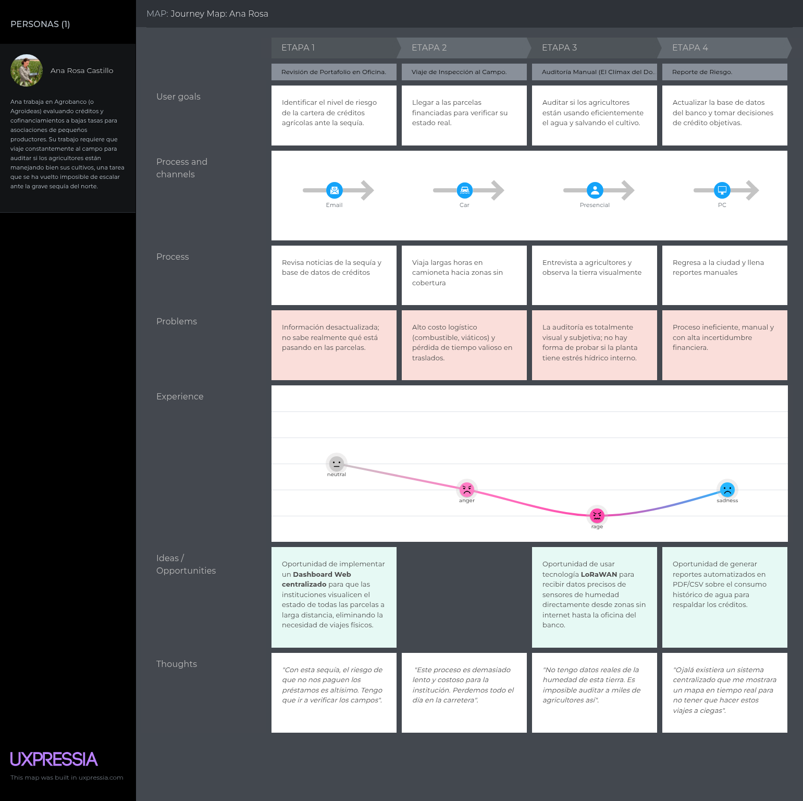
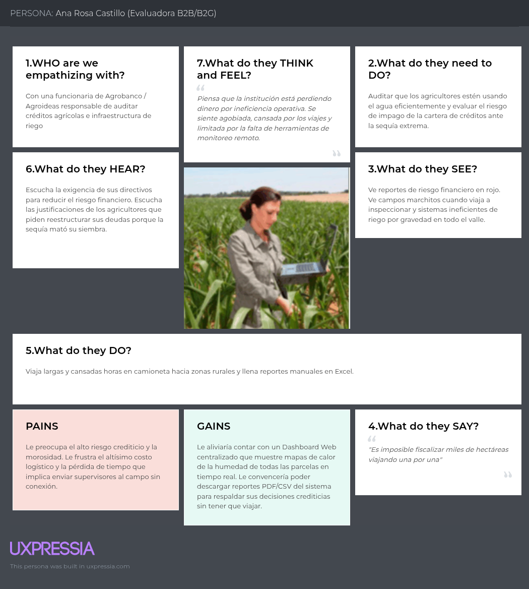
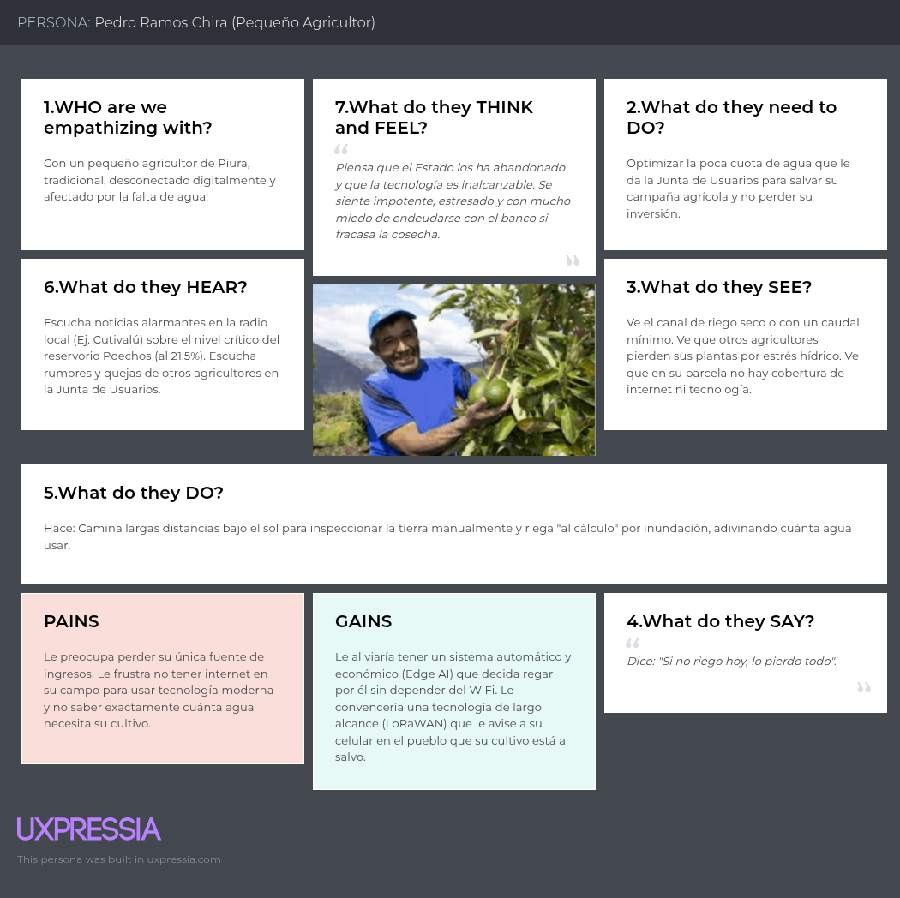
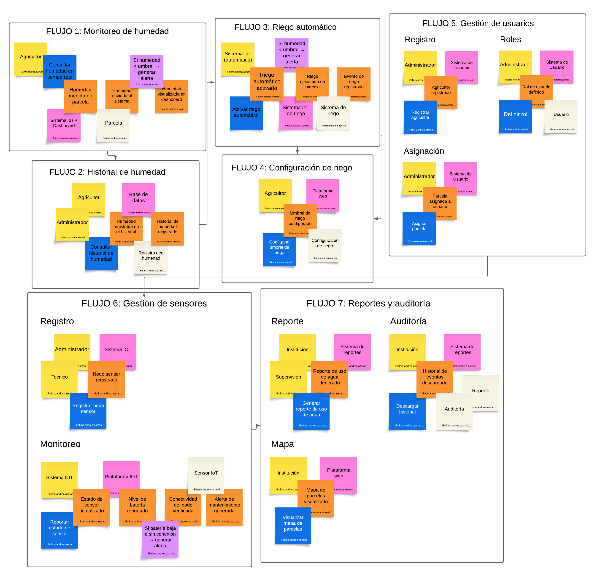

# Capítulo II: Requirements Elicitation & Analysis

## 2.1. Competidores.

Para el desarrollo de nuestra solución, hemos identificado a tres empresas y marcas que representan las alternativas actuales de riego tecnificado e inteligente en el mercado peruano:

1. **Competidor 1 (Directo - Global): Netafim.** Empresa transnacional israelí, líder mundial en riego por goteo y agricultura de precisión, con fuerte presencia en la agroexportación peruana.
2. **Competidor 2 (Directo - Local): Smelpro.** Empresa peruana integradora de soluciones IoT industriales que ofrece sistemas de riego utilizando sensores y tecnología LoRaWAN conectados a la nube.
3. **Competidor 3 (Indirecto - Comercial): Rain Bird.** Corporación global y marca dominante en la venta de hardware de riego tradicional y controladores comerciales basados en Wi-Fi, muy usados a nivel local.

A continuación, se desarrolla el análisis competitivo:

### 2.1.1. Análisis competitivo.

**¿Por qué llevar a cabo este análisis?** Identificar las brechas tecnológicas y comerciales de las empresas de riego actuales en el mercado peruano, para validar cómo nuestra arquitectura Edge Computing representa una ventaja competitiva única para zonas rurales sin internet frente a soluciones que dependen estrictamente de la Nube (Cloud) o Wi-Fi local.

| Perfil                                         | Nuestra Startup                                                                                                                 | Comp. 1: Netafim                                                                                                                      | Comp. 2: Smelpro                                                                                                        | Comp. 3: Rain Bird                                                                                                               |
| ---------------------------------------------- | ------------------------------------------------------------------------------------------------------------------------------- | ------------------------------------------------------------------------------------------------------------------------------------- | ----------------------------------------------------------------------------------------------------------------------- | -------------------------------------------------------------------------------------------------------------------------------- |
| Overview                                       | Ecosistema de riego de precisión autónomo con procesamiento Edge AI y transmisión LoRaWAN para zonas rurales.                   | Gigante global que ofrece proyectos "llave en mano" y su plataforma digital GrowSphere para riego y fertirrigación de alta precisión. | Integradora peruana de IoT que utiliza sensores, gateways LoRaWAN y centraliza el control en plataformas cloud (AWS).   | Fabricante global de aspersores, válvulas y controladores de riego comerciales que operan mediante Wi-Fi y apps móviles.         |
| Ventaja competitiva                            | ¿Qué valor ofrece a los clientes? Decisiones de riego autónomas sin depender de internet (Edge Computing) en parcelas alejadas. | Soporte agronómico global, altísima precisión y soluciones probadas en miles de hectáreas.                                            | Soporte técnico local (Lima/Perú) y uso de tecnología de largo alcance (LoRaWAN) para la transmisión de datos.          | Marca muy confiable, productos fáciles de comprar en ferreterías o distribuidores locales, tecnología muy probada mecánicamente. |
| Perfil de Marketing - Mercado objetivo         | Pequeños agricultores (Piura), Juntas de Usuarios y entidades del Estado (Agrobanco/Agroideas).                                 | Grandes agroexportadoras (ej. en Olmos y Piura) y fundos de alto valor.                                                               | Medianas empresas agrícolas e industrias peruanas que buscan automatización.                                            | Huertos urbanos, jardinería residencial, parques públicos y pequeña agricultura.                                                 |
| Perfil de Marketing - Estrategias de marketing | Alianzas B2B/B2G con Juntas de Riego; demostraciones piloto de ROI en campo.                                                    | Venta corporativa B2B, líneas de crédito propias (ej. USD 20 millones para agroindustrias).                                           | Marketing digital, desarrollo de proyectos integrales "a medida" en Perú.                                               | Amplia red de distribuidores autorizados internacionales, venta B2C y B2B.                                                       |
| Perfil de Producto - Productos & Servicios     | Nodos sensores Edge (TinyML), App móvil, Dashboard Web administrativo para Juntas, red LoRaWAN.                                 | Mangueras de goteo, válvulas, software GrowSphere, servicios técnicos y capacitación.                                                 | Sensores de suelo, gateways LoRaWAN, sistema SCADA y plataforma en la nube (AWS).                                       | Controladores Wi-Fi locales, aspersores, válvulas, temporizadores.                                                               |
| Perfil de Producto - Precios & Costos          | Costo medio-bajo, accesible mediante cofinanciamiento del Estado.                                                               | Costos muy elevados por suscripciones de software y hardware de alta gama.                                                            | Costo medio, requiere inversión en gateways y suscripciones cloud.                                                      | Costo medio-bajo en hardware (S/ 600 - 1,200 por controlador), pero alto costo en consumo de agua si no se calibra bien.         |
| Perfil de Producto - Canales de distribución   | Venta institucional (B2B/B2G) y portal web.                                                                                     | Venta directa corporativa y distribuidores exclusivos.                                                                                | Venta directa mediante consultoría técnica en Perú.                                                                     | Distribuidores de equipos de riego, grandes almacenes.                                                                           |
| Análisis SWOT - Fortalezas                     | Funciona 100% offline (Edge), no colapsa si cae el internet.                                                                    | Músculo financiero enorme, investigación agronómica líder.                                                                            | Desarrollo de hardware local (PCB a medida), uso de LoRaWAN.                                                            | Fácil adopción, equipos de larga durabilidad.                                                                                    |
| Análisis SWOT - Debilidades                    | Marca nueva, requiere esfuerzo para generar confianza en el agricultor.                                                         | Soluciones inalcanzables para el pequeño agricultor de subsistencia.                                                                  | Depende de la nube (AWS) para tomar decisiones; si se cae la señal celular del Gateway, el riego no se automatiza bien. | Los equipos Wi-Fi son inútiles en el campo rural sin señal de internet.                                                          |
| Análisis SWOT - Oportunidades                  | El déficit del reservorio Poechos obliga a los pequeños agricultores a tecnificarse urgentemente.                               | Alianzas globales (ej. Bayer, IFC) para expandir sus créditos agrícolas.                                                              | Crecimiento de la agricultura inteligente en valles costeros peruanos.                                                  | Integración de sus controladores de casa con asistentes inteligentes.                                                            |
| Análisis SWOT - Amenazas                       | Resistencia cultural de los agricultores mayores frente al software.                                                            | Surgimiento de startups ágiles y económicas de AgTech.                                                                                | Competencia de startups que no cobran licencias cloud costosas.                                                         | Marcas más baratas o sistemas IoT más avanzados que dejan obsoletos a los temporizadores simples.                                |

### 2.1.2. Estrategias y tácticas frente a competidores.

- **Frente a Netafim (La corporación global):** Nuestra táctica será la accesibilidad tecnológica. Netafim apunta a las grandes agroexportadoras con alto poder adquisitivo. Nosotros atacaremos el nicho desatendido: la agricultura familiar de Piura, ofreciendo una tecnología TinyML y Edge AI de bajo costo que puede ser cofinanciada por programas del Estado (Agroideas), logrando resultados de precisión corporativa pero con presupuestos acordes a la realidad rural.
- **Frente a Smelpro (El competidor IoT local dependiente de la Nube):** Aplicaremos la táctica de resiliencia de infraestructura (Edge Computing). Aunque Smelpro usa LoRaWAN, su "cerebro" está en la nube (AWS). Si el gateway en el campo pierde la señal de internet para comunicarse con AWS, el sistema pierde autonomía. Nuestra startup gana al procesar las decisiones localmente en el microcontrolador (Edge), asegurando que el cultivo se riegue en el momento exacto incluso ante un corte total de telecomunicaciones.
- **Frente a Rain Bird (La solución de hardware Wi-Fi off-the-shelf):** Nuestra ventaja será el alcance y la descentralización. Los controladores comerciales Wi-Fi de Rain Bird son excelentes para casas o zonas periurbanas, pero son inoperativos en parcelas dispersas rurales sin routers de internet. Reemplazaremos la dependencia del Wi-Fi con una red LoRaWAN de varios kilómetros de alcance, permitiendo controlar cientos de hectáreas desde un solo punto sin requerir internet tradicional.

## 2.2. Entrevistas.

### 2.2.1. Diseño de entrevistas.

Para llevar a cabo la recolección de información que sustentará nuestro proceso de _Needfinding_, hemos diseñado dos guías de entrevistas semiestructuradas, dirigidas específicamente a nuestros dos segmentos objetivo. Las preguntas han sido formuladas aplicando buenas prácticas de investigación cualitativa, con el fin de extraer datos reales sobre datos demográficos, comportamiento tecnológico, objetivos, frustraciones y rutinas diarias.

---

**A. Guía de Entrevista para el Segmento 1: Pequeños y Medianos Agricultores (Usuario Final)**

**Objetivo de la entrevista:** Comprender el impacto de la crisis hídrica (reservorio Poechos) en su día a día, identificar sus métodos de riego actuales, sus frustraciones ante la falta de conectividad en el campo y su nivel de adopción tecnológica para perfilar su User Persona.

**Bloque 1: Perfil Demográfico y Background**

1. ¿Podría indicarme su nombre completo, edad y en qué distrito o comunidad de Piura se ubica su parcela?
2. ¿Quiénes conforman su núcleo familiar y cuántos dependen de la actividad agrícola?
3. ¿Cuántas hectáreas cultiva actualmente y cuáles son sus principales cultivos?
4. Cuénteme un poco de su historia, ¿cuánto tiempo lleva dedicándose a la agricultura y cómo aprendió el oficio?

**Bloque 2: Comportamiento Tecnológico, Marcas y Canales de Interacción**

5. ¿Qué tipo de teléfono celular utiliza (básico o smartphone) y qué aplicaciones usa con más frecuencia en su día a día (ej. WhatsApp, Facebook, radio local)?
6. Cuando está en su parcela, ¿cómo es la señal de internet o datos móviles? ¿Suele perder la conexión?
7. ¿Qué marcas de herramientas, insumos agrícolas o tecnología reconoce como confiables en su trabajo diario?
8. ¿Cómo suele informarse sobre el clima o los avisos de la Junta de Usuarios (radio, boca a boca, WhatsApp)?

**Bloque 3: Tareas, Objetivos y Frustraciones (Pain Points & Goals)**

9. Actualmente, con la reducción de agua del reservorio Poechos, ¿cómo está haciendo para regar sus cultivos? ¿Qué método utiliza (inundación, gravedad, goteo)?
10. ¿Cómo decide exactamente cuándo y cuánta agua necesita su cultivo? ¿Se basa en la intuición, la experiencia o alguna herramienta?
11. ¿Cuál es su mayor miedo o frustración cuando piensa en la actual campaña agrícola frente a la sequía?
12. ¿Alguna vez ha intentado usar sistemas automáticos o tecnología para regar? Si falló o no lo hizo, ¿cuál fue el motivo (costo, complejidad, falta de luz/internet)?

**Bloque 4: Validación de la Solución (Edge Computing y LoRaWAN)**

13. Si existiera un sistema económico que le avise a su celular que su tierra está seca, pero que además decida por sí solo abrir el agua para salvar su planta incluso cuando usted no tiene internet en el campo, ¿le daría confianza usarlo? ¿Por qué?
14. Para usted, ¿cuál sería el objetivo principal o el mayor beneficio de usar una tecnología así en su parcela?

---

**B. Guía de Entrevista para el Segmento 2: Juntas de Usuarios e Instituciones (Cliente B2B/B2G)**

**Objetivo de la entrevista:** Identificar cómo auditan el uso del agua y los créditos agrícolas, conocer sus herramientas de gestión actuales y validar si un Dashboard centralizado con tecnología de largo alcance resolvería sus problemas de fiscalización y riesgo crediticio.

**Bloque 1: Perfil Profesional y Background**

1. ¿Cuál es su nombre, qué cargo ocupa y en qué institución labora (Junta de Usuarios / Agrobanco / Agroideas)?
2. ¿Cuáles son sus principales responsabilidades o tareas diarias respecto a la gestión del agua o el financiamiento agrícola?
3. ¿Cuál es su formación profesional y cuántos años de experiencia tiene en el sector agrario?

**Bloque 2: Comportamiento Tecnológico y Herramientas**

4. Para realizar su trabajo de monitoreo o gestión, ¿qué dispositivos y software utiliza regularmente (PC, laptops, tablets, Excel, sistemas internos del Estado)?
5. ¿Tienen actualmente algún software o herramienta digital que les permita saber en tiempo real cuánta agua usa cada agricultor en su parcela?

**Bloque 3: Tareas, Objetivos y Frustraciones (Pain Points & Goals)**

6. Ante la grave crisis hídrica en Piura, ¿cuál es el mayor obstáculo que enfrentan como institución para asegurar que los agricultores no desperdicien la cuota de agua asignada?
7. (Para bancos/Agroideas): ¿Cómo afecta la sequía y el mal uso del agua al riesgo de que los agricultores no puedan pagar sus créditos o fracasen en sus planes de negocio?
8. ¿Qué tan costoso, lento o frustrante es enviar supervisores físicamente al campo para auditar los cultivos o las redes de riego?

**Bloque 4: Validación de la Solución (Dashboard Remoto / Ecosistema IoT)**

9. Si contaran con una plataforma web (Dashboard) que les mostrara un mapa en tiempo real indicando qué parcelas mantienen niveles óptimos de humedad y cuáles desperdician agua (transmitido desde zonas sin internet), ¿cómo cambiaría esto su forma de trabajar?
10. ¿Cree que su institución estaría dispuesta a financiar o subsidiar este tipo de tecnología para los pequeños agricultores organizados? ¿Qué requisitos pedirían?

### 2.2.2. Registro de entrevistas.

En esta sección se describe el proceso de recolección de información que respalda el Needfinding, el cual se llevó a cabo mediante la elaboración de dos guías de entrevistas semiestructuradas. Estas fueron diseñadas específicamente para abordar a los segmentos objetivo definidos: pequeños y medianos agricultores, como usuarios finales, y representantes de juntas de usuarios e instituciones, como actores clave del entorno.

Las preguntas fueron formuladas siguiendo buenas prácticas de investigación cualitativa, con el propósito de obtener información relevante sobre aspectos demográficos, comportamiento tecnológico, objetivos, frustraciones y dinámicas cotidianas. De esta manera, se busca comprender en profundidad las necesidades, desafíos y expectativas de cada segmento frente a la crisis hídrica y el uso de tecnología, permitiendo así fundamentar el diseño de una solución innovadora basada en un ecosistema IoT orientado a la optimización del riego agrícola.

&nbsp;

| **Entrevista 1** |
|------------------|
| <strong>Nombre:</strong> Andrea Begonia |
| <strong>Edad:</strong> 28 |
| <strong>Procedencia:</strong> Piura  |
| <strong>Segmento:</strong> Pequeños y Medianos Agricultores (Usuario Final) |
| <strong>Resumen:</strong> Andrea trabaja 3 hectáreas junto a su familia de 5 integrantes que dependen de la agricultura, cultiva principalmente arroz y limón y aprendió el oficio desde joven por experiencia familiar, utiliza un smartphone básico donde usa WhatsApp, Facebook y radio pero enfrenta señal inestable en su parcela, confía en marcas conocidas recomendadas por otros agricultores y se informa por radio, grupos de WhatsApp y boca a boca, actualmente riega por gravedad debido a la reducción de agua del reservorio Poechos y decide cuándo regar basándose en la experiencia observando la tierra y la planta, su mayor frustración es perder la cosecha por la sequía y no ha adoptado tecnologías por su costo, complejidad y falta de conectividad, aunque estaría dispuesto a usar un sistema automático sin internet si es confiable y económico ya que le permitiría ahorrar agua y reducir el riesgo de pérdida de cultivos |
| <strong>Enlace de video:</strong> [https://upcedupe-my.sharepoint.com/:v:/g/personal/u20221b490_upc_edu_pe/IQDMDQdLqakCTJsGhNQBFPbDAZuyXbkfBPyHMNfMpYh6MxU?nav=eyJyZWZlcnJhbEluZm8iOnsicmVmZXJyYWxBcHAiOiJPbmVEcml2ZUZvckJ1c2luZXNzIiwicmVmZXJyYWxBcHBQbGF0Zm9ybSI6IldlYiIsInJlZmVycmFsTW9kZSI6InZpZXciLCJyZWZlcnJhbFZpZXciOiJNeUZpbGVzTGlua0NvcHkifX0&e=xF3XNj](https://upcedupe-my.sharepoint.com/:v:/g/personal/u20221b490_upc_edu_pe/IQDMDQdLqakCTJsGhNQBFPbDAZuyXbkfBPyHMNfMpYh6MxU?nav=eyJyZWZlcnJhbEluZm8iOnsicmVmZXJyYWxBcHAiOiJPbmVEcml2ZUZvckJ1c2luZXNzIiwicmVmZXJyYWxBcHBQbGF0Zm9ybSI6IldlYiIsInJlZmVycmFsTW9kZSI6InZpZXciLCJyZWZlcnJhbFZpZXciOiJNeUZpbGVzTGlua0NvcHkifX0&e=xF3XNj) |
| <strong>Foto del entrevistado:</strong>  |

&nbsp;

| **Entrevista 2** |
|------------------|
| <strong>Nombre:</strong> xxxx |
| <strong>Edad:</strong> xxxx |
| <strong>Procedencia:</strong> xxxx |
| <strong>Segmento:</strong> Pequeños y Medianos Agricultores (Usuario Final) |
| <strong>Resumen:</strong> xxxx |
| <strong>Enlace de video:</strong> xxxx |
| <strong>Foto del entrevistado:</strong>  |

&nbsp;

| **Entrevista 3** |
|------------------|
| <strong>Nombre:</strong> xxxx |
| <strong>Edad:</strong> xxxx |
| <strong>Procedencia:</strong> xxxx |
| <strong>Segmento:</strong> Pequeños y Medianos Agricultores (Usuario Final) |
| <strong>Resumen:</strong> xxxx |
| <strong>Enlace de video:</strong> xxxx |
| <strong>Foto del entrevistado:</strong>  |

&nbsp;

| **Entrevista 4** |
|------------------|
| <strong>Nombre:</strong> Rodrigo Aquije |
| <strong>Edad:</strong> 30 |
| <strong>Procedencia:</strong> Lima |
| <strong>Segmento:</strong> Juntas de Usuarios e Instituciones (Cliente B2B/B2G) |
| <strong>Resumen:</strong> La entrevista a Rodrigo Aquije, especialista en gestión de recursos hídricos, evidenció que la gestión del agua en el sector agrario enfrenta limitaciones debido a la falta de monitoreo en tiempo real, lo que obliga a trabajar con datos estimados y reduce la eficiencia en la toma de decisiones. Asimismo, la supervisión en campo resulta costosa y poco oportuna, mientras que la crisis hídrica incrementa los riesgos productivos y crediticios. En este contexto, se identificó que la implementación de un sistema con dashboard en tiempo real mejoraría significativamente la gestión del recurso y que existe disposición institucional para financiar este tipo de soluciones si demuestran impacto y viabilidad. |
| <strong>Enlace de video:</strong> [https://upcedupe-my.sharepoint.com/:v:/g/personal/u20221b490_upc_edu_pe/IQAuyPvT7CXURoTXpQArPvxUAcaJnqvuP_HVGP5L_iE7PMQ?nav=eyJyZWZlcnJhbEluZm8iOnsicmVmZXJyYWxBcHAiOiJPbmVEcml2ZUZvckJ1c2luZXNzIiwicmVmZXJyYWxBcHBQbGF0Zm9ybSI6IldlYiIsInJlZmVycmFsTW9kZSI6InZpZXciLCJyZWZlcnJhbFZpZXciOiJNeUZpbGVzTGlua0NvcHkifX0&e=sWB09n](https://upcedupe-my.sharepoint.com/:v:/g/personal/u20221b490_upc_edu_pe/IQAuyPvT7CXURoTXpQArPvxUAcaJnqvuP_HVGP5L_iE7PMQ?nav=eyJyZWZlcnJhbEluZm8iOnsicmVmZXJyYWxBcHAiOiJPbmVEcml2ZUZvckJ1c2luZXNzIiwicmVmZXJyYWxBcHBQbGF0Zm9ybSI6IldlYiIsInJlZmVycmFsTW9kZSI6InZpZXciLCJyZWZlcnJhbFZpZXciOiJNeUZpbGVzTGlua0NvcHkifX0&e=sWB09n) |
| <strong>Foto del entrevistado:</strong>  |

&nbsp;

| **Entrevista 5** |
|------------------|
| <strong>Nombre:</strong> xxxx |
| <strong>Edad:</strong> xxxx |
| <strong>Procedencia:</strong> xxxx |
| <strong>Segmento:</strong> Juntas de Usuarios e Instituciones (Cliente B2B/B2G) |
| <strong>Resumen:</strong> xxxx |
| <strong>Enlace de video:</strong> xxxx |
| <strong>Foto del entrevistado:</strong>  |

&nbsp;

| **Entrevista 6** |
|------------------|
| <strong>Nombre:</strong> xxxx |
| <strong>Edad:</strong> xxxx |
| <strong>Procedencia:</strong> xxxx |
| <strong>Segmento:</strong> Juntas de Usuarios e Instituciones (Cliente B2B/B2G) |
| <strong>Resumen:</strong> xxxx |
| <strong>Enlace de video:</strong> xxxx |
| <strong>Foto del entrevistado:</strong>  |

&nbsp;

### 2.2.3. Análisis de entrevistas.

**Entrevista 1:**

xxxxx

**Entrevista 2:**

xxxx

**Entrevista 3:**

xxxxxx

**Entrevista 4:**

La entrevista a Rodrigo Aquije, especialista en gestión de recursos hídricos y financiamiento agrícola, permitió identificar aspectos clave sobre la gestión del agua en el sector agrario. En su labor, se encarga del monitoreo del uso del recurso hídrico, la coordinación con agricultores y la evaluación de proyectos agrícolas, utilizando principalmente herramientas como Excel, sistemas del Estado y, en algunos casos, sistemas de información geográfica.

Uno de los principales problemas detectados es la ausencia de sistemas de monitoreo en tiempo real, lo que obliga a trabajar con datos estimados o recolectados manualmente, limitando la eficiencia en la toma de decisiones. Frente a la crisis hídrica, el mayor obstáculo es la falta de control y visibilidad sobre el uso del agua, lo que incrementa el riesgo productivo y crediticio en los agricultores.

Asimismo, se evidenció que la supervisión en campo resulta costosa, lenta y poco eficiente. En este contexto, la implementación de un dashboard con información en tiempo real sería altamente beneficiosa, ya que permitiría mejorar la gestión, optimizar recursos y reducir la necesidad de supervisión presencial. Finalmente, se concluye que existe disposición institucional para financiar este tipo de tecnología, siempre que demuestre impacto, viabilidad y accesibilidad para los pequeños agricultores.

**Entrevista 5:**

xxxx

**Entrevista 6:**

xxxxx

## 2.3. Needfinding.

### 2.3.1. User Personas.

**Ficha 1 (Segmento 1): El Pequeño Agricultor Afectado:**

	

<em>Persona del Segmento 1: Pedro Ramos Chira.</em>

**Ficha 2 (Segmento 2): El Cliente Institucional B2B/B2G:**

	

<em>Persona del Segmento 2: Ana Rosa Castillo.</em>

### 2.3.2. User Task Matrix.

A continuación, se presenta la Matriz de Tareas de Usuario (User Task Matrix), la cual identifica las principales acciones que nuestros segmentos objetivo necesitan realizar para cumplir sus metas, evaluando la frecuencia e importancia de cada una desde su propia perspectiva.

| Tareas de los Usuarios (User Tasks)                                   | User Persona 1: Pedro (Pequeño Agricultor) - Frecuencia | User Persona 1: Pedro (Pequeño Agricultor) - Importancia | User Persona 2: Ana (Evaluadora / Institución) - Frecuencia | User Persona 2: Ana (Evaluadora / Institución) - Importancia |
| --------------------------------------------------------------------- | ------------------------------------------------------- | -------------------------------------------------------- | ----------------------------------------------------------- | ------------------------------------------------------------ |
| Revisar el estado de humedad de la tierra en la parcela               | Alta (Diaria)                                           | Alta                                                     | Media (Semanal)                                             | Alta                                                         |
| Abrir o cerrar el paso de agua para regar los cultivos                | Media                                                   | Alta                                                     | Nunca                                                       | Ninguna                                                      |
| Identificar señales de falta de agua o enfermedad en las plantas      | Alta                                                    | Alta                                                     | Media                                                       | Alta                                                         |
| Calcular y registrar el consumo histórico de agua en el valle         | Baja (Mensual)                                          | Media                                                    | Alta (Diaria)                                               | Alta                                                         |
| Inspeccionar las parcelas agrícolas para aprobar o verificar créditos | Nunca                                                   | Ninguna                                                  | Alta                                                        | Alta                                                         |

### 2.3.3. User Journey Mapping.

**Segmento 1: Pequeños y Medianos Agricultores (Usuario Final):**

	

**Segmento 2: Juntas de Usuarios e Instituciones (Cliente B2B/B2G):**

	

### 2.3.4. Empathy Mapping.

**Empathy Map 1: Pedro Ramos Chira (Pequeño Agricultor)**

	

<em>Empathy Map del Segmento 1: Pedro Ramos Chira.</em>

**Empathy Map 2: Ana Rosa Castillo (Evaluadora B2B/B2G)**

	

<em>Empathy Map del Segmento 2: Ana Rosa Castillo.</em>

## 2.4. Big Picture EventStorming.

En esta sección se presenta la aplicación de la técnica Big Picture EventStorming, utilizada para comprender de manera integral el dominio del sistema de riego inteligente. Esta dinámica permitió identificar los principales eventos del negocio, actores involucrados, reglas del sistema y relaciones entre procesos, tomando como base los epics y user stories definidos previamente.

**Metodología aplicada**

La sesión se desarrolló siguiendo la dinámica de EventStorming, utilizando notas adhesivas clasificadas por colores:

Eventos (naranja): representan hechos ocurridos en el sistema.
Comandos (azul): acciones solicitadas por usuarios o sistemas.
Actores (amarillo): usuarios que interactúan con el sistema.
Políticas (morado): reglas automáticas del sistema.
Sistemas (rosa): componentes tecnológicos involucrados.
Agregados (beige): entidades principales del dominio.

**Evidencia del EventStorming**

	

La Figura muestra el resultado del Big Picture EventStorming, donde se organizan los eventos en una línea temporal y se identifican sus relaciones con comandos, actores y políticas.

**Descripción del flujo principal**

A partir del análisis, se identificó el siguiente flujo principal:

Un agricultor configura los umbrales de humedad, lo que permite al sistema monitorear continuamente las condiciones del suelo. Cuando la humedad desciende por debajo del nivel establecido, se genera una alerta y se activa automáticamente el riego, registrando cada evento para su posterior consulta. Paralelamente, los datos son almacenados y utilizados para generar reportes que pueden ser consultados por instituciones.

**Contextos identificados (Bounded Contexts)**

El ejercicio permitió identificar los siguientes contextos:

- Monitoreo de humedad
- Gestión de riego automático
- Administración de usuarios
- Gestión de dispositivos IoT
- Reportes y auditoría

**Conclusiones**

El Big Picture EventStorming permitió obtener una visión global del sistema, identificar los procesos clave y definir un lenguaje común entre los actores. Además, facilitó la detección de reglas de negocio críticas y la segmentación del sistema en contextos delimitados, lo cual servirá como base para el diseño de la arquitectura y los microservicios.

## 2.5. Ubiquitous Language

| Término en Inglés          | Término en Español          | Definición                                                                                                                                                                                                      |
| -------------------------- | --------------------------- | --------------------------------------------------------------------------------------------------------------------------------------------------------------------------------------------------------------- |
| Edge Computing             | Computación en el Borde     | Arquitectura donde el procesamiento de datos y la toma de decisiones se realizan localmente en el dispositivo (microcontrolador) en el campo, sin depender de la conexión a internet o la nube.                 |
| LoRaWAN                    | LoRaWAN                     | Tecnología de red de área amplia de baja potencia y largo alcance utilizada para transmitir datos entre sensores, nodos y el dashboard central, incluso en zonas rurales sin cobertura de internet tradicional. |
| User Persona               | Persona de Usuario          | Representación ficticia de los usuarios objetivo del sistema, como el pequeño agricultor (Pedro) o la evaluadora institucional (Ana), utilizada para guiar el diseño centrado en el usuario.                    |
| Dashboard                  | Panel de Control            | Plataforma web centralizada que permite a las instituciones monitorear en tiempo real el estado de las parcelas, el uso del agua y la eficiencia del riego, incluso desde zonas sin internet.                   |
| Sensor Node                | Nodo Sensor                 | Dispositivo físico instalado en la parcela que mide variables como humedad del suelo y transmite los datos mediante LoRaWAN para la toma de decisiones autónoma de riego.                                       |
| TinyML                     | TinyML                      | Implementación de modelos de aprendizaje automático (Machine Learning) en microcontroladores de bajo consumo para procesar datos y tomar decisiones localmente en el campo.                                     |
| Irrigation Event           | Evento de Riego             | Acción de apertura o cierre de válvulas para suministrar agua a los cultivos, ejecutada automáticamente por el sistema según las condiciones detectadas por los sensores.                                       |
| User Task Matrix           | Matriz de Tareas de Usuario | Herramienta que identifica y prioriza las acciones principales que los diferentes usuarios necesitan realizar para cumplir sus objetivos, evaluando frecuencia e importancia.                                   |
| Water Stress               | Estrés Hídrico              | Condición en la que los cultivos sufren por falta de agua suficiente, poniendo en riesgo la producción agrícola y la economía familiar del agricultor.                                                          |
| Agricultural Credit        | Crédito Agrícola            | Financiamiento otorgado por instituciones como Agrobanco o Agroideas a los agricultores para la implementación de tecnología o mejora de infraestructura de riego.                                              |
| Junta de Usuarios          | Junta de Usuarios           | Organización local encargada de la gestión y distribución del agua entre los agricultores de una región o comunidad.                                                                                            |
| Remote Monitoring          | Monitoreo Remoto            | Supervisión a distancia del estado de las parcelas y el uso del agua, posible gracias a la transmisión de datos por LoRaWAN y la visualización en el dashboard.                                                 |
| Autonomous Irrigation      | Riego Autónomo              | Proceso en el que el sistema decide y ejecuta el riego de los cultivos sin intervención humana directa, basado en datos de sensores y algoritmos locales.                                                       |
| Cloud Dependency           | Dependencia de la Nube      | Limitación de algunos sistemas que requieren conexión constante a internet para funcionar, lo que los hace inoperativos en zonas rurales sin cobertura.                                                         |
| Pilot Demonstration        | Demostración Piloto         | Prueba de campo realizada para mostrar la efectividad y el retorno de inversión (ROI) del sistema a potenciales clientes o instituciones.                                                                       |
| Maintenance Alert          | Alerta de Mantenimiento     | Notificación enviada al usuario cuando el sistema detecta la necesidad de realizar tareas de mantenimiento preventivo o correctivo en los sensores o válvulas.                                                  |
| Water Quota                | Cuota de Agua               | Cantidad de agua asignada a cada agricultor por la Junta de Usuarios, que debe ser utilizada eficientemente para evitar sanciones o pérdida de crédito.                                                         |
| Institutional Client       | Cliente Institucional       | Entidad como una Junta de Usuarios, Agrobanco o Agroideas que adquiere o financia la solución tecnológica para beneficiar a un grupo de agricultores.                                                           |
| Field Connectivity         | Conectividad en el Campo    | Disponibilidad y calidad de señal de internet o datos móviles en la parcela agrícola, factor crítico para la viabilidad de soluciones tecnológicas.                                                             |
| ROI (Return on Investment) | Retorno de Inversión        | Beneficio económico obtenido por el agricultor o la institución al implementar el sistema de riego inteligente, medido en ahorro de agua, reducción de pérdidas y mejora de la producción.                      |

