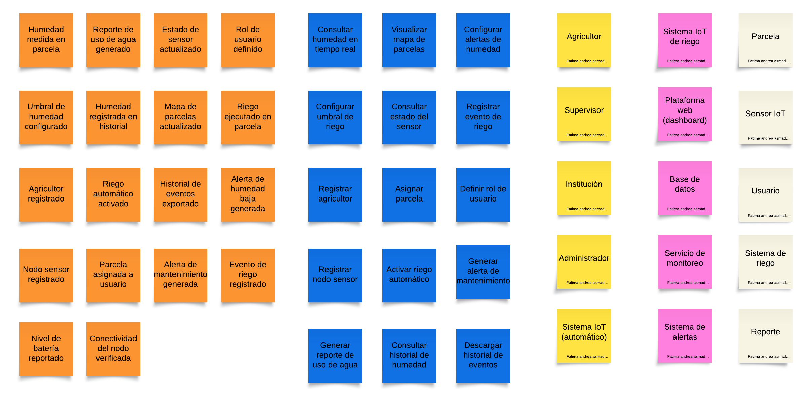
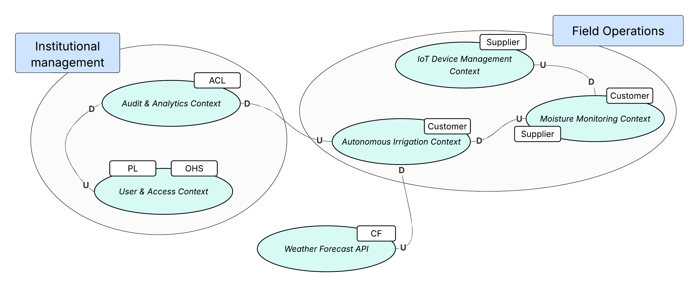
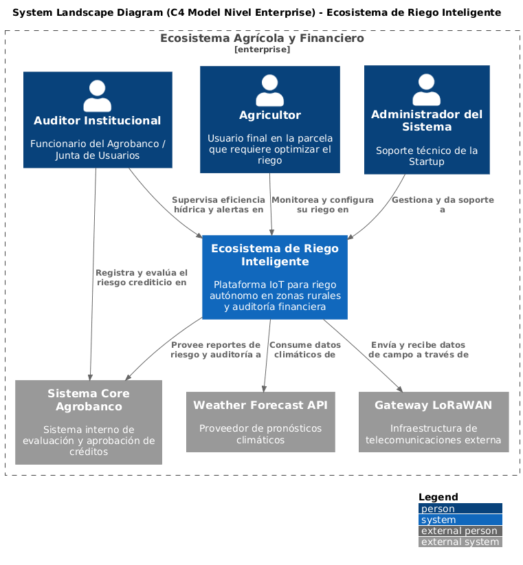
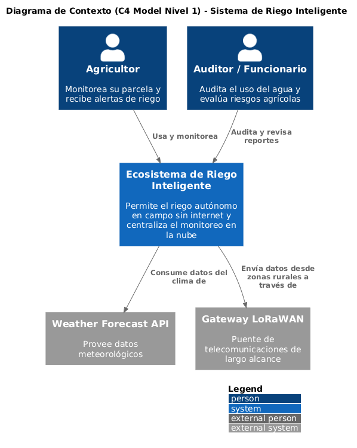
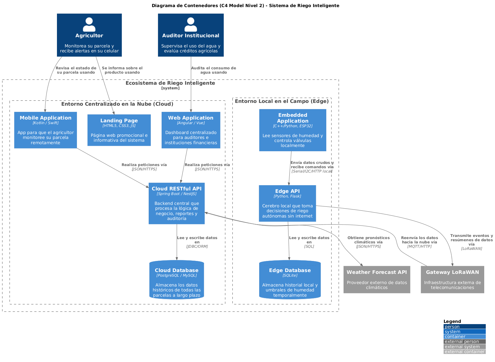
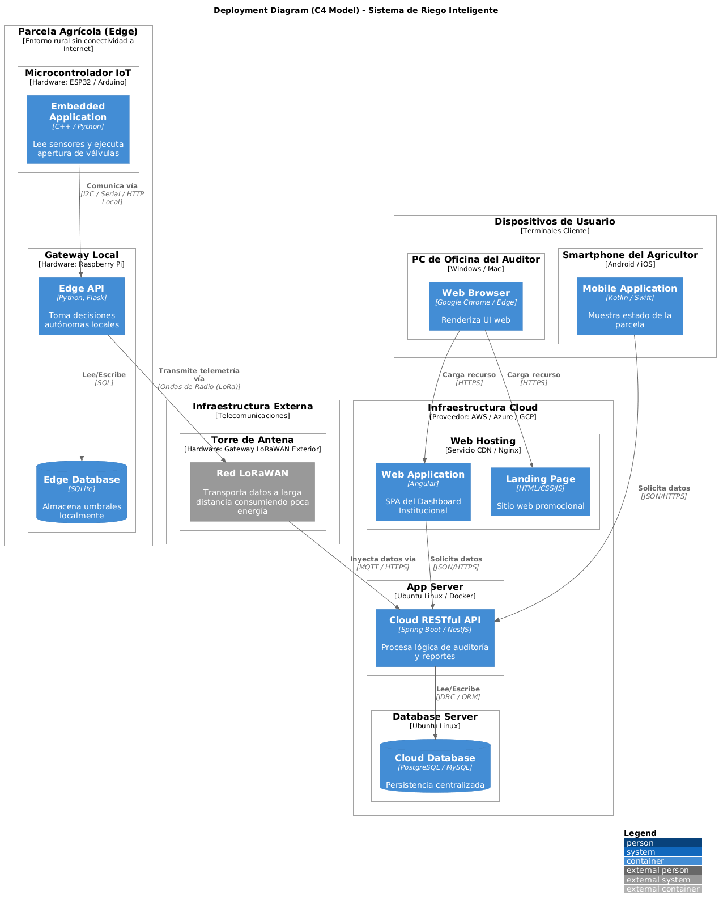

# Capítulo IV: Solution Software Design

## 4.1. Strategic-Level Domain-Driven Design.

### 4.1.1. Design-Level EventStorming.

Con el propósito de lograr una comprensión profunda del dominio del sistema, se realizó una sesión de Event Storming con una duración aproximada de una hora. Esta actividad permitió al equipo estructurar y analizar sus ideas desde distintas perspectivas, incluyendo el enfoque de negocio, el usuario final, la administración y la experiencia general del sistema.

A través de esta dinámica, se identificaron elementos clave como eventos, comandos, actores y agregados, lo que facilitó la construcción de una primera visión integral del sistema. Durante la sesión, se abordaron los siguientes aspectos:

**Exploración del dominio general**
El análisis inició desde la interacción del usuario con la plataforma, considerando su recorrido desde el acceso inicial hasta las principales funcionalidades del sistema, incluyendo los procesos de registro, autenticación y uso de los servicios disponibles.

**Identificación de eventos y comandos clave**
Se emplearon notas adhesivas para representar los eventos (en color naranja) y los comandos (en color azul), tomando como base las User Stories previamente definidas, lo que permitió mantener coherencia en el flujo de la solución.

**Asignación de roles y responsables**
Se identificaron y diferenciaron los distintos actores del sistema, con el fin de delimitar sus responsabilidades e interacciones. Esta segmentación facilitó la detección de posibles mejoras y puntos críticos dentro del sistema.

**Evidencia de la sesión**
Finalmente, se recopiló evidencia del trabajo realizado durante la sesión como respaldo del proceso de análisis y modelado del dominio.

	

#### 4.1.1.1 Candidate Context Discovery.

La identificación de contextos candidatos constituye una etapa fundamental para gestionar la complejidad en el desarrollo de sistemas. Este proceso implica un análisis detallado orientado a reconocer los elementos principales del dominio y sus relaciones. A partir de ello, dichos elementos se organizan en contextos delimitados que mantienen coherencia lógica. Esta estructuración no solo simplifica el diseño y la implementación, sino que también contribuye a mejorar la escalabilidad, el rendimiento y la mantenibilidad del sistema.

	

#### 4.1.1.2 Domain Message Flows Modeling.

El Modelado de Flujos de Mensajes de Dominio es una técnica empleada para analizar y diseñar sistemas de software, la cual permite representar el intercambio de información entre los distintos componentes mediante mensajes. Este enfoque se centra en definir los mensajes que los actores del sistema envían y reciben, así como en comprender las relaciones entre ellos. Su aplicación facilita la visualización de los flujos de información, lo que contribuye a identificar posibles problemas y a mejorar la estructura del diseño. A continuación, se presentan algunos diagramas ilustrativos aplicados al sistema propuesto.

	

#### 4.1.1.3 Bounded Context Canvases.

### 4.1.2. Context Mapping

	

El presente diagrama de Context Map tiene como objetivo visualizar las relaciones y dependencias estratégicas entre los distintos Bounded Contexts previamente descubiertos, así como su interacción con sistemas externos. Para este propósito, se han aplicado los patrones de relacionamiento estratégico de Domain-Driven Design (DDD) definidos por Eric Evans, estableciendo claramente las direcciones de influencia (Upstream/Downstream) y las estrategias de integración para evitar la propagación de modelos inadecuados o "Big Ball of Mud" en nuestra arquitectura.

Para reflejar la realidad de nuestro ecosistema IoT, los contextos han sido agrupados visualmente en dos grandes regiones o subdominios físicos y lógicos:

1. **Subdominio Edge / Operaciones de Campo:** Agrupa los contextos que se ejecutan localmente en el microcontrolador o minicomputadora de la parcela sin dependencia de internet (IoT Device Management, Moisture Monitoring, Autonomous Irrigation).

2. **Subdominio Cloud / Gestión Institucional:** Agrupa los contextos desplegados en la nube, enfocados en la administración y auditoría financiera por parte de bancos y Juntas de Usuarios (User & Access, Audit & Analytics).

A continuación, se detallan y sustentan las relaciones establecidas en el mapa:

- **Conformist (CF) con Sistemas Externos:** El sistema interactúa con un proveedor externo (Weather Forecast API) para optimizar los algoritmos de riego. Dado que nuestro equipo no tiene capacidad de influencia sobre el diseño ni la evolución de esta API externa, nuestro Autonomous Irrigation Context asume un rol Downstream y aplica el patrón Conformist (CF). Esto significa que nos adherimos rígidamente al modelo de datos del clima tal como es provisto por el proveedor, simplificando la integración y eliminando la complejidad de traducción.

- **Customer / Supplier (C/S) en recolección de datos:** Existe una relación de dependencia directa donde el IoT Device Management Context actúa como proveedor (Upstream - Supplier) enviando las lecturas físicas de los sensores al Moisture Monitoring Context (Downstream - Customer). Las necesidades del contexto de monitoreo dictan cómo y con qué frecuencia el contexto de dispositivos debe proveer la información para que sea útil.

- **Customer / Supplier (C/S) entre Monitoreo y Riego:** Existe una relación intrínseca donde el Moisture Monitoring Context actúa como proveedor (Upstream - Supplier), siendo el responsable de traducir los datos eléctricos crudos de los sensores en métricas agrícolas con significado para el negocio (ej. nivel de estrés hídrico o porcentaje de humedad). El Autonomous Irrigation Context actúa como cliente (Downstream - Customer), consumiendo estos datos procesados para evaluar sus propias reglas de negocio y tomar la decisión autónoma de abrir o cerrar las electroválvulas en el campo.

- **Anti-Corruption Layer (ACL) entre el Campo y la Nube:** Para comunicar las decisiones tomadas localmente en el campo sin internet (Autonomous Irrigation Context ejecutado vía Edge Computing) con el sistema central en la nube (Audit & Analytics Context), se ha implementado una Capa Anticorrupción (ACL) en el lado del Downstream. Esta capa se encarga de traducir los datos crudos y eventos del riego autónomo provenientes de la red LoRaWAN a un modelo propio del contexto de auditoría. Esto aísla y protege al sistema financiero del banco de posibles fallos, obligando a interactuar mediante una interfaz propia que no compromete el modelo de negocio central.

- **Open-Host Service (OHS) y Published Language (PL):** El User & Access Context actúa como Upstream proveyendo servicios de autenticación y autorización al resto de los contextos de la plataforma en la nube. Para evitar integraciones "uno a uno" que complejicen el sistema, este contexto expone un protocolo de APIs abiertas bajo el patrón Open-Host Service (OHS) y utiliza tokens de seguridad estandarizados bajo un Published Language (PL). Esto permite que cualquier contexto Downstream (como el de Auditoría) se integre a través de un lenguaje de intercambio común y bien documentado.

### 4.1.3. Software Architecture.

#### 4.1.3.1. Software Architecture System Landscape Diagram

	

Para la representación de la arquitectura de software de nuestra solución, el equipo ha adoptado el **C4 Model**, un marco de trabajo visual jerárquico. Iniciamos con el **System Landscape Diagram (Nivel Enterprise)**, el cual representa el nivel más alto de abstracción. A diferencia de un diagrama de contexto tradicional, el Landscape nos permite visualizar un mapa completo del ecosistema agrícola, tecnológico y financiero en el que nuestra startup operará, mostrando no solo nuestro producto, sino cómo coexiste con la infraestructura externa.

En el diagrama se pueden identificar:

- **Nuestro Sistema Core:** El Ecosistema IoT de Riego Inteligente, responsable de recolectar datos de humedad, tomar decisiones autónomas de riego y exponer dashboards institucionales.
- **Actores:** El Agricultor (usuario final), el Auditor Institucional (de entidades como Agrobanco, que usa la plataforma para evaluar el riesgo crediticio), y el Administrador del Sistema.
- **Sistemas Externos:** El Weather Forecast API (proveedor meteorológico), la infraestructura de red Gateway LoRaWAN (que suple la falta de conectividad celular), y el Sistema Core de Agrobanco (sistema interno del banco donde la funcionaria registra las aprobaciones basándose en nuestros datos).

#### 4.1.3.2. Software Architecture Context Level Diagrams

	

En este nivel de abstracción (Nivel 1 del C4 Model), el diagrama de Contexto delimita estrictamente las fronteras de nuestro **Ecosistema de Riego Inteligente**. El sistema se representa como una única "caja negra", ocultando los detalles de su infraestructura técnica para centrarse exclusivamente en el valor que aporta a sus usuarios directos (el agricultor en el campo y el auditor en la institución) y en sus dependencias de software externo. Se evidencia que nuestra plataforma no actúa de manera aislada, sino que delega la recolección de pronósticos climáticos a una API externa (Weather Forecast API) y se apoya en infraestructura de terceros (Gateway LoRaWAN) para sortear la brecha de conectividad rural, logrando así entregar la información a los usuarios finales.

#### 4.1.3.3. Software Architecture Container Level Diagrams

	

El Diagrama de Contenedores (Nivel 2 del C4 Model) realiza un "zoom in" a nuestro Ecosistema de Riego Inteligente para revelar sus unidades desplegables, responsabilidades y las decisiones tecnológicas de arquitectura de software establecidas.
Dada la naturaleza de nuestra solución frente a la carencia de conectividad en zonas rurales, la arquitectura se ha dividido físicamente en dos grandes entornos:

1. **Entorno Local en el Campo (Edge):**
	- **Embedded Application:** Escrita en **C++ / Python** y desplegada sobre microcontroladores (ej. ESP32). Actúa como la interfaz física interactuando directamente con los sensores de humedad y las electroválvulas.
	- **Edge API:** Representa el núcleo del Edge Computing. Desarrollado en **Python utilizando el micro-framework Flask y Peewee ORM**, este contenedor toma decisiones de riego de forma local y autónoma, asegurando la supervivencia del cultivo independientemente de la conexión a internet.
	- **Edge Database:** Base de datos embebida **SQLite** para el almacenamiento temporal y ágil de los eventos en la propia parcela.
2. **Entorno Centralizado (Cloud):**
	- **Cloud RESTful API:** El backend central, desplegado en la nube y desarrollado en **Spring Boot (Java)** [o NestJS/ASP.NET Core]. Es responsable de consolidar los datos de todas las parcelas y aplicar la lógica de negocio para la auditoría institucional.
	- **Cloud Database:** Base de datos relacional robusta **(PostgreSQL/MySQL)** orientada a la persistencia histórica y analítica.
	- **Web Application (SPA):** Desarrollada en **Angular** [o Vue], sirve como el Dashboard institucional para que los auditores revisen los reportes en tiempo real.
	- **Mobile Application:** Desarrollada en **Kotlin** [o Swift], enfocada en la experiencia del agricultor para visualizar el estado de sus sensores a distancia.
	- **Landing Page:** Sitio estático de captación B2B/B2C desarrollado con **HTML5, CSS3 y JavaScript.**

La comunicación puente entre el entorno de campo (Edge) y la nube (Cloud) se orquesta a través de un **Gateway LoRaWAN**, enviando tramas ligeras vía MQTT/HTTP, optimizando el bajo consumo energético de los sensores y garantizando el flujo de datos.

#### 4.1.3.4. Software Architecture Deployment Diagrams

	

El Diagrama de Despliegue ilustra cómo los contenedores de software previamente definidos se mapean e instalan sobre la infraestructura de hardware y redes físicas. Este diagrama es fundamental en nuestra arquitectura IoT, ya que demuestra la separación estratégica de responsabilidades para superar la barrera tecnológica de la falta de internet en zonas rurales.

La infraestructura se divide en los siguientes Nodos de Despliegue (Deployment Nodes):

1. **Nodos de Parcela Agrícola (Entorno Edge):**

	- **Microcontrolador IoT (ESP32/Arduino):** Hardware de bajo consumo energético y costo que ejecuta el Embedded Application, interactuando físicamente con la tierra y las válvulas.
	- **Gateway Local (Raspberry Pi):** Minicomputadora instalada en el campo que aloja el Edge API (Flask) y la Edge Database (SQLite). Aquí reside la inteligencia local (Edge Computing) que permite al sistema tomar decisiones de riego autónomas sin depender de servicios en la nube.

2. **Nodos de Telecomunicaciones Externa:**

	- **Torre de Antena LoRaWAN:** Infraestructura de hardware que captura las señales de radio de los dispositivos en el campo y actúa como puente (Gateway) inyectando los paquetes de datos hacia la red troncal de internet mediante el protocolo MQTT.

3. **Nodos de Infraestructura Cloud (AWS/Azure/GCP):**
	- Hardware virtualizado (servidores Ubuntu Linux / contenedores Docker) que aloja el ecosistema centralizado. Incluye el servidor de base de datos relacional (PostgreSQL), el servidor de aplicaciones (Spring Boot / NestJS) y el CDN que distribuye los archivos estáticos de la Web Application (Angular) y el Landing Page.

4. **Nodos de Dispositivos de Usuario:**
	- Representan los terminales físicos desde donde interactúan los usuarios finales: el Smartphone del agricultor (ejecutando la Mobile Application nativa) y las computadoras de oficina de la entidad financiera (ejecutando el Web Browser para acceder al Dashboard web).

## 4.2. Tactical-Level Domain-Driven Design

### 4.2.X. Bounded Context: <Bounded Context Name>

#### 4.2.X.1. Domain Layer.

#### 4.2.X.2. Interface Layer.

#### 4.2.X.3. Application Layer.

#### 4.2.X.4. Infrastructure Layer.

#### 4.2.X.5. Bounded Context Software Architecture Component Level Diagrams.

#### 4.2.X.6. Bounded Context Software Architecture Code Level Diagrams.

##### 4.2.X.6.1. Bounded Context Domain Layer Class Diagrams.

##### 4.2.X.6.2. Bounded Context Database Design Diagram.
