# Capítulo IV: Solution Software Design

## 4.1. Strategic-Level Domain-Driven Design

### 4.1.1. Design-Level EventStorming

Con el propósito de lograr una comprensión profunda del dominio del sistema, se realizó una sesión de Event Storming con una duración aproximada de una hora. Esta actividad permitió al equipo estructurar y analizar sus ideas desde distintas perspectivas, incluyendo el enfoque de negocio, el usuario final, la administración y la experiencia general del sistema.

A través de esta dinámica, se identificaron elementos clave como eventos, comandos, actores y agregados, lo que facilitó la construcción de una primera visión integral del sistema. Durante la sesión, se abordaron los siguientes aspectos:

**Exploración del dominio general**
El análisis inició desde la interacción del usuario con la plataforma, considerando su recorrido desde el acceso inicial hasta las principales funcionalidades del sistema, incluyendo los procesos de registro, autenticación y uso de los servicios disponibles.

**Identificación de eventos y comandos clave**
Se emplearon notas adhesivas para representar los eventos (en color naranja) y los comandos (en color azul), tomando como base las User Stories previamente definidas, lo que permitió mantener coherencia en el flujo de la solución.

**Asignación de roles y responsables**
Se identificaron y diferenciaron los distintos actores del sistema, con el fin de delimitar sus responsabilidades e interacciones. Esta segmentación facilitó la detección de posibles mejoras y puntos críticos dentro del sistema.

**Evidencia de la sesión**
Finalmente, se recopiló evidencia del trabajo realizado durante la sesión como respaldo del proceso de análisis y modelado del dominio.

	

#### 4.1.1.1 Candidate Context Discovery

La identificación de contextos candidatos constituye una etapa fundamental para gestionar la complejidad en el desarrollo de sistemas. Este proceso implica un análisis detallado orientado a reconocer los elementos principales del dominio y sus relaciones. A partir de ello, dichos elementos se organizan en contextos delimitados que mantienen coherencia lógica. Esta estructuración no solo simplifica el diseño y la implementación, sino que también contribuye a mejorar la escalabilidad, el rendimiento y la mantenibilidad del sistema.

	

#### 4.1.1.2 Domain Message Flows Modeling

El Modelado de Flujos de Mensajes de Dominio es una técnica empleada para analizar y diseñar sistemas de software, la cual permite representar el intercambio de información entre los distintos componentes mediante mensajes. Este enfoque se centra en definir los mensajes que los actores del sistema envían y reciben, así como en comprender las relaciones entre ellos. Su aplicación facilita la visualización de los flujos de información, lo que contribuye a identificar posibles problemas y a mejorar la estructura del diseño. A continuación, se presentan algunos diagramas ilustrativos aplicados al sistema propuesto.

	

#### 4.1.1.3 Bounded Context Canvases

### 4.1.2. Context Mapping

	

El presente diagrama de Context Map tiene como objetivo visualizar las relaciones y dependencias estratégicas entre los distintos Bounded Contexts previamente descubiertos, así como su interacción con sistemas externos. Para este propósito, se han aplicado los patrones de relacionamiento estratégico de Domain-Driven Design (DDD) definidos por Eric Evans, estableciendo claramente las direcciones de influencia (Upstream/Downstream) y las estrategias de integración para evitar la propagación de modelos inadecuados o "Big Ball of Mud" en nuestra arquitectura.

Para reflejar la realidad de nuestro ecosistema IoT, los contextos han sido agrupados visualmente en dos grandes regiones o subdominios físicos y lógicos:

1. **Subdominio Edge / Operaciones de Campo:** Agrupa los contextos que se ejecutan localmente en el microcontrolador o minicomputadora de la parcela sin dependencia de internet (IoT Device Management, Moisture Monitoring, Autonomous Irrigation).

2. **Subdominio Cloud / Gestión Institucional:** Agrupa los contextos desplegados en la nube, enfocados en la administración y auditoría financiera por parte de bancos y Juntas de Usuarios (User & Access, Audit & Analytics).

A continuación, se detallan y sustentan las relaciones establecidas en el mapa:

- **Conformist (CF) con Sistemas Externos:** El sistema interactúa con un proveedor externo (Weather Forecast API) para optimizar los algoritmos de riego. Dado que nuestro equipo no tiene capacidad de influencia sobre el diseño ni la evolución de esta API externa, nuestro Autonomous Irrigation Context asume un rol Downstream y aplica el patrón Conformist (CF). Esto significa que nos adherimos rígidamente al modelo de datos del clima tal como es provisto por el proveedor, simplificando la integración y eliminando la complejidad de traducción.

- **Customer / Supplier (C/S) en recolección de datos:** Existe una relación de dependencia directa donde el IoT Device Management Context actúa como proveedor (Upstream - Supplier) enviando las lecturas físicas de los sensores al Moisture Monitoring Context (Downstream - Customer). Las necesidades del contexto de monitoreo dictan cómo y con qué frecuencia el contexto de dispositivos debe proveer la información para que sea útil.

- **Customer / Supplier (C/S) entre Monitoreo y Riego:** Existe una relación intrínseca donde el Moisture Monitoring Context actúa como proveedor (Upstream - Supplier), siendo el responsable de traducir los datos eléctricos crudos de los sensores en métricas agrícolas con significado para el negocio (ej. nivel de estrés hídrico o porcentaje de humedad). El Autonomous Irrigation Context actúa como cliente (Downstream - Customer), consumiendo estos datos procesados para evaluar sus propias reglas de negocio y tomar la decisión autónoma de abrir o cerrar las electroválvulas en el campo.

- **Anti-Corruption Layer (ACL) entre el Campo y la Nube:** Para comunicar las decisiones tomadas localmente en el campo sin internet (Autonomous Irrigation Context ejecutado vía Edge Computing) con el sistema central en la nube (Audit & Analytics Context), se ha implementado una Capa Anticorrupción (ACL) en el lado del Downstream. Esta capa se encarga de traducir los datos crudos y eventos del riego autónomo provenientes de la red LoRaWAN a un modelo propio del contexto de auditoría. Esto aísla y protege al sistema financiero del banco de posibles fallos, obligando a interactuar mediante una interfaz propia que no compromete el modelo de negocio central.

- **Open-Host Service (OHS) y Published Language (PL):** El User & Access Context actúa como Upstream proveyendo servicios de autenticación y autorización al resto de los contextos de la plataforma en la nube. Para evitar integraciones "uno a uno" que complejicen el sistema, este contexto expone un protocolo de APIs abiertas bajo el patrón Open-Host Service (OHS) y utiliza tokens de seguridad estandarizados bajo un Published Language (PL). Esto permite que cualquier contexto Downstream (como el de Auditoría) se integre a través de un lenguaje de intercambio común y bien documentado.

### 4.1.3. Software Architecture

#### 4.1.3.1. Software Architecture System Landscape Diagram

	

Para la representación de la arquitectura de software de nuestra solución, el equipo ha adoptado el **C4 Model**, un marco de trabajo visual jerárquico. Iniciamos con el **System Landscape Diagram (Nivel Enterprise)**, el cual representa el nivel más alto de abstracción. A diferencia de un diagrama de contexto tradicional, el Landscape nos permite visualizar un mapa completo del ecosistema agrícola, tecnológico y financiero en el que nuestra startup operará, mostrando no solo nuestro producto, sino cómo coexiste con la infraestructura externa.

En el diagrama se pueden identificar:

- **Nuestro Sistema Core:** El Ecosistema IoT de Riego Inteligente, responsable de recolectar datos de humedad, tomar decisiones autónomas de riego y exponer dashboards institucionales.
- **Actores:** El Agricultor (usuario final), el Auditor Institucional (de entidades como Agrobanco, que usa la plataforma para evaluar el riesgo crediticio), y el Administrador del Sistema.
- **Sistemas Externos:** El Weather Forecast API (proveedor meteorológico), la infraestructura de red Gateway LoRaWAN (que suple la falta de conectividad celular), y el Sistema Core de Agrobanco (sistema interno del banco donde la funcionaria registra las aprobaciones basándose en nuestros datos).

#### 4.1.3.2. Software Architecture Context Level Diagrams

	

En este nivel de abstracción (Nivel 1 del C4 Model), el diagrama de Contexto delimita estrictamente las fronteras de nuestro **Ecosistema de Riego Inteligente**. El sistema se representa como una única "caja negra", ocultando los detalles de su infraestructura técnica para centrarse exclusivamente en el valor que aporta a sus usuarios directos (el agricultor en el campo y el auditor en la institución) y en sus dependencias de software externo. Se evidencia que nuestra plataforma no actúa de manera aislada, sino que delega la recolección de pronósticos climáticos a una API externa (Weather Forecast API) y se apoya en infraestructura de terceros (Gateway LoRaWAN) para sortear la brecha de conectividad rural, logrando así entregar la información a los usuarios finales.

#### 4.1.3.3. Software Architecture Container Level Diagrams

	

El Diagrama de Contenedores (Nivel 2 del C4 Model) realiza un "zoom in" a nuestro Ecosistema de Riego Inteligente para revelar sus unidades desplegables, responsabilidades y las decisiones tecnológicas de arquitectura de software establecidas.
Dada la naturaleza de nuestra solución frente a la carencia de conectividad en zonas rurales, la arquitectura se ha dividido físicamente en dos grandes entornos:

1. **Entorno Local en el Campo (Edge):**
	- **Embedded Application:** Escrita en **C++ / Python** y desplegada sobre microcontroladores (ej. ESP32). Actúa como la interfaz física interactuando directamente con los sensores de humedad y las electroválvulas.
	- **Edge API:** Representa el núcleo del Edge Computing. Desarrollado en **Python utilizando el micro-framework Flask y Peewee ORM**, este contenedor toma decisiones de riego de forma local y autónoma, asegurando la supervivencia del cultivo independientemente de la conexión a internet.
	- **Edge Database:** Base de datos embebida **SQLite** para el almacenamiento temporal y ágil de los eventos en la propia parcela.
2. **Entorno Centralizado (Cloud):**
	- **Cloud RESTful API:** El backend central, desplegado en la nube y desarrollado en **Spring Boot (Java)** [o NestJS/ASP.NET Core]. Es responsable de consolidar los datos de todas las parcelas y aplicar la lógica de negocio para la auditoría institucional.
	- **Cloud Database:** Base de datos relacional robusta **(PostgreSQL/MySQL)** orientada a la persistencia histórica y analítica.
	- **Web Application (SPA):** Desarrollada en **Angular** [o Vue], sirve como el Dashboard institucional para que los auditores revisen los reportes en tiempo real.
	- **Mobile Application:** Desarrollada en **Kotlin** [o Swift], enfocada en la experiencia del agricultor para visualizar el estado de sus sensores a distancia.
	- **Landing Page:** Sitio estático de captación B2B/B2C desarrollado con **HTML5, CSS3 y JavaScript.**

La comunicación puente entre el entorno de campo (Edge) y la nube (Cloud) se orquesta a través de un **Gateway LoRaWAN**, enviando tramas ligeras vía MQTT/HTTP, optimizando el bajo consumo energético de los sensores y garantizando el flujo de datos.

#### 4.1.3.4. Software Architecture Deployment Diagrams

	

El Diagrama de Despliegue ilustra cómo los contenedores de software previamente definidos se mapean e instalan sobre la infraestructura de hardware y redes físicas. Este diagrama es fundamental en nuestra arquitectura IoT, ya que demuestra la separación estratégica de responsabilidades para superar la barrera tecnológica de la falta de internet en zonas rurales.

La infraestructura se divide en los siguientes Nodos de Despliegue (Deployment Nodes):

1. **Nodos de Parcela Agrícola (Entorno Edge):**

	- **Microcontrolador IoT (ESP32/Arduino):** Hardware de bajo consumo energético y costo que ejecuta el Embedded Application, interactuando físicamente con la tierra y las válvulas.
	- **Gateway Local (Raspberry Pi):** Minicomputadora instalada en el campo que aloja el Edge API (Flask) y la Edge Database (SQLite). Aquí reside la inteligencia local (Edge Computing) que permite al sistema tomar decisiones de riego autónomas sin depender de servicios en la nube.

2. **Nodos de Telecomunicaciones Externa:**

	- **Torre de Antena LoRaWAN:** Infraestructura de hardware que captura las señales de radio de los dispositivos en el campo y actúa como puente (Gateway) inyectando los paquetes de datos hacia la red troncal de internet mediante el protocolo MQTT.

3. **Nodos de Infraestructura Cloud (AWS/Azure/GCP):**
	- Hardware virtualizado (servidores Ubuntu Linux / contenedores Docker) que aloja el ecosistema centralizado. Incluye el servidor de base de datos relacional (PostgreSQL), el servidor de aplicaciones (Spring Boot / NestJS) y el CDN que distribuye los archivos estáticos de la Web Application (Angular) y el Landing Page.

4. **Nodos de Dispositivos de Usuario:**
	- Representan los terminales físicos desde donde interactúan los usuarios finales: el Smartphone del agricultor (ejecutando la Mobile Application nativa) y las computadoras de oficina de la entidad financiera (ejecutando el Web Browser para acceder al Dashboard web).

## 4.2. Tactical-Level Domain-Driven Design

### 4.2.1. Bounded Context: Autonomous Irrigation Context

#### 4.2.1.1. Domain Layer

En esta capa se define el núcleo o core del negocio y sus reglas inherentes, completamente aislada de detalles tecnológicos o de frameworks. Hemos definido los siguientes elementos:

- **IrrigationRule (Aggregate Root / Entity):** Entidad principal que encapsula la regla de negocio para una parcela o sector de riego específico. Define si el riego automático está activo.
- **MoistureThreshold (Value Object):** Objeto inmutable que almacena los valores mínimos y máximos permisibles de humedad del suelo.
- **IrrigationEvent (Entity):** Entidad que registra el hecho histórico de que una válvula se abrió y cerró, calculando el volumen de agua utilizado y la duración del riego.
- **Valve (Entity):** Representación lógica de la electroválvula física en el campo.
- **IIrrigationRepository (Interface):** Interfaz de abstracción (Domain Repository) que define los contratos de persistencia (ej. `saveIrrigationEvent`, `findRuleByParcelId`), protegiendo al dominio de la base de datos real.

#### 4.2.1.2. Interface Layer

Esta capa contiene los puntos de entrada para interactuar con el contexto, encargándose de recibir las peticiones externas y traducirlas para la capa de aplicación:

- **IrrigationController (REST Controller):** Expone endpoints locales (ej. `/api/v1/irrigation/rules`) usando Flask, permitiendo que un técnico o agricultor conectado a la red local (vía Bluetooth o Wi-Fi directo a la Raspberry Pi) configure los umbrales manualmente.
- **SensorDataConsumer (Consumer/Subscriber):** Consumidor que escucha internamente las mediciones de humedad provenientes del Moisture Monitoring Context (por ejemplo, vía un bus de eventos local o I2C/Serial).

#### 4.2.1.3. Application Layer

Aquí se orquestan los flujos y casos de uso del negocio, sin contener reglas de dominio puras. Se definen las siguientes clases:

- **EvaluateIrrigationCommandHandler:** Recibe el comando con el dato actual de humedad. Obtiene la regla (`IrrigationRule`) desde el repositorio, ejecuta la evaluación lógica y, si la tierra está seca, coordina la orden de abrir la válvula.
- **RecordIrrigationEventHandler:** Escucha el evento de dominio "Riego Finalizado" y se encarga de orquestar el guardado del evento histórico en el repositorio local.
- **SyncToCloudEventHandler:** Orquesta el empaquetado del evento de riego para enviarlo a la capa anticorrupción (ACL) hacia la nube, para la posterior auditoría del banco.

#### 4.2.1.4. Infrastructure Layer

En esta capa se implementan las interfaces del dominio utilizando las tecnologías técnicas elegidas y requeridas por el proyecto:

- **SqliteIrrigationRepository:** Implementación real de IIrrigationRepository utilizando el framework Peewee ORM y la base de datos embebida SQLite.
- **GpioValveActuator:** Servicio de infraestructura que traduce la orden lógica de riego en una señal eléctrica real de apertura/cierre enviada a los pines de la Raspberry Pi/ESP32.
- **LoRaWANPublisher:** Implementa el envío de tramas de datos ligeros a través del Gateway LoRaWAN usando el protocolo MQTT, inyectando los eventos hacia la nube.

#### 4.2.1.5. Bounded Context Software Architecture Component Level Diagrams

	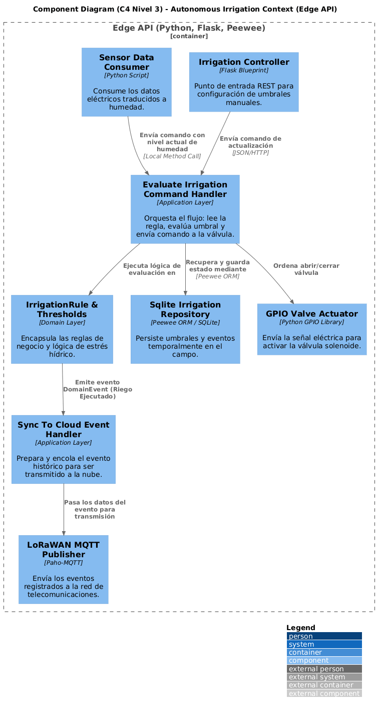

#### 4.2.1.6. Bounded Context Software Architecture Code Level Diagrams

##### 4.2.1.6.1. Bounded Context Domain Layer Class Diagrams

	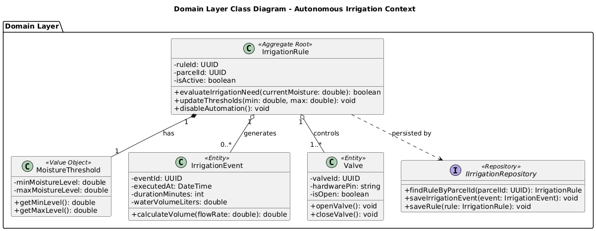

##### 4.2.1.6.2. Bounded Context Database Design Diagram

	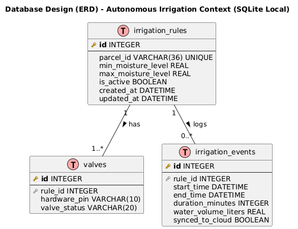

### 4.2.2. Bounded Context: Moisture Monitoring Context

Este contexto delimitado pertenece al subdominio de operaciones de campo (Edge). Su responsabilidad exclusiva es la captura, traducción y transmisión de la telemetría del suelo. Actúa como el puente entre el hardware físico (sensores capacitivos de humedad y temperatura) y la lógica de software, convirtiendo señales eléctricas (voltaje/miliamperios) en el Contenido Volumétrico de Agua (VWC) y publicando esta información tanto para el sistema de riego local como para la nube a través de redes de largo alcance.

#### 4.2.2.1. Domain Layer

En esta capa se modelan los conceptos fundamentales de la telemetría agrícola, garantizando que el sistema entienda el estado físico de la parcela:

- **SensorNode (Aggregate Root):** Representa la unidad física desplegada en el campo (ej. placa ESP32 con sus periféricos). Controla el estado del dispositivo (activo, inactivo, batería baja).
- **SoilMoistureReading (Entity):** Encapsula un evento de lectura individual en el tiempo. Almacena tanto el valor crudo del hardware como el valor ya procesado.
- **VolumetricWaterContent (Value Object):** Objeto de valor inmutable que representa el porcentaje exacto de humedad en el suelo (VWC), calculado a partir de la señal eléctrica del sensor.
- **SensorStatus (Value Object):** Define la salud operativa del sensor (ej. nivel de batería, calidad de la señal de radio).
- **IMonitoringRepository (Interface):** Contrato que define cómo se persisten y recuperan las lecturas (ej. `saveReading()`, `getLatestReadingByNodeId()`).

#### 4.2.2.2. Interface Layer

Esta capa maneja la ingesta de datos en tiempo real proveniente del hardware:

- **HardwareSignalListener (Endpoint/Consumer):** Un demonio o proceso en segundo plano que escucha constantemente los puertos analógicos o el bus I2C del microcontrolador para capturar los datos eléctricos crudos emitidos por los sensores de humedad en el suelo.
- **MonitoringController (REST API):** Expone endpoints de diagnóstico local para que el administrador del sistema pueda calibrar el sensor en campo usando una aplicación móvil o terminal.

#### 4.2.2.3. Application Layer

Aquí se define el flujo de orquestación para el procesamiento de los datos:

- **ProcessSensorSignalCommandHandler:** Recibe la señal eléctrica cruda del HardwareSignalListener, invoca los métodos del dominio para convertir ese voltaje en un porcentaje VWC comprensible, y orquesta su guardado en el repositorio local.
- **PublishTelemetryEventHandler:** Un manejador de eventos que reacciona cada vez que se guarda una nueva lectura. Su trabajo es doble: enviar el dato agronómico al Autonomous Irrigation Context (para que decida si riega) y empaquetar la lectura para enviarla a la nube.

#### 4.2.2.4. Infrastructure Layer

En esta capa residen las integraciones tecnológicas específicas requeridas por el hardware IoT y las telecomunicaciones:

- **AnalogSensorDriver:** Implementación concreta en C++/Python que interactúa directamente con los pines del microcontrolador (ej. ESP32) para leer los sensores capacitivos de humedad.
- **SqliteMonitoringRepository:** Implementación del repositorio de dominio utilizando Peewee ORM y SQLite para guardar un búfer temporal de lecturas en caso de pérdida de conexión.
- **LoRaWANTelemetryPublisher:** Servicio de infraestructura que transmite el paquete de datos de humedad hacia el Gateway LoRaWAN utilizando el protocolo MQTT, asegurando un bajo consumo energético y largo alcance.

#### 4.2.2.5. Bounded Context Software Architecture Component Level Diagrams

	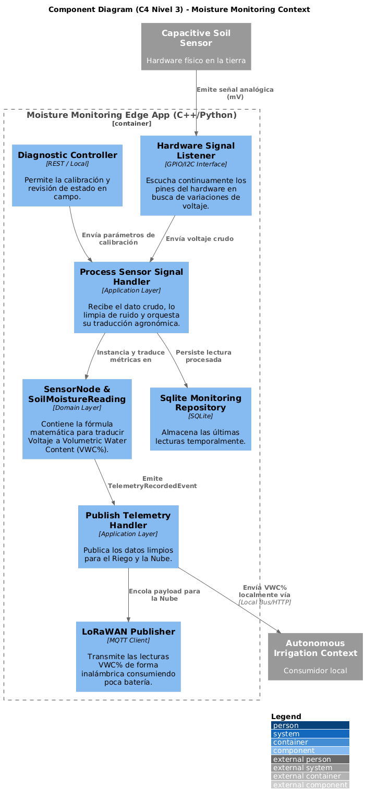

#### 4.2.2.6. Bounded Context Software Architecture Code Level Diagrams

##### 4.2.2.6.1. Bounded Context Domain Layer Class Diagrams

	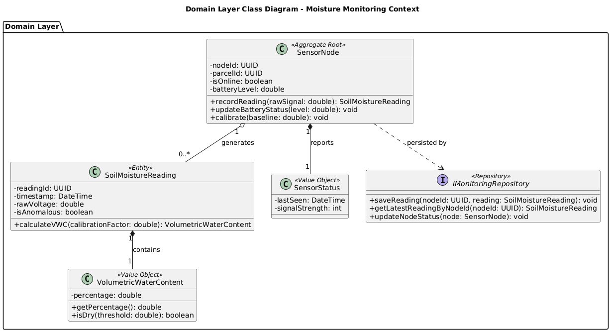

##### 4.2.2.6.2. Bounded Context Database Design Diagram

	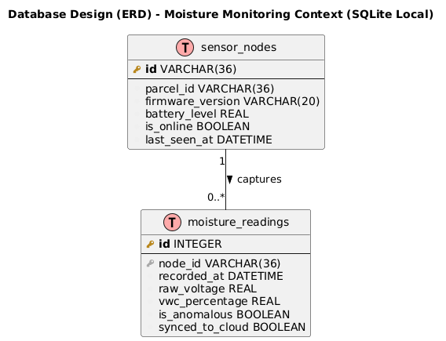

### 4.2.3. Bounded Context: Audit & Analytics Context

Este contexto delimitado se sitúa en el subdominio Cloud (Gestión Institucional). Su responsabilidad principal es consolidar la información histórica del uso del agua proveniente de todas las parcelas a nivel nacional, analizar la eficiencia hídrica y generar reportes automatizados. Esta información es vital para que las Juntas de Usuarios y entidades financieras (ej. Agrobanco) evalúen el riesgo crediticio y productivo de los agricultores frente a las sequías.

#### 4.2.3.1. Domain Layer

En esta capa reside la lógica financiera y de auditoría institucional, agnóstica a cualquier framework de la nube:

- **ParcelAudit (Aggregate Root):** Entidad principal que representa el expediente de auditoría de una parcela específica. Centraliza el estado de cumplimiento de la cuota de agua asignada al agricultor.
- **WaterConsumptionReport (Entity):** Entidad que consolida los volúmenes de agua utilizados en un periodo determinado (ej. mensual o por campaña agrícola).
- **RiskEvaluation (Value Object):** Objeto inmutable que califica el nivel de riesgo del agricultor (ej. LOW, MEDIUM, HIGH) basándose en su eficiencia hídrica y la supervivencia esperada de su cultivo.
- **IAuditRepository (Interface):** Contrato del dominio que define los métodos para persistir y consultar las auditorías (ej. `findAuditByParcelId()`, `saveConsumptionReport()`).

#### 4.2.3.2. Interface Layer

Esta capa expone el sistema central tanto a los usuarios web (auditores) como a los sistemas del campo:

- **AuditController (REST Controller):** Controlador desarrollado en Spring Boot que expone endpoints HTTP (ej. `GET /api/v1/audits/reports`) consumidos por la Web Application (SPA en Angular) que utiliza la funcionaria del banco.
- **TelemetryEventConsumer (Message Listener):** Un consumidor asíncrono que escucha los mensajes provenientes del Gateway LoRaWAN a través de un Message Broker en la nube, ingiriendo los eventos de riego ejecutados en el campo.

#### 4.2.3.3. Application Layer

Aquí se orquestan los flujos de negocio institucionales:

- **RegisterIrrigationEventHandler:** Escucha el evento de telemetría entrante, lo traduce (actuando en conjunto con la ACL) y actualiza el balance de agua consumida en el `ParcelAudit` correspondiente.
- **GenerateWaterReportCommandHandler:** Orquesta la generación de un nuevo `WaterConsumptionReport` cuando un auditor institucional lo solicita desde el dashboard.
- **EvaluateCreditRiskCommandHandler:** Aplica las reglas de negocio cruzando el consumo de agua vs. la cuota permitida, para emitir un `RiskEvaluation` actualizado para el banco.

#### 4.2.3.4. Infrastructure Layer

En esta capa se implementan los detalles técnicos de la nube:

- **PostgresAuditRepository o MySQL:** Implementación del `IAuditRepository` utilizando **Spring Data JPA / Hibernate** para persistir la información a largo plazo en una base de datos relacional **PostgreSQL** (o MySQL).
- **MqttTelemetryConsumerImpl:** Implementación técnica que se conecta al broker MQTT en la nube (ej. AWS IoT Core) para desencriptar y recibir los paquetes enviados por los nodos LoRaWAN.

#### 4.2.3.5. Bounded Context Software Architecture Component Level Diagrams

	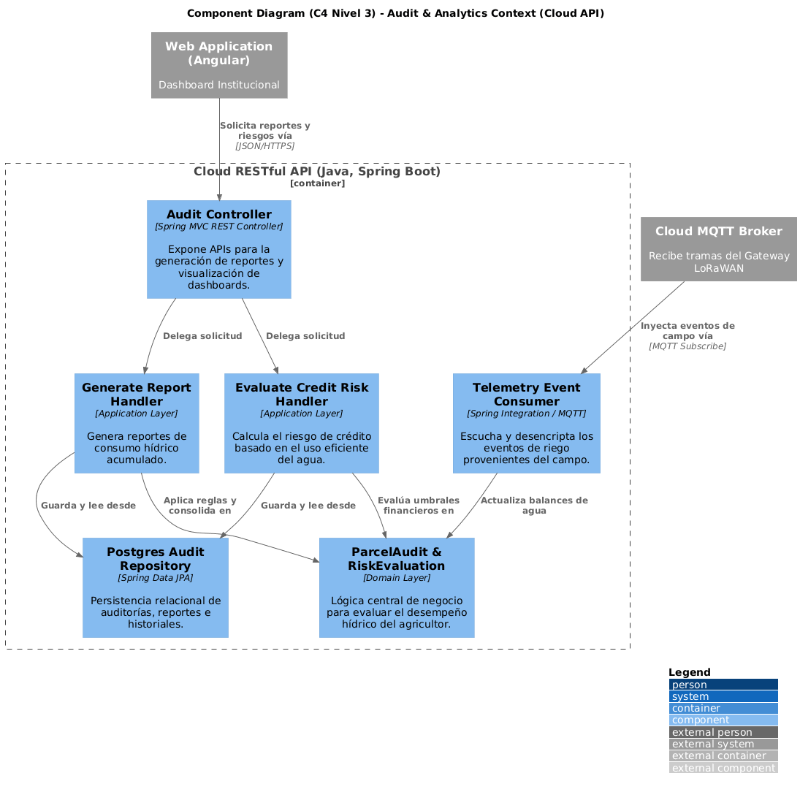

#### 4.2.3.6. Bounded Context Software Architecture Code Level Diagrams

##### 4.2.3.6.1. Bounded Context Domain Layer Class Diagrams

	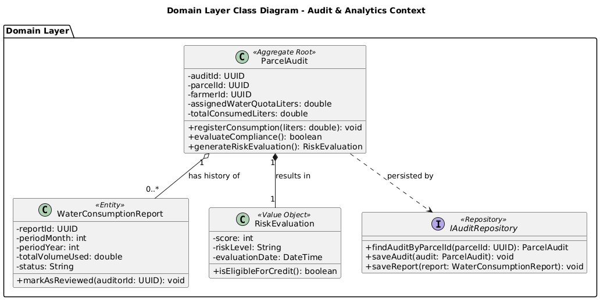

##### 4.2.3.6.2. Bounded Context Database Design Diagram

	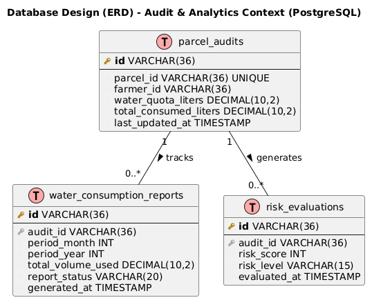

### 4.2.4. Bounded Context: IoT Device Management Context

Este contexto delimitado pertenece al subdominio de Operaciones de Campo (Edge). Su responsabilidad exclusiva es la gestión del ciclo de vida del hardware físico desplegado en la parcela. A diferencia del monitoreo de humedad (que evalúa datos agronómicos), este contexto ignora la agricultura y se enfoca puramente en la salud de la infraestructura tecnológica: registrar nuevos microcontroladores, monitorear su conectividad (pings/heartbeats), evaluar el nivel de las baterías solares y emitir alertas de mantenimiento técnico.

#### 4.2.4.1. Domain Layer

En esta capa se modelan los conceptos técnicos de la infraestructura de red, aislados de cualquier framework:

- **IoTDevice (Aggregate Root):** Entidad principal que representa un nodo físico (ej. ESP32 o Gateway LoRa). Controla su ciclo de vida (Registrado, Activo, Inactivo, Mantenimiento).
- **MacAddress (Value Object):** Objeto de valor inmutable que representa el identificador físico único de la tarjeta de red del dispositivo, garantizando que no existan nodos duplicados.
- **BatteryHealth (Value Object):** Representa el voltaje actual de la batería y calcula el porcentaje de vida útil restante.
- **DevicePingEvent (Entity):** Registro temporal de la última vez que el dispositivo reportó actividad ("heartbeat") hacia el cerebro local.
- **IDeviceRepository (Interface):** Contrato de persistencia que define cómo guardar y buscar el estado de los dispositivos (ej. `findDeviceByMacAddress()`, `savePing()`).

#### 4.2.4.2. Interface Layer

Esta capa contiene los puntos de acceso para la administración técnica del hardware:

- **DeviceProvisioningController (REST Controller):** Endpoint (ej. `POST /api/v1/devices`) utilizado por el Administrador del Sistema o técnico en campo a través de su laptop para registrar (dar de alta) un nuevo sensor en la red local.
- **HeartbeatListener (Consumer):** Escucha constantemente las señales de vida (pings) que emiten los microcontroladores por la red local o puerto serial para confirmar que siguen encendidos.

#### 4.2.4.3. Application Layer

Aquí se orquestan los flujos de gestión de dispositivos:

- **RegisterNewDeviceCommandHandler:** Recibe la MAC Address y especificaciones del hardware, valida mediante el dominio que no exista un duplicado, y lo guarda en el repositorio.
- **ProcessHeartbeatEventHandler:** Orquesta la actualización de la fecha de "última conexión" (`lastSeen`) y el voltaje de la batería cada vez que un dispositivo emite su señal de vida.
- **CheckDeviceHealthCommandHandler:** Un proceso programado (CRON job) que barre el repositorio buscando dispositivos que no han emitido heartbeats en las últimas horas o cuya batería esté crítica, generando alertas de soporte técnico.

#### 4.2.4.4. Infrastructure Layer

En esta capa se implementan las tecnologías que manejan el estado del hardware localmente:

- **SqliteDeviceRepository:** Implementación del `IDeviceRepository` usando Peewee ORM y SQLite en la Raspberry Pi (Gateway Local) para mantener el inventario de sensores en el campo.
- **LocalNetworkPingService:** Servicio de infraestructura que interactúa a bajo nivel con la red para verificar la latencia y la potencia de la señal (RSSI) del dispositivo IoT.

#### 4.2.4.5. Bounded Context Software Architecture Component Level Diagrams

	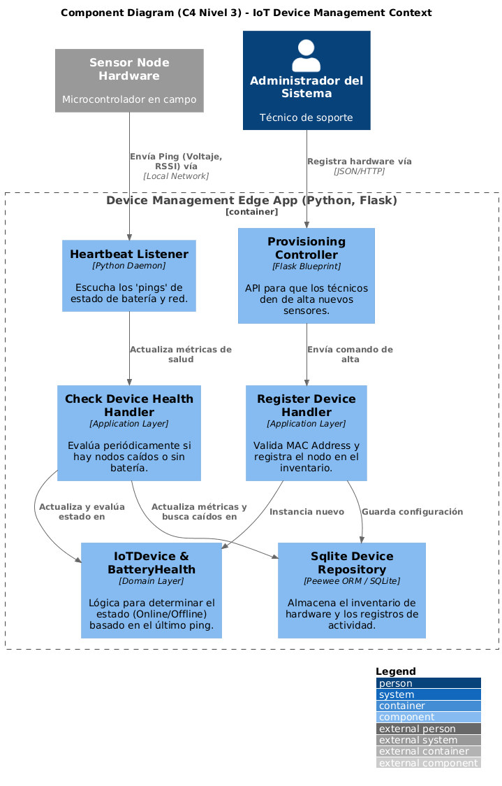

#### 4.2.4.6. Bounded Context Software Architecture Code Level Diagrams

##### 4.2.4.6.1. Bounded Context Domain Layer Class Diagrams

	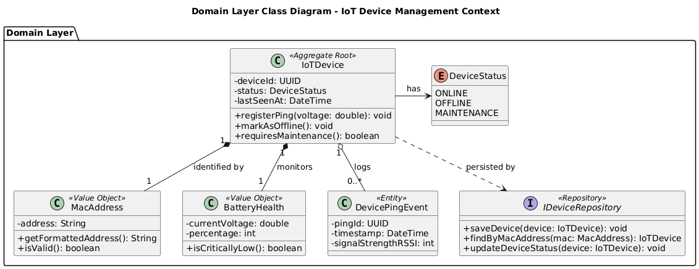

##### 4.2.4.6.2. Bounded Context Database Design Diagram

	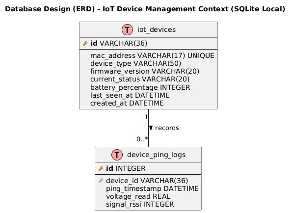

### 4.2.5. Bounded Context: User & Access Context

Este contexto delimitado pertenece al subdominio Cloud y actúa como un servicio de soporte central (Generic Subdomain) para toda la plataforma. Su responsabilidad exclusiva es la gestión de la identidad, la autenticación (AuthN) y la autorización (AuthZ) de los usuarios que interactúan con el Ecosistema de Riego Inteligente, incluyendo a los pequeños agricultores en el campo, los auditores institucionales y los administradores del sistema. Este contexto emite y valida los tokens de seguridad para proteger los endpoints del resto de los contextos en la nube.

#### 4.2.5.1. Domain Layer

En esta capa se encapsula la lógica pura de la gestión de identidades y accesos, sin depender de librerías de seguridad externas:

- **UserAccount (Aggregate Root):** Entidad central que representa la cuenta de un individuo en la plataforma. Controla el estado de la cuenta (Activa, Bloqueada, Pendiente de Verificación).
- **Credentials (Value Object):** Objeto de valor inmutable que encapsula el correo electrónico (o número de teléfono) y la contraseña encriptada. Contiene la lógica para validar reglas de contraseñas seguras.
- **Role (Value Object):** Define el nivel de privilegios del usuario dentro de la plataforma (ej. `ROLE_FARMER`, `ROLE_AUDITOR`, `ROLE_ADMIN`).
- **IUserRepository (Interface):** Contrato que define los métodos de persistencia para las cuentas (ej.`findByEmail()`, `saveUser()`).

#### 4.2.5.2. Interface Layer

Esta capa expone los servicios de identidad hacia el exterior:

- **AuthController (REST Controller):** Controlador desarrollado en Spring Boot que expone los endpoints públicos (ej. `POST /api/v1/auth/login`, `POST /api/v1/auth/register`) consumidos tanto por la aplicación móvil del agricultor como por la aplicación web institucional.

#### 4.2.5.3. Application Layer

Aquí se orquestan los flujos de inicio de sesión y registro:

- **AuthenticateUserCommandHandler**: Recibe las credenciales en texto plano, coordina con el dominio para buscar la cuenta, delega la verificación del hash de la contraseña a la infraestructura y, si es exitoso, orquesta la generación del token de acceso.
- **RegisterUserCommandHandler:** Coordina la creación de una nueva cuenta, validando que el correo o teléfono no estén duplicados y asignando el rol inicial por defecto.

#### 4.2.5.4. Infrastructure Layer

En esta capa se implementan los mecanismos técnicos de seguridad, encriptación y persistencia en la nube:

- **PostgresUserRepository:** Implementación del `IUserRepository` utilizando **Spring Data JPA** para almacenar las cuentas en la base de datos relacional **PostgreSQL** (u MySQL).
- **JwtTokenService:** Servicio de infraestructura que implementa la generación, firma electrónica y validación de tokens **JWT (JSON Web Tokens)**, actuando como el "Published Language" para que otros contextos confíen en la sesión del usuario.
- **BcryptPasswordEncoder:** Herramienta técnica que aplica algoritmos de hashing para proteger las contraseñas en la base de datos.

#### 4.2.5.5. Bounded Context Software Architecture Component Level Diagrams

	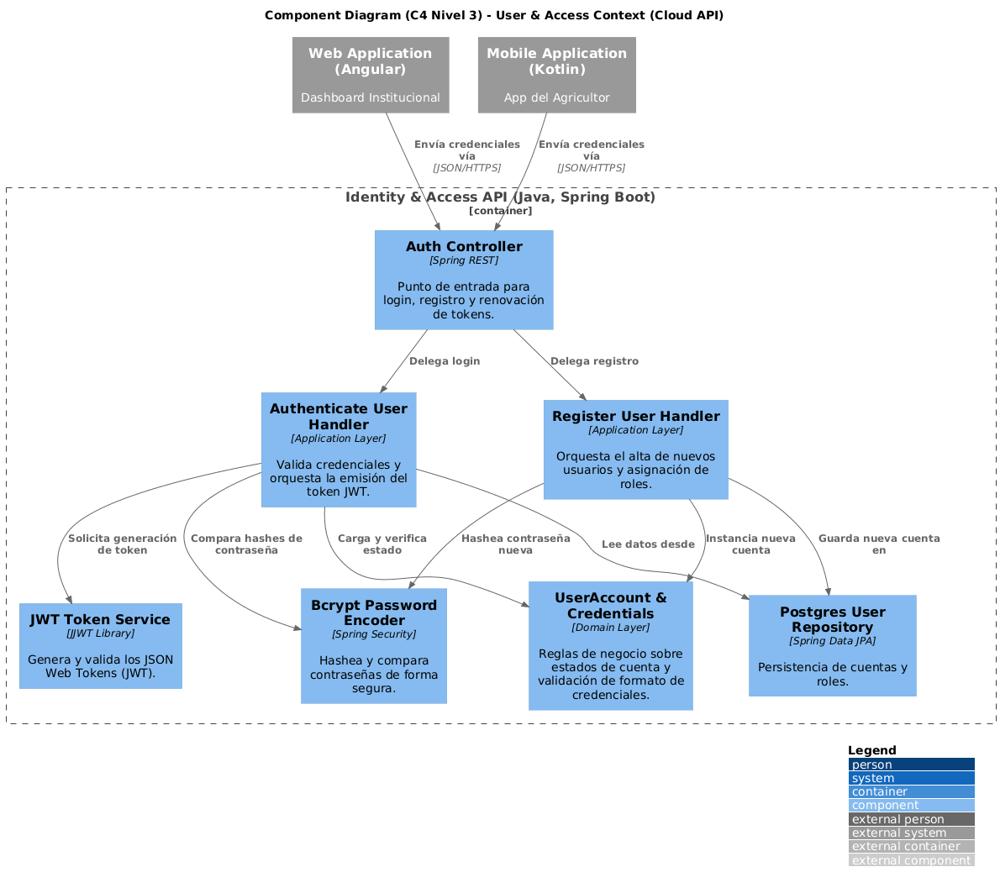

#### 4.2.5.6. Bounded Context Software Architecture Code Level Diagrams

##### 4.2.5.6.1. Bounded Context Domain Layer Class Diagrams

	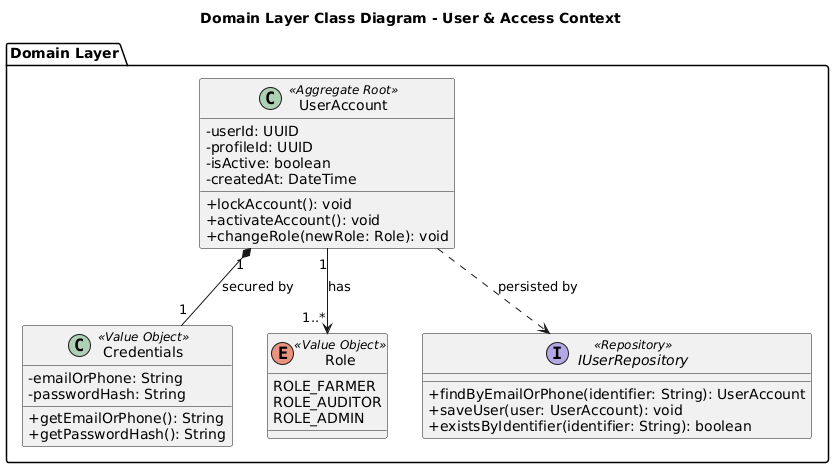

##### 4.2.5.6.2. Bounded Context Database Design Diagram

	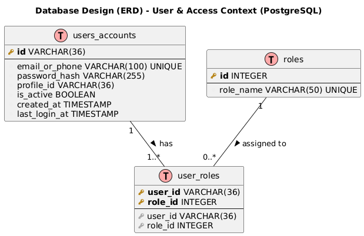

