# Capítulo V: Solution UI/UX Design

## 5.1. Style Guidelines.

### 5.1.1. General Style Guidelines.

La experiencia visual de AquaEdge prioriza claridad, confianza y lectura rapida en campo, por lo que se adopta un estilo sobrio y funcional: tipografia sans-serif legible, jerarquia clara (titulos, subtitulos y datos clave), alto contraste para visibilidad en exteriores, espaciado generoso para reducir errores en toques, y uso consistente de iconos simples para estados de humedad, riego y alertas. El color comunica estado (normal, advertencia, critico) y evita saturaciones, mientras que las metricas esenciales se muestran primero con etiquetas cortas y unidades visibles. Todo el contenido mantiene lenguaje directo y tecnico accesible para agricultores e instituciones, asegurando coherencia entre web, mobile e interfaces IoT incluso en contextos de baja conectividad.

<p align="center">
	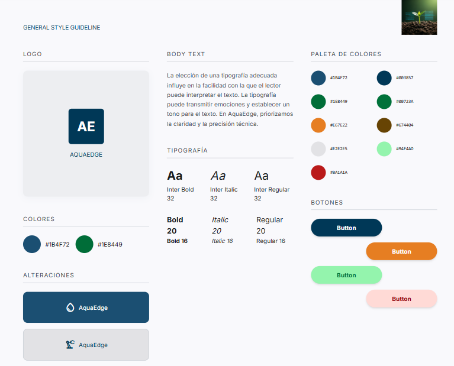
</p>

### 5.1.2. Web, Mobile and IoT Style Guidelines.

En web, el dashboard prioriza paneles densos pero ordenados para analistas, con tablas filtrables, graficas comparativas y estados por parcela, usando layout de 12 columnas y navegacion lateral persistente. En mobile, la interfaz se reduce a tareas criticas del agricultor: alertas, estado de riego y acciones rapidas, con botones grandes, modo una mano y tarjetas resumidas para conexion intermitente. En IoT (pantallas o indicadores del nodo), se emplean señales minimas y robustas: colores de estado, iconos simples, textos cortos y feedback inmediato de encendido/valvula, evitando animaciones o detalles que consuman energia. Las tres plataformas comparten nomenclatura, iconografia y codigos de estado para que el usuario reconozca el mismo significado sin importar el dispositivo.

<p align="center">
	
</p>

<p align="center">
	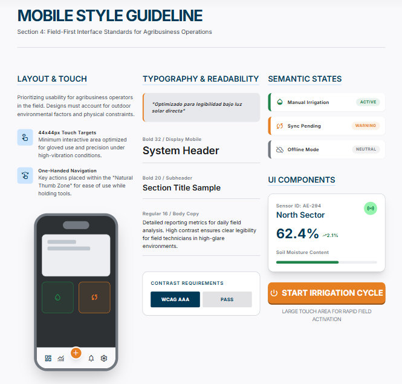
</p>

<p align="center">
	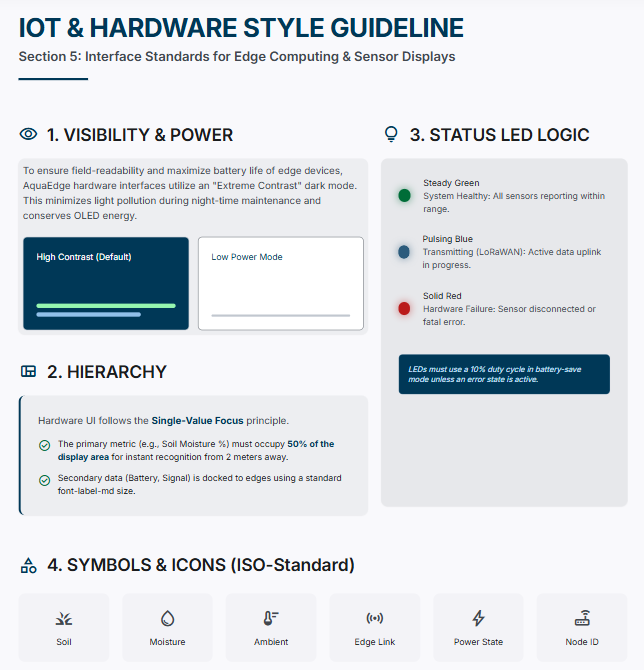
</p>

## 5.2. Information Architecture.

### 5.2.1. Organization Systems.

### 5.2.2. Labeling Systems.

Antes de implementar las etiquetas en AquaEdge, definimos los requisitos de claridad, accionabilidad y coherencia entre web, mobile e IoT. Las etiquetas agregan contexto inmediato sobre el estado del riego, la humedad y la operacion del sistema. A continuacion se detalla el sistema de etiquetado implementado:

Etiquetas para parcelas
Etiqueta | Descripcion
[ESTABLE] | Humedad dentro del rango objetivo
[ALERTA] | Humedad cerca del limite, requiere atencion
[CRITICO] | Estres hidrico detectado, riego prioritario

Etiquetas para riego
Etiqueta | Descripcion
[AUTOMATICO] | Riego gestionado por Edge API
[MANUAL] | Riego activado por el usuario
[PAUSADO] | Riego deshabilitado temporalmente

Etiquetas para sensores
Etiqueta | Descripcion
[ONLINE] | Sensor reportando lecturas recientes
[OFFLINE] | Sensor sin comunicacion o bateria baja

Etiquetas para notificaciones del sistema
Etiqueta | Descripcion
[CONFIRMADO] | Operacion completada exitosamente
[ERROR] | Problema durante la operacion

Este sistema de etiquetas brinda contexto visual inmediato y mejora la comprension de la informacion tanto para agricultores como para analistas institucionales.

### 5.2.3. SEO Tags and Meta Tags

La implementacion de etiquetas SEO en AquaEdge busca mejorar la visibilidad de la landing page y presentar informacion clara en buscadores y redes sociales. A continuacion se detallan las etiquetas principales y un ejemplo de uso:

Titulo (55-60 caracteres, descriptivo)

```
<title>AquaEdge - Riego inteligente IoT para agricultura</title>
```

Descripcion (propuesta de valor breve)

```
<meta
  name="description"
  content="AquaEdge optimiza el riego agricola con IoT, Edge Computing y alertas en tiempo real para ahorrar agua en zonas rurales."
/>
```

Robots (indexacion y seguimiento)

```
<meta name="robots" content="index, follow" />
```

Tipo de contenido e idioma

```
<meta http-equiv="Content-Type" content="text/html; charset=UTF-8" />
<meta http-equiv="Content-Language" content="es" />
```

Viewport (adaptacion mobile)

```
<meta name="viewport" content="width=device-width, initial-scale=1.0" />
```

Open Graph (compartir en redes sociales)

```
<meta property="og:title" content="AquaEdge - Riego inteligente para el agro" />
<meta
  property="og:description"
  content="Sistema IoT y Edge Computing para monitorear humedad y automatizar el riego."
/>
<meta
  property="og:image"
  content="https://aquaedge.pe/images/aquaedge-preview.jpg"
/>
<meta property="og:url" content="https://aquaedge.pe" />
<meta property="og:type" content="website" />
```

Keywords (apoyo semantico)

```
<meta
  name="keywords"
  content="riego inteligente, IoT agricola, edge computing, monitoreo humedad, ahorro de agua, agricultura"
/>
```

### 5.2.4. Searching Systems.

El sistema de busqueda de AquaEdge permite encontrar informacion critica por parcela, sensores y eventos de riego, ayudando tanto al agricultor como al analista institucional. Se plantean dos niveles de busqueda:

Sistema de busqueda para agricultores (mobile)
Nombre del filtro | Descripcion
Parcela | Filtra por nombre o codigo de parcela
Estado de humedad | Muestra solo parcelas en [ESTABLE], [ALERTA] o [CRITICO]
Riego | Filtra por [AUTOMATICO], [MANUAL] o [PAUSADO]
Ultima lectura | Ordena por lecturas mas recientes
Alertas activas | Muestra solo parcelas con alertas vigentes

Sistema de busqueda para analistas (web)
Nombre del filtro | Descripcion
Ubicacion | Filtra por distrito o zona agricola
Consumo de agua | Filtra por rangos de consumo historico
Rango de fechas | Busca eventos de riego por periodo
Estado de sensores | Filtra por [ONLINE] o [OFFLINE]
Riesgo hidrico | Prioriza parcelas con estres hidrico

Caracteristicas adicionales del sistema de busqueda

- Actualizacion casi en tiempo real: resultados refrescados por sincronizacion LoRaWAN.
- Historial de busquedas: guarda los ultimos filtros aplicados para acceso rapido.
- Busqueda tolerante: acepta variaciones de nombres y codigos de parcela.

Este sistema de busqueda mejora la localizacion de informacion clave y acelera la toma de decisiones operativas y financieras.

### 5.2.5. Navigation Systems.

El sistema de navegacion de AquaEdge guia a agricultores y analistas a traves de funciones criticas con rutas claras y consistentes. Se definen los siguientes elementos:

Navegacion global
Nombre | Descripcion
Inicio | Resumen de estado general segun rol
Parcelas | Acceso a listado y detalle por parcela
Alertas | Bandeja de eventos criticos y notificaciones
Perfil | Configuracion personal y preferencias

Navegacion para agricultores (mobile)
Nombre | Descripcion
Estado de riego | Vista rapida de humedad y valvulas
Mis alertas | Alertas activas y acciones inmediatas
Historial | Eventos de riego recientes
Soporte | Guia basica y contacto tecnico

Navegacion para analistas (web)
Nombre | Descripcion
Dashboard | Indicadores clave y comparativas por zona
Auditoria | Consumo, cumplimiento y reportes
Sensores | Estado de dispositivos y fallas
Usuarios | Gestion de cuentas y roles

Elementos y patrones de navegacion

- Menu lateral persistente en web para acceso rapido a modulos.
- Barra inferior en mobile con 3-4 accesos principales.
- Navegacion jerarquica: zona -> parcela -> sensor -> evento.
- Pestañas por categoria en vistas densas (riego, alertas, consumo).
- Acciones rapidas con botones flotantes en mobile para iniciar o pausar riego.

Este sistema asegura una navegacion consistente, intuitiva y adaptada a cada dispositivo, reduciendo el tiempo de acceso a informacion critica.

## 5.3. Landing Page UI Design.

### 5.3.1. Landing Page Wireframe.

En esta seccion se representa una estructura funcional preliminar de la landing page de AquaEdge, organizada por bloques clave (hero con propuesta de valor, beneficios, solucion IoT, casos de uso, testimonios/alianzas y llamado a la accion). El wireframe define la jerarquia informativa y el flujo de navegacion del visitante, priorizando la comprension rapida del problema y la solucion. Esta etapa se centra en la logica y disposicion del contenido, sin aplicar aun colores, imagenes ni estilos graficos.

<p align="center">
	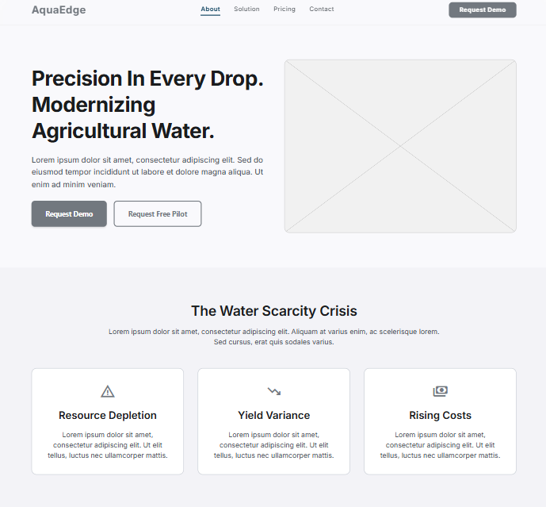
</p>

<p align="center">
	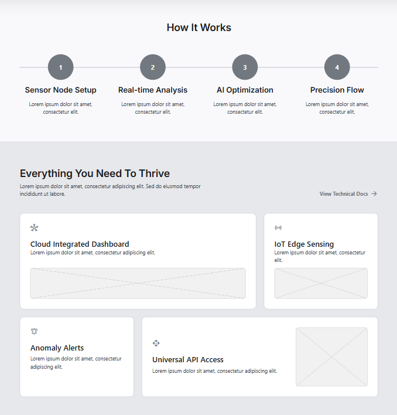
</p>

<p align="center">
	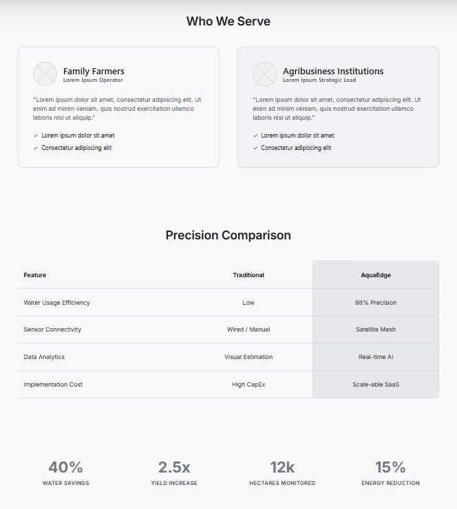
</p>

### 5.3.2. Landing Page Mock-up.

El mock-up de la landing page de AquaEdge presenta una version visual refinada y cercana al resultado final. Siguiendo los General Style Guidelines, se mantiene una paleta sobria, tipografia clara y alto contraste para comunicar confianza y tecnologia aplicada al agro. El contenido resalta el valor principal de AquaEdge: optimizar el riego con IoT y Edge Computing en zonas de baja conectividad. Las secciones explican el problema hidrico, la solucion propuesta, beneficios para agricultores e instituciones, y el flujo de funcionamiento del sistema, incorporando llamados a la accion, evidencias de impacto y un formulario de contacto. El mock-up transmite una experiencia profesional, confiable y orientada a resultados en campo.

<p align="center">
	
</p>

<p align="center">
	
</p>

<p align="center">
	
</p>

<p align="center">
	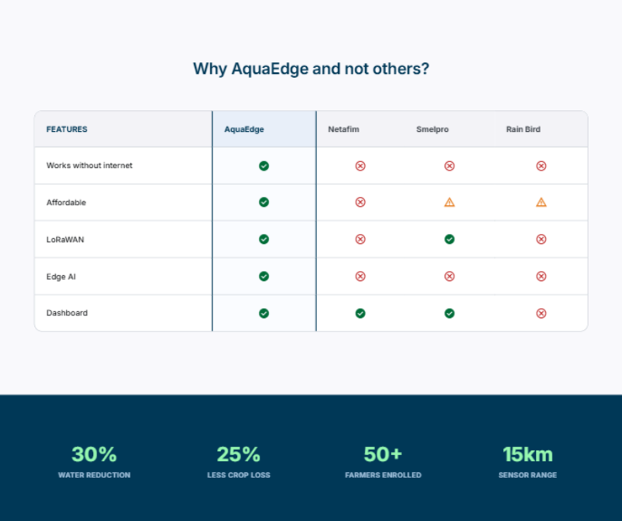
</p>

<p align="center">
	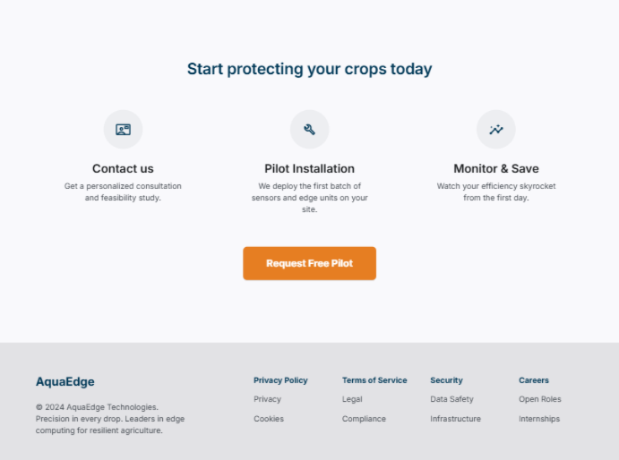
</p>

## 5.4. Applications UX/UI Design.

### 5.4.1. Applications Wireframes.

Esta seccion presenta los wireframes de las aplicaciones web y movil de AquaEdge, disenadas para dos perfiles: agricultores (usuario final) y analistas institucionales (cliente B2B). Cada wireframe define la estructura, jerarquia y flujo de los elementos antes de aplicar estilo visual o contenido final. Los primeros wireframes son compartidos por ambos perfiles e incluyen inicio de sesion y registro, con formularios simples, acceso rapido y opciones de recuperacion de cuenta. Luego, para web se muestran vistas de dashboard, auditoria de consumo, estado de sensores y reportes; mientras que en mobile se priorizan alertas, estado de riego, acciones rapidas y resumen por parcela. En todos los casos se busca una navegacion clara, con foco en datos criticos y minima friccion para tareas repetitivas.

<p align="center">
	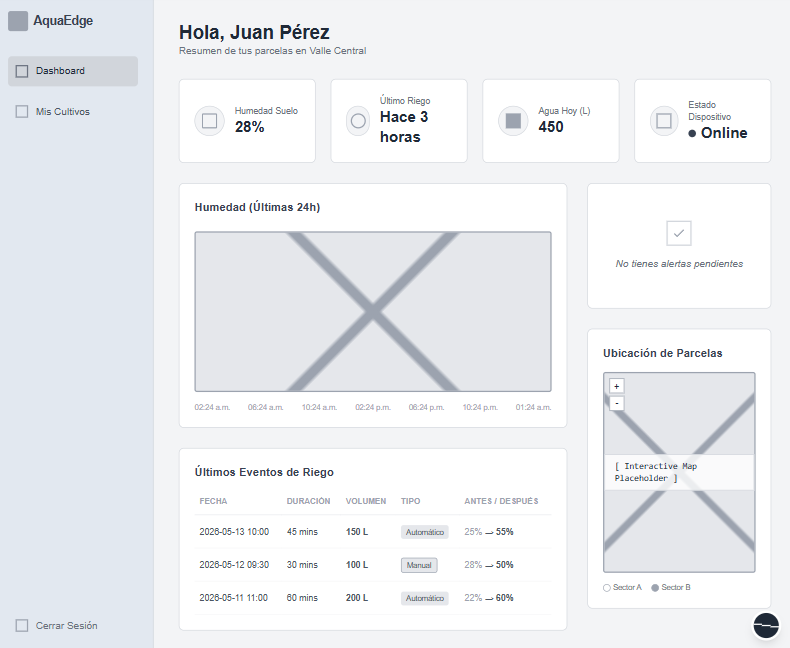
</p>

<p align="center">
	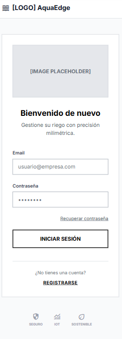
</p>

<p align="center">
	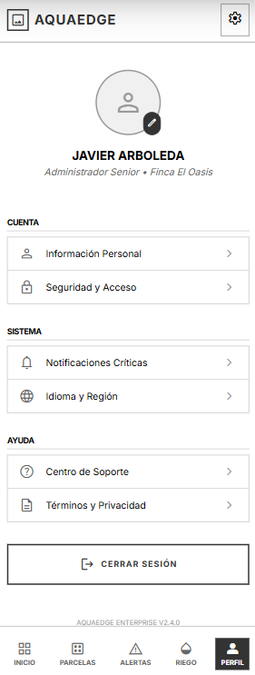
</p>

<p align="center">
	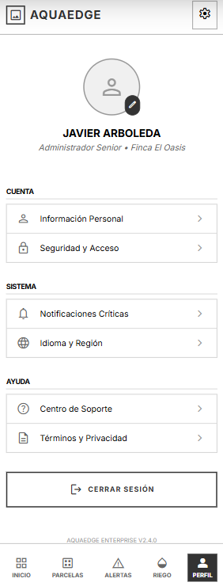
</p>

<p align="center">
	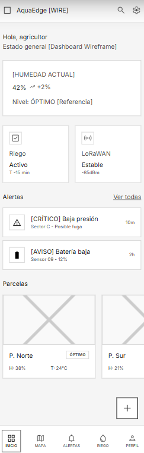
</p>

<p align="center">
	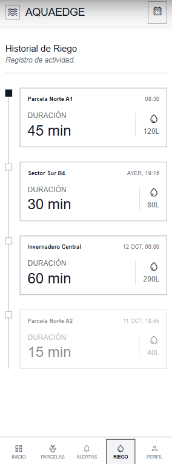
</p>

### 5.4.2. Applications Wireflow Diagrams.

Los wireflows de AquaEdge ilustran el recorrido del usuario entre pantallas clave y decisiones de navegacion, combinando estructura y flujo de interaccion. Para mobile, se detalla el camino desde la recepcion de una alerta hasta la accion de riego (visualizar estado, confirmar, ejecutar y recibir feedback).

<p align="center">
	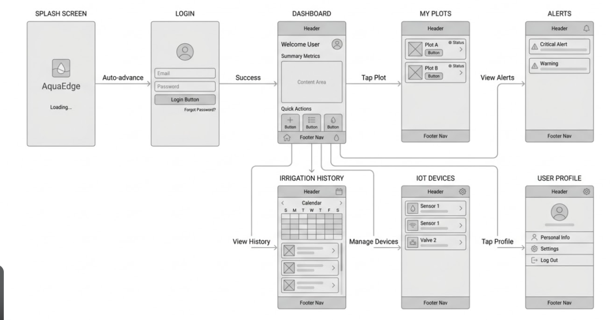
</p>

### 5.4.3. Applications Mock-ups.

Los mock-ups de las aplicaciones de AquaEdge muestran la version visual refinada de las vistas web y mobile, aplicando la paleta, tipografia y jerarquia definidas en las guias de estilo. En web, el dashboard presenta indicadores, comparativas y alertas con enfoque analitico, mientras que en mobile se resaltan estados de humedad, acciones rapidas y notificaciones criticas para el agricultor. Los elementos visuales comunican prioridad y riesgo mediante color y etiquetas, manteniendo consistencia con los estados del sistema.

<p align="center">
	
</p>

<p align="center">
	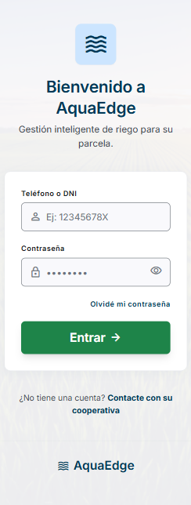
</p>

<p align="center">
	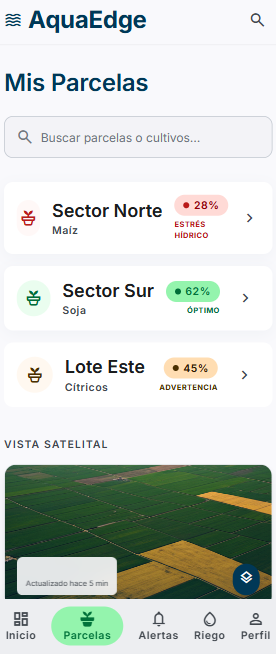
</p>

<p align="center">
	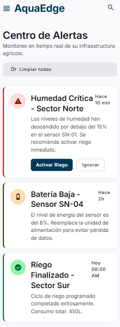
</p>

<p align="center">
	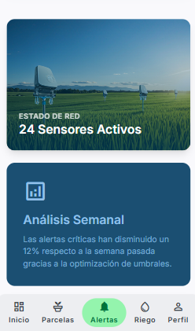
</p>

<p align="center">
	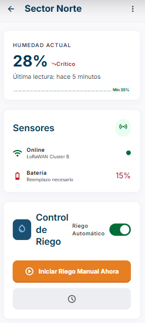
</p>

<p align="center">
	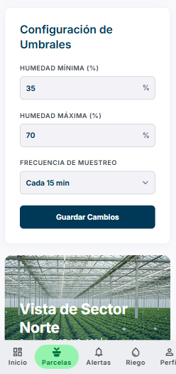
</p>

<p align="center">
	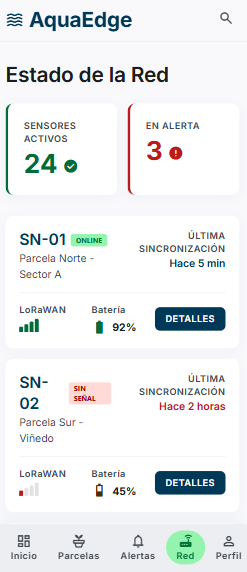
</p>

<p align="center">
	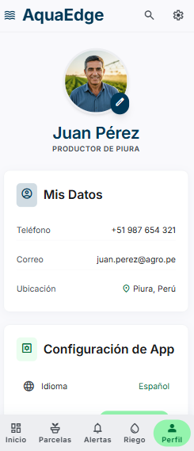
</p>

<p align="center">
	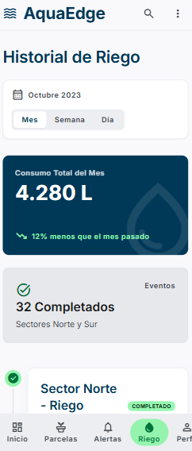
</p>

### 5.4.4. Applications User Flow Diagrams.

Los diagramas de flujo de usuario de AquaEdge describen la interaccion desde una perspectiva logica, incluyendo decisiones condicionales y respuestas del sistema. En mobile, el flujo principal cubre: recepcion de alerta -> validacion de estado -> confirmacion de accion -> ejecucion de riego -> notificacion de resultado, con caminos alternativos ante fallas de sensor o conectividad.

<p align="center">
	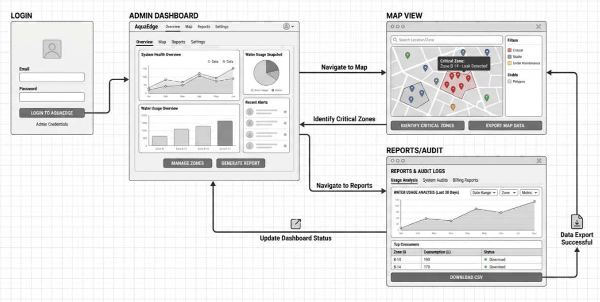
</p>

<p align="center">
	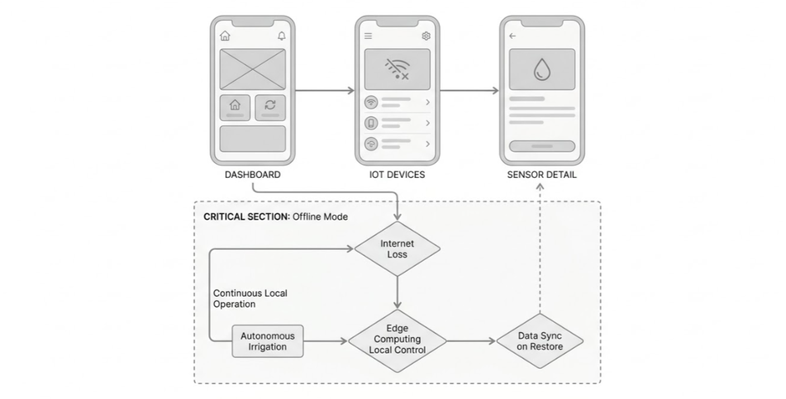
</p>

## 5.5. Applications Prototyping.

## 5.6. IoT Device Design

En esta sección se detalla el diseño final del nodo sensor de **AquaEdge**. Siguiendo el **Paso 9 (Device & Component Design)** de la metodología de diseño de soluciones IoT, se presenta la arquitectura de hardware, el mapeo de pines y la lógica de control local (Edge) validada mediante simulación.

### 5.6.1. Bill of Materials (BOM)

Se presenta la lista de componentes finales utilizados en el prototipo funcional. Se ha priorizado una sonda industrial integrada para la captura de nutrientes y humedad, optimizando el despliegue en campo.

| **Componente** | **Especificación** | **Función** | **Cantidad** |
| --- | --- | --- | --- |
| **MCU** | ESP32-WROOM-32 (30 pines) | Procesamiento central y lógica de borde. | 1 |
| **Sonda Industrial** | Sensor NPK + Humedad (RS485) | Captura de N, P, K y Humedad del suelo. | 1 |
| **Sensor de Clima** | DHT22 | Medición de temperatura y humedad ambiental. | 1 |
| **Comunicación** | Módulo LoRa RYLR998 | Transmisión de largo alcance (LPWAN). | 1 |
| **Actuador** | Módulo Relé 5V | Control de la electroválvula de riego. | 1 |
| **Interfaz** | LEDs Difusos (R, G, B) | Indicadores visuales de estado del sistema. | 3 |
| **Energía** | Panel Solar 1W + Batería 18650 | Sistema de alimentación autónoma. | 1 |

### 5.6.2. IoT Device Hardware Architecture (Pinout)

La interconexión de la **Capa Física** se ha diseñado para evitar interferencias y maximizar la precisión de los sensores de tiempo crítico.

| **Componente** | **Pin ESP32 (GPIO)** | **Tipo de Señal** | **Función** |
| --- | --- | --- | --- |
| **Sensor DHT22** | GPIO 13 | Digital (One-Wire) | Lectura de Clima |
| **Sensor NPK (TX)** | GPIO 16 (RX2) | Serial (UART2) | Recepción de datos de suelo |
| **Sensor NPK (RX)** | GPIO 17 (TX2) | Serial (UART2) | Solicitud de datos |
| **Relé (Bomba)** | GPIO 18 | Digital (Output) | Activación de riego |
| **LED Rojo** | GPIO 2 | PWM/Digital | Alerta de riego/Humedad baja |
| **LED Azul** | GPIO 4 | PWM/Digital | Indicador de comunicación |
| **LED Verde** | GPIO 5 | PWM/Digital | Estado óptimo |

### 5.6.3. IoT Device Software Logic (Edge Computing)

El dispositivo no es un simple transmisor; ejecuta una **Lógica de Borde** que permite la autonomía del sistema incluso sin conexión a la nube:

1. **Lectura Asíncrona:** El firmware utiliza temporizadores no bloqueantes (`millis()`) para leer el clima cada 2.5 segundos, evitando que el sensor DHT22 se sature o entregue valores erróneos.

2. **Procesamiento de Trama Serial:** Se implementó una función de parsing para extraer valores individuales de Nitrógeno, Fósforo, Potasio y Humedad desde una trama de datos industrial.

3. **Umbral de Decisión:** Si la humedad del suelo cae por debajo del **30%**, el dispositivo activa automáticamente el relé de riego y el indicador visual rojo, sin esperar instrucciones del servidor.

### 5.6.4. IoT Device Physical Design & Simulation

El prototipo ha sido validado en el simulador **Wokwi**, donde se verificó la correcta integración de todos los componentes del BOM. El diseño físico final contempla el uso de una carcasa **IP66** con pasacables estancos para proteger la electrónica de la humedad extrema de Piura.

- **Estado de Simulación:** Validado (Humedad, Clima, NPK y Actuación funcionando).

- **Representación Visual:** Se adjuntan capturas de pantalla del circuito en Wokwi y del monitor serial mostrando el reporte de datos procesados.

<p align="center">
	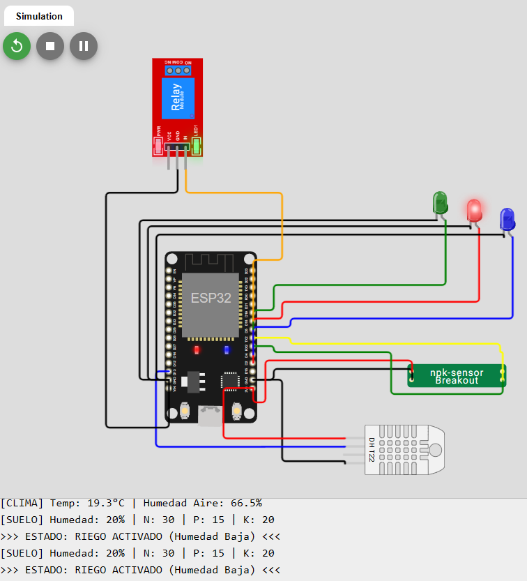
</p>

*Figura X. Implementación de la Capa Física en el entorno de simulación Wokwi. Se observa la integración del microcontrolador ESP32 con la sonda industrial (Custom Chip), el sensor de clima DHT22 y el subsistema de actuación, validando la interoperabilidad de los componentes antes del despliegue físico*