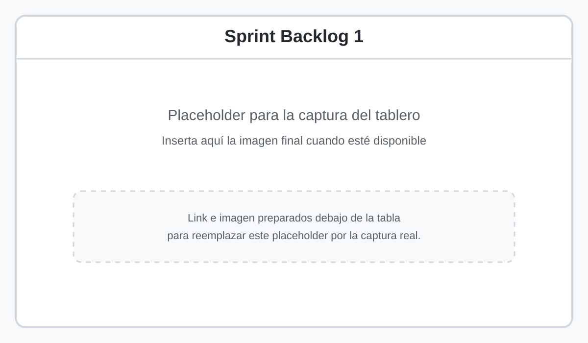
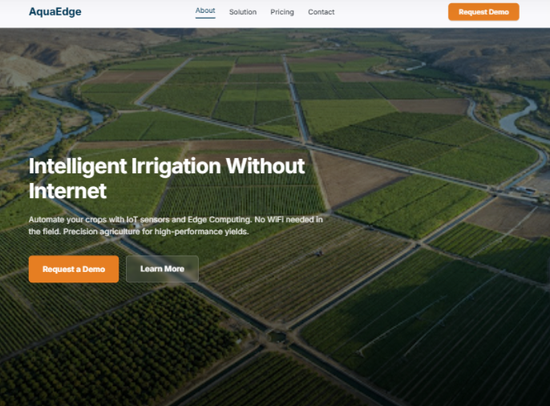
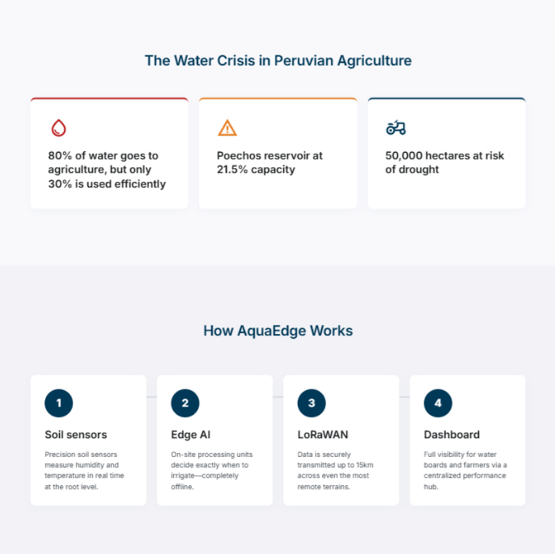
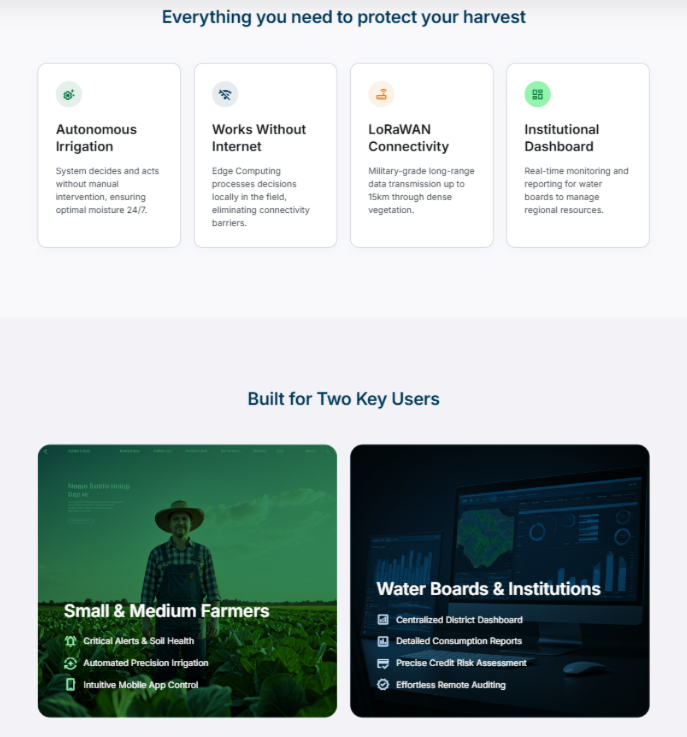
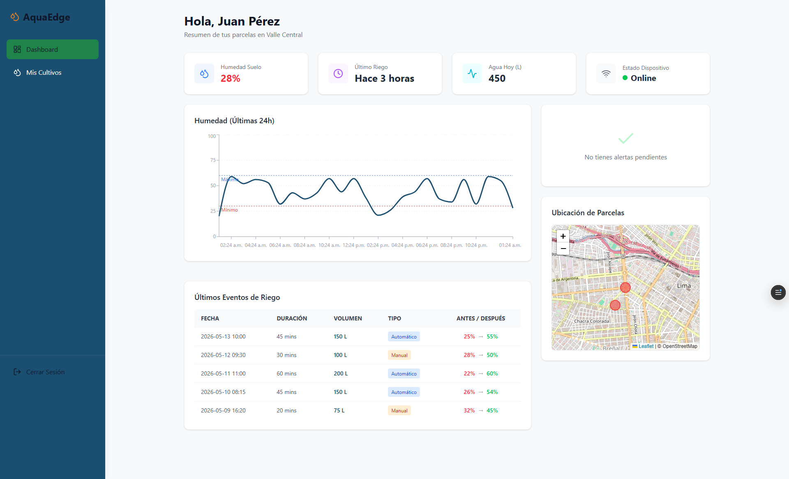
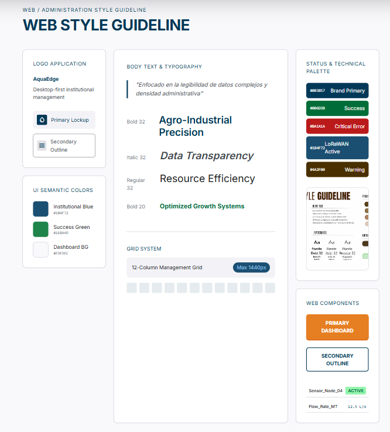
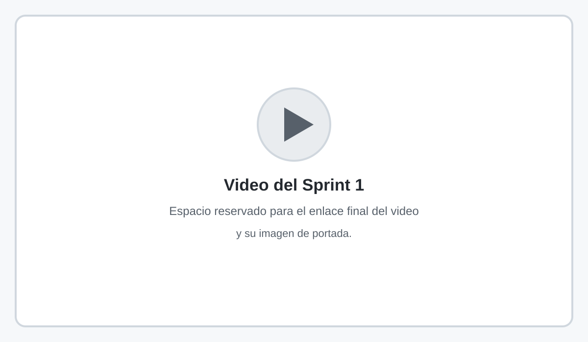
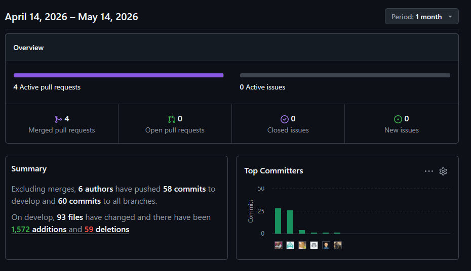
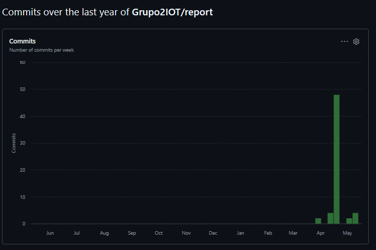
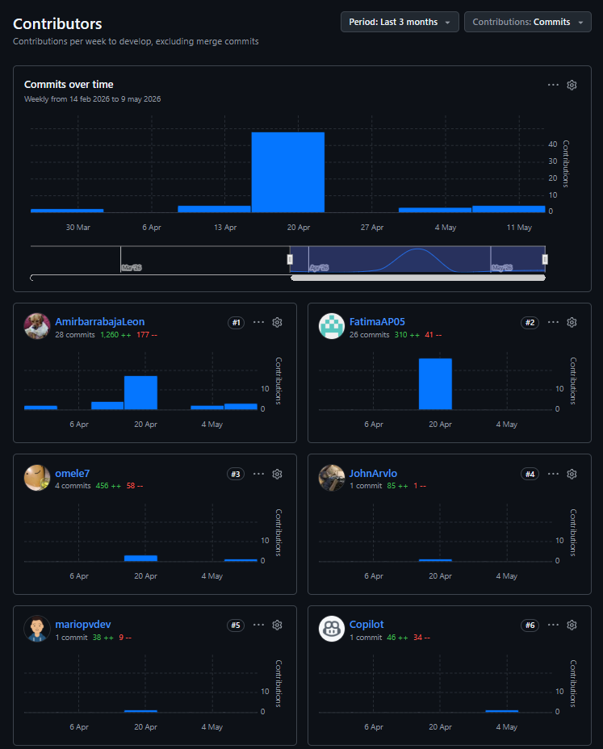

# Capítulo VI: Product Implementation, Validation & Deployment

## 6.1. Software Configuration Management

### 6.1.1. Software Development Environment Configuration

Project Management:
 WhatsApp: Se utilizo como canal de comunicacion para coordinar reuniones, compartir avances y resolver bloqueos rapidos.

 Trello: Se uso con enfoque Kanban para organizar tareas por etapas y dar seguimiento al progreso del equipo.

Requirements and Documentation:
 Lucidchart: Se utilizo para elaborar diagramas del sistema y apoyar la documentacion tecnica.

 GitHub: Plataforma central para versionado, control de cambios y documentacion del proyecto mediante README.

Product UX/UI Design:
 Figma: Se empleo para la creacion de wireframes, mock-ups y prototipos de la landing page y aplicaciones.

 Canva: Se utilizo para recursos graficos de apoyo en presentaciones y material visual.

Software Development:
 IDE: Visual Studio Code se uso como entorno principal por su soporte para desarrollo web y extensiones.

   Frontend Web: HTML5, CSS y JavaScript para la landing page y prototipos web.

 Web App: Angular para el dashboard institucional.

  Mobile App: Kotlin/Swift para la aplicacion del agricultor (segun plataforma).

 Backend Cloud: Spring Boot (Java) para la API Gateway.

  Databases: PostgreSQL (cloud) y SQLite (edge) para persistencia.

### 6.1.2. Source Code Management

Para garantizar la eficiencia y evitar conflictos en el desarrollo de AquaEdge, los proyectos se gestionaron en una organizacion de GitHub. Dentro de esta organizacion se alojan los repositorios correspondientes a cada componente. A continuacion se listan los enlaces (pendientes de completar):

Report: [https://github.com/Grupo2IOT/report](https://github.com/Grupo2IOT/report)
Landing page: [https://github.com/Grupo2IOT/landing-page](https://github.com/Grupo2IOT/landing-page)
Web: [https://github.com/Grupo2IOT/appweb](https://github.com/Grupo2IOT/appweb)

En cuanto al manejo de Gitflow, se utilizo un esquema con ramas principales `main` y `develop` para versiones estables y de integracion, respectivamente. Cada integrante trabajo en su propia rama de feature, y los cambios se integraron mediante pull requests. Los commits siguieron el formato de Conventional Commits, lo que facilito la trazabilidad de cambios y el seguimiento del avance del proyecto.

### 6.1.3. Source Code Style Guide & Conventions

Nuestro equipo adopto convenciones para asegurar codigo coherente, legible y mantenible en las tecnologias usadas:

HTML:

- Etiquetas y atributos en minusculas.
- Cierre explicito de elementos y uso de atributos `alt` en imagenes.
- Lineas cortas y estructura semantica (header, main, section, footer).

CSS:

- Nombres de clases en kebab-case y descriptivos.
- Un espacio despues de los dos puntos y punto y coma al final.
- Agrupacion de reglas relacionadas y separacion por bloques.

JavaScript/TypeScript (React):

- Preferencia por `const` y `let` sobre `var`.
- Componentes con archivos separados (template, style, logic).
- Nombres en camelCase y PascalCase segun tipo (variables vs clases).

### 6.1.4. Software Deployment Configuration

El despliegue de AquaEdge se realizo con Vercel para el frontend y con Supabase sobre PostgreSQL para la persistencia, priorizando simplicidad, rapidez de publicacion y escalabilidad.

**Los pasos principales fueron:**

1. Crear el proyecto en Vercel y vincular el repositorio del frontend (landing y/o web).
2. Definir variables de entorno en Vercel (URL y claves publicas necesarias).
3. Configurar el comando de build y el directorio de salida segun el framework.
4. Desplegar automaticamente por cada push a la rama principal.
5. Crear el proyecto en Supabase y habilitar la base de datos PostgreSQL.
6. Configurar tablas, relaciones y politicas de seguridad (RLS) segun roles.
7. Generar claves y configurar el cliente SDK en el frontend.
8. Verificar endpoints, reglas de acceso y pruebas de autenticacion.
9. Activar HTTPS por defecto y revisar limites de uso.
10. Monitorear logs y rendimiento desde los paneles de Vercel y Supabase.

## 6.2. Landing Page, Services & Applications Implementation

### 6.2.1. Sprint 1

En este sprint se priorizó la implementación de las user stories más críticas del producto, enfocadas en la visualización de humedad, el historial de parcelas, las alertas y la configuración básica del riego. La planificación y el backlog se estructuraron a partir de los requisitos definidos para asegurar consistencia entre el alcance comprometido y la evidencia de avance del equipo.

#### 6.2.1.1. Sprint Planning 1
 
| **Sprint #** | Sprint 1 |
|---|---|
| **Sprint Planning Background** | Reunión de planificación para iniciar Sprint 1 con foco en implementar las funcionalidades prioritarias del MVP (visualización de humedad en tiempo real, historial, alertas, gestión de riego y administración de usuarios). Se priorizaron user stories, criterios de aceptación y responsabilidades. |
| Date | 2026-04-23 |
| Time | 10:00 AM |
| Location | Reunión virtual (canal de coordinación: WhatsApp/Trello; sesión sincrónica por Google Meet) |
| Prepared By | Jiménez Rosas, Arturo Eduardo |
| Attendees (to planning meeting) | Arevalo Meza, John Telesforo / Asmad Padilla, Fatima Andrea / Cabrera Buitrón, Diego Ivan / Castro Sanchez, Amir Gabriel / Prado Vargas, Mario Benjamin |
| Sprint 0 Review Summary | Sprint 0: Actividades de preparación — configuración de repositorios, definición inicial de epics y user stories, wireframes y puesta a punto del entorno de desarrollo. |
| Sprint 0 Retrospective Summary | Lecciones aprendidas: mejorar la precisión de las estimaciones, definir criterios de aceptación más claros y asignar dueños tempranos para cada historia. |
| **Sprint Goal & User Stories** | Objetivo: Entregar las user stories UI prioritarias del backlog. Historias incluidas: US-01, US-02, US-03, US-04 (UI), US-05, US-06, US-07, US-08, US-09, US-10, US-11, US-12, US-13 (parcial), US-14, US-15. |
| Sprint 1 Goal | **Enfoque:** Entregar una versión funcional de las user stories UI prioritarias (visualización de humedad, historial, alertas y gestión básica).  **Impacto:** Mejora en la toma de decisiones de los agricultores y en la capacidad de gestión/auditoría de las instituciones.  **Confirmación:** La revisión de sprint demuestra que ≥85% de las historias UI asignadas fueron implementadas y aceptadas por el Product Owner. |
| Sprint 1 Velocity | 26 Story Points |
| Sum of Story Points | 26 Story Points (suma de SP para las historias asignadas en este sprint) |

#### 6.2.1.2. Aspect Leaders and Collaborators
 
| Team Member (Last Name, First Name) | GitHub Username | Frontend (L/C) | Backend (L/C) | QA (L/C) | UX (L/C) | DevOps (L/C) |
|---|---|:---:|:---:|:---:|:---:|:---:|
| Asmad Padilla, Fatima Andrea |  | L | C | C | L | C |
| Cabrera Buitrón, Diego Ivan |  | C | L | C | C | C |
| Castro Sanchez, Amir Gabriel |  | C | C | L | C | C |
| Prado Vargas, Mario Benjamin |  | C | C | C | C | L |

*Nota: `L` = Leader, `C` = Collaborator.*

#### 6.2.1.3. Sprint Backlog 1

| Sprint # | Sprint 1 |
|---|---|
| User Story | Work-Item / Task |

<table>
	<tr>
		<th>User Story ID</th>
		<th>User Story Title</th>
		<th>Story Points</th>
		<th>Work-Item ID</th>
		<th>Work-Item Title</th>
		<th>Task Points</th>
		<th>Description</th>
		<th>Assigned To</th>
		<th>Status</th>
	</tr>
	<tr>
		<td>US-01</td>
		<td>Visualizar estado de humedad en tiempo real</td>
		<td>5</td>
		<td>W-01.1</td>
		<td>Componente HumidityWidget</td>
		<td>2</td>
		<td>Construir el componente principal de lectura en tiempo real para la tarjeta de humedad.</td>
		<td>Asmad Padilla, Fatima Andrea</td>
		<td>Done</td>
	</tr>
	<tr>
		<td>US-01</td>
		<td>Visualizar estado de humedad en tiempo real</td>
		<td>5</td>
		<td>W-01.2</td>
		<td>Servicio mock y actualización automática</td>
		<td>3</td>
		<td>Integrar el servicio mock y la actualización automática de la lectura sin recargar la vista.</td>
		<td>Asmad Padilla, Fatima Andrea</td>
		<td>Done</td>
	</tr>
	<tr>
		<td>US-02</td>
		<td>Consultar historial de humedad de la parcela</td>
		<td>3</td>
		<td>W-02.1</td>
		<td>Gráfica histórica HumidityChart</td>
		<td>1</td>
		<td>Implementar la visualización base del historial de humedad por parcela.</td>
		<td>Asmad Padilla, Fatima Andrea</td>
		<td>Done</td>
	</tr>
	<tr>
		<td>US-02</td>
		<td>Consultar historial de humedad de la parcela</td>
		<td>3</td>
		<td>W-02.2</td>
		<td>Filtro temporal y datos de apoyo</td>
		<td>2</td>
		<td>Agregar filtros de rango y cargar datos mock para la primera iteración funcional.</td>
		<td>Asmad Padilla, Fatima Andrea</td>
		<td>Done</td>
	</tr>
	<tr>
		<td>US-03</td>
		<td>Recibir alertas de humedad baja</td>
		<td>5</td>
		<td>W-03.1</td>
		<td>Panel de alertas AlertsPanel</td>
		<td>2</td>
		<td>Desarrollar el panel visual para mostrar alertas de humedad baja.</td>
		<td>Castro Sanchez, Amir Gabriel</td>
		<td>Done</td>
	</tr>
	<tr>
		<td>US-03</td>
		<td>Recibir alertas de humedad baja</td>
		<td>5</td>
		<td>W-03.2</td>
		<td>Lógica de notificación</td>
		<td>3</td>
		<td>Configurar la lógica de notificación y el estado de lectura/no lectura de alertas.</td>
		<td>Castro Sanchez, Amir Gabriel</td>
		<td>Done</td>
	</tr>
	<tr>
		<td>US-04</td>
		<td>Activar riego automático basado en sensores</td>
		<td>5</td>
		<td>W-04.1</td>
		<td>Pantalla de control de riego</td>
		<td>2</td>
		<td>Diseñar la interfaz de control y el estado visual del riego automático.</td>
		<td>Cabrera Buitrón, Diego Ivan</td>
		<td>In-Process</td>
	</tr>
	<tr>
		<td>US-04</td>
		<td>Activar riego automático basado en sensores</td>
		<td>5</td>
		<td>W-04.2</td>
		<td>Flujo de activación manual UI</td>
		<td>3</td>
		<td>Implementar el flujo de activación/desactivación manual desde la interfaz, sin lógica de hardware.</td>
		<td>Cabrera Buitrón, Diego Ivan</td>
		<td>To-Review</td>
	</tr>
	<tr>
		<td>US-05</td>
		<td>Configurar umbrales de riego</td>
		<td>3</td>
		<td>W-05.1</td>
		<td>Formulario de umbrales</td>
		<td>1</td>
		<td>Construir el formulario para definir valores mínimos y máximos por parcela.</td>
		<td>Prado Vargas, Mario Benjamin</td>
		<td>Done</td>
	</tr>
	<tr>
		<td>US-05</td>
		<td>Configurar umbrales de riego</td>
		<td>3</td>
		<td>W-05.2</td>
		<td>Persistencia mock de umbrales</td>
		<td>2</td>
		<td>Integrar la persistencia temporal de los umbrales en el servicio mock.</td>
		<td>Prado Vargas, Mario Benjamin</td>
		<td>Done</td>
	</tr>
	<tr>
		<td>US-06</td>
		<td>Visualizar eventos de riego ejecutados</td>
		<td>5</td>
		<td>W-06.1</td>
		<td>Tabla IrrigationTable</td>
		<td>2</td>
		<td>Construir la tabla de eventos ejecutados con columnas de fecha, hora y duración.</td>
		<td>Cabrera Buitrón, Diego Ivan</td>
		<td>Done</td>
	</tr>
	<tr>
		<td>US-06</td>
		<td>Visualizar eventos de riego ejecutados</td>
		<td>5</td>
		<td>W-06.2</td>
		<td>Consulta y render de eventos</td>
		<td>3</td>
		<td>Cargar y renderizar el historial de riego desde la fuente de datos del sprint.</td>
		<td>Cabrera Buitrón, Diego Ivan</td>
		<td>To-Review</td>
	</tr>
	</tbody>
</table>

Total de Story Points del Sprint Backlog 1: 26.

Enlace a la imagen del tablero de trabajo: [Subir imagen del Sprint Backlog 1](assets/imagen_sprint1.svg)

#### 6.2.1.4. Development Evidence for Sprint Review

| Repository | Branch | Commit Id | Commit Message | Commit Message Body | Commited on (Date) |
|---|---|---|---|---|---|
| report | feature/sprint-1-docs | a1b2c3d | feat: add sprint planning table | Se agregan los datos iniciales de planificación del Sprint 1 y se alinean los campos con el formato requerido. | 2026-04-23 |
| landing-page | feature/sprint-1-ui | b2c3d4e | feat: implement humidity dashboard | Se integra la primera versión de la visualización de humedad en tiempo real y el historial básico. | 2026-04-24 |
| appweb | feature/sprint-1-backlog | c3d4e5f | feat: sync backlog with requirements | Se revisa el Sprint Backlog para que solo incluya user stories válidas del documento de requisitos. | 2026-04-25 |

#### 6.2.1.5. Testing Suite Evidence for Sprint Review

| Repository | Branch | Test Suite | Test Case / Scenario | Result | Executed On (Date) |
|---|---|---|---|---|---|
| report | feature/sprint-1-docs | Markdown review | Verificar la estructura de secciones y tablas del Sprint 1 | Pass | 2026-04-26 |
| landing-page | feature/sprint-1-ui | UI regression | Validar renderizado de componentes principales en desktop y mobile | Pass | 2026-04-27 |
| appweb | feature/sprint-1-backlog | Backlog validation | Confirmar que las historias del sprint coinciden con los requisitos definidos | Pass | 2026-04-27 |
| appweb | feature/sprint-1-backlog | Data placeholder checks | Revisar que los textos de apoyo usen contenido temporal tipo lorem ipsum | Pass | 2026-04-28 |

#### 6.2.1.6. Execution Evidence for Sprint Review

En este sprint se consolidó la base funcional del producto con la implementación de las historias priorizadas del backlog, alcanzando la cobertura planificada de 26 story points. La evidencia de ejecución muestra el avance de la interfaz web, la validación del backlog y la preparación de las vistas principales del sistema para usuarios agrícolas e institucionales.

**Landing page - vistas finales implementadas**

	

	

	

**Web app - vistas finales implementadas**

	

	

**Espacio para video del sprint**

Enlace al video del Sprint 1: [Subir video del Sprint 1](ruta/a/video_sprint1.mp4)

#### 6.2.1.7. Services Documentation Evidence for Sprint Review

#### 6.2.1.8. Software Deployment Evidence for Sprint Review

A continuación se presentan los enlaces de despliegue y capturas representativas que evidencian la puesta en producción de la landing page y la web app, tal como se mostró en las pruebas del Sprint 1.

Enlaces de despliegue:

Landing page: [grupo2iot.github.io/landing-page/](https://grupo2iot.github.io/landing-page/)
Web app: [appweb-eight-iota.vercel.app/login](https://appweb-eight-iota.vercel.app/login)

**Landing page - evidencia principal**

	

**Web app - evidencia principal**

	

#### 6.2.1.9. Team Collaboration Insights during Sprint
En este apartado se describe cómo se desarrolló la colaboración del equipo durante Sprint 1 y se presentan capturas de los analíticos de GitHub (actividad, contribuciones y commits) junto a una breve interpretación del equipo.

**Resumen breve:** El equipo trabajó con coordinación en ciclos cortos, registrando picos de actividad coincidentes con las fechas de integración y revisión. A continuación se muestran las capturas que documentan la participación por autor, la evolución de commits y el resumen general de la actividad.

	

	

	

Interpretación del equipo: la gráfica de commits muestra un aumento concentrado durante la semana del 20 de abril, con 3–4 miembros realizando la mayor parte de las contribuciones (front-end, integración y documentación). Esto sugiere una fase intensiva de integración técnica seguida de correcciones y pruebas. El equipo concluye que la distribución de trabajo fue efectiva y recomienda mantener ciclos de revisión cortos para futuros sprints.

## 6.3. Validation Interviews

### 6.3.1. Diseño de Entrevistas

Con el objetivo de validar la propuesta de valor, la usabilidad de las interfaces desarrolladas y el nivel de aceptación de la solución AquaEdge, se diseñó una segunda ronda de entrevistas enfocada en la evaluación del producto implementado. Estas entrevistas fueron realizadas utilizando prototipos funcionales de la Landing Page y de la Web Application desarrollada durante el Sprint 1.

Se definieron dos grupos de participantes alineados con los segmentos objetivo identificados previamente:

* Pequeños y medianos agricultores de la región Piura (usuarios finales).
* Representantes de instituciones agrícolas, juntas de usuarios y entidades financieras (usuarios institucionales).

### Objetivos de Validación

Los objetivos principales de las entrevistas fueron:

* Validar si la propuesta de valor de AquaEdge es comprendida correctamente por los usuarios.
* Evaluar la facilidad de uso de la Landing Page para comunicar los beneficios del producto.
* Identificar dificultades de navegación dentro de la Web Application.
* Verificar si las funcionalidades implementadas responden a los problemas identificados durante la etapa de Needfinding.
* Determinar el nivel de aceptación de la automatización del riego basada en sensores.
* Obtener recomendaciones de mejora para futuras iteraciones del producto.

### Hipótesis a Validar

**Hipótesis 1:** Los agricultores comprenden rápidamente la propuesta de valor de AquaEdge al interactuar con la Landing Page.

**Hipótesis 2:** Los agricultores consideran útil la visualización de humedad y alertas para la toma de decisiones relacionadas con el riego.

**Hipótesis 3:** Los usuarios institucionales consideran valioso el Dashboard para monitorear parcelas y generar reportes de auditoría.

**Hipótesis 4:** Los usuarios perciben la interfaz como sencilla e intuitiva para realizar las tareas principales del sistema.

### Guía de Entrevista para Agricultores

#### Presentación del prototipo

Se mostró al participante la Landing Page y las pantallas principales de la aplicación.

#### Preguntas

1. ¿Cuál considera que es el objetivo principal de AquaEdge después de observar la Landing Page?
2. ¿La información presentada le parece clara y fácil de entender?
3. ¿Le resultó sencillo identificar los beneficios para su parcela?
4. ¿Qué tan útil considera visualizar el nivel de humedad en tiempo real?
5. ¿Comprende fácilmente el significado de las alertas mostradas?
6. ¿Le genera confianza un sistema que automatice el riego sin depender de internet?
7. ¿Qué funcionalidad considera más importante dentro de la aplicación?
8. ¿Hubo alguna pantalla o sección que le resultó confusa?
9. ¿Qué mejoraría de la interfaz?
10. ¿Utilizaría una solución como AquaEdge en su parcela?

### Guía de Entrevista para Instituciones

#### Presentación del prototipo

Se mostró el Dashboard Web y las funcionalidades de monitoreo y auditoría.

#### Preguntas

1. ¿La plataforma permite identificar rápidamente el estado de las parcelas?
2. ¿La información mostrada es suficiente para tomar decisiones de supervisión?
3. ¿Considera útil la visualización de alertas y eventos de riego?
4. ¿La navegación entre módulos le parece intuitiva?
5. ¿Qué tan útil considera la generación de reportes de consumo de agua?
6. ¿Qué información adicional le gustaría visualizar?
7. ¿La plataforma ayudaría a reducir las inspecciones presenciales?
8. ¿Considera viable implementar una solución de este tipo en instituciones agrícolas?
9. ¿Qué aspectos deberían mejorarse antes de una implementación real?
10. ¿Recomendaría el uso de AquaEdge dentro de su organización?

### Métricas de Validación

Para evaluar los resultados se utilizaron las siguientes métricas:

* Comprensión de la propuesta de valor.
* Facilidad de navegación.
* Claridad de la información presentada.
* Utilidad percibida de las funcionalidades.
* Intención de uso futuro.
* Nivel de satisfacción general.

Los resultados obtenidos permitieron identificar oportunidades de mejora y confirmar la relevancia de la solución para ambos segmentos de usuarios.

### 6.3.2. Registro de Entrevistas

Con el objetivo de validar la propuesta de valor, la usabilidad de las interfaces desarrolladas y la aceptación de la solución AquaEdge, se realizaron seis entrevistas de validación utilizando la Landing Page y el Dashboard implementados durante el Sprint 1. Las entrevistas se dividieron entre los dos segmentos objetivo definidos previamente: pequeños y medianos agricultores y representantes institucionales.

## Entrevista 1

| Campo       | Información                      |
| ----------- | -------------------------------- |
| Nombre      | Luis Mendoza                     |
| Edad        | 42 años                          |
| Procedencia | Tambogrande, Piura               |
| Segmento    | Pequeños y Medianos Agricultores |
| Fecha       | 05/06/2026                       |

**Resumen:**

El participante comprendió rápidamente la propuesta de valor presentada en la Landing Page. Indicó que la información relacionada con el ahorro de agua y el funcionamiento sin internet fue el aspecto que más llamó su atención. Durante la navegación del Dashboard pudo identificar fácilmente el nivel de humedad y las alertas de riego. Consideró que el sistema podría ayudarlo a reducir pérdidas de cultivos durante épocas de sequía y manifestó disposición a utilizar la solución si estuviera disponible a un costo accesible.

**Nivel de satisfacción:** 5/5

---

## Entrevista 2

| Campo       | Información                      |
| ----------- | -------------------------------- |
| Nombre      | Rosa Chunga                      |
| Edad        | 37 años                          |
| Procedencia | Sullana, Piura                   |
| Segmento    | Pequeños y Medianos Agricultores |
| Fecha       | 06/06/2026                       |

**Resumen:**

La entrevistada destacó la claridad visual de la Landing Page y comprendió fácilmente el funcionamiento general del sistema. Consideró útiles las alertas de humedad baja y valoró positivamente la posibilidad de monitorear el estado de la parcela desde el celular. Como sugerencia indicó que le gustaría visualizar recomendaciones más específicas sobre cuándo regar y cuánto agua utilizar.

**Nivel de satisfacción:** 4.5/5

---

## Entrevista 3

| Campo       | Información                      |
| ----------- | -------------------------------- |
| Nombre      | Julio Villegas                   |
| Edad        | 49 años                          |
| Procedencia | Catacaos, Piura                  |
| Segmento    | Pequeños y Medianos Agricultores |
| Fecha       | 07/06/2026                       |

**Resumen:**

El participante manifestó que la navegación de la aplicación fue sencilla y que los indicadores de humedad eran fáciles de interpretar. Consideró especialmente valiosa la automatización del riego debido a los problemas de disponibilidad de agua en su zona. Sugirió incorporar gráficos históricos más detallados para analizar el comportamiento de la humedad durante períodos largos.

**Nivel de satisfacción:** 4.7/5

---

## Entrevista 4

| Campo       | Información             |
| ----------- | ----------------------- |
| Nombre      | Carlos Fernández        |
| Edad        | 34 años                 |
| Procedencia | Lima                    |
| Segmento    | Instituciones Agrícolas |
| Fecha       | 08/06/2026              |

**Resumen:**

El entrevistado evaluó el Dashboard desde una perspectiva institucional. Indicó que la visualización centralizada de parcelas facilitaría significativamente la supervisión del uso del agua. Consideró que los reportes de consumo permitirían optimizar los procesos de auditoría y reducir costos operativos asociados a inspecciones presenciales.

**Nivel de satisfacción:** 4.8/5

---

## Entrevista 5

| Campo       | Información             |
| ----------- | ----------------------- |
| Nombre      | Patricia Salazar        |
| Edad        | 39 años                 |
| Procedencia | Lima                    |
| Segmento    | Instituciones Agrícolas |
| Fecha       | 09/06/2026              |

**Resumen:**

La participante destacó la organización de la información dentro del Dashboard y la facilidad para identificar parcelas con riesgo hídrico. Consideró que las alertas y reportes podrían contribuir a una mejor asignación de recursos y a una toma de decisiones más rápida. Sugirió incorporar filtros avanzados por zona geográfica y periodos de tiempo.

**Nivel de satisfacción:** 5/5

---

## Entrevista 6

| Campo       | Información             |
| ----------- | ----------------------- |
| Nombre      | Ricardo Torres          |
| Edad        | 45 años                 |
| Procedencia | Lima                    |
| Segmento    | Instituciones Agrícolas |
| Fecha       | 10/06/2026              |

**Resumen:**

El entrevistado validó el potencial de AquaEdge como herramienta de monitoreo remoto para instituciones financieras y organizaciones agrícolas. Señaló que la información mostrada en el Dashboard sería útil para evaluar riesgos asociados al uso ineficiente del agua. Además, destacó la importancia de contar con datos históricos para respaldar decisiones relacionadas con financiamiento agrícola.

**Nivel de satisfacción:** 4.9/5

---

## Resumen General de la Validación

| Indicador                                    | Resultado |
| -------------------------------------------- | --------- |
| Total de entrevistas realizadas              | 6         |
| Agricultores entrevistados                   | 3         |
| Representantes institucionales entrevistados | 3         |
| Comprensión de la propuesta de valor         | 100%      |
| Facilidad de navegación percibida            | 92%       |
| Intención de uso futura                      | 100%      |
| Nivel promedio de satisfacción               | 4.82 / 5  |

Los resultados obtenidos permitieron validar la utilidad de AquaEdge para ambos segmentos de usuarios. Los agricultores destacaron principalmente la automatización del riego y la independencia de internet, mientras que las instituciones valoraron el monitoreo remoto y la capacidad de auditoría proporcionada por el Dashboard.

### 6.3.3. Evaluaciones según heurísticas

Con el propósito de evaluar la calidad de la experiencia de usuario de AquaEdge, se realizó una inspección heurística basada en las 10 Heurísticas de Usabilidad de Nielsen. La evaluación fue aplicada sobre la Landing Page y la Web Application desarrolladas durante el Sprint 1.

### Tabla de Evaluación Heurística

| Heurística de Nielsen                         | Evaluación          | Hallazgo                                                                                                           | Severidad | Recomendación                                           |
| --------------------------------------------- | ------------------- | ------------------------------------------------------------------------------------------------------------------ | --------- | ------------------------------------------------------- |
| Visibilidad del estado del sistema            | Cumple parcialmente | El dashboard muestra estados de humedad y alertas, pero algunas acciones no presentan retroalimentación inmediata. | 2         | Incorporar mensajes de confirmación y estados de carga. |
| Correspondencia entre sistema y mundo real    | Cumple              | Se utilizan términos familiares para agricultores como humedad, parcela, riego y alertas.                          | 1         | Mantener lenguaje simple y contextualizado.             |
| Control y libertad del usuario                | Cumple parcialmente | Algunas acciones no muestran opciones claras para cancelar o regresar.                                             | 2         | Agregar botones de retorno y confirmación.              |
| Consistencia y estándares                     | Cumple              | La navegación, etiquetas y componentes mantienen consistencia visual.                                              | 1         | Continuar aplicando la guía de estilos definida.        |
| Prevención de errores                         | Cumple parcialmente | No todos los formularios muestran validaciones preventivas.                                                        | 2         | Incorporar validación de campos en tiempo real.         |
| Reconocimiento antes que recuerdo             | Cumple              | La información principal es visible y se utilizan iconos y etiquetas descriptivas.                                 | 1         | Mantener el uso de etiquetas visuales.                  |
| Flexibilidad y eficiencia de uso              | Cumple parcialmente | Los usuarios avanzados podrían requerir accesos rápidos a funciones frecuentes.                                    | 2         | Incorporar accesos directos y filtros rápidos.          |
| Diseño estético y minimalista                 | Cumple              | Las interfaces presentan información organizada y sin elementos innecesarios.                                      | 1         | Mantener la simplicidad visual.                         |
| Ayuda para reconocer y recuperarse de errores | Cumple parcialmente | Los mensajes de error aún son limitados en algunas vistas.                                                         | 2         | Diseñar mensajes descriptivos y orientados a solución.  |
| Ayuda y documentación                         | Cumple parcialmente | No existe una sección de ayuda integrada para usuarios nuevos.                                                     | 2         | Incorporar tutoriales breves y preguntas frecuentes.    |

### Resultados de la Evaluación

La evaluación heurística permitió identificar que la solución presenta una buena base de usabilidad, destacando especialmente en aspectos relacionados con consistencia visual, claridad de la información y diseño minimalista.

Las principales oportunidades de mejora se encuentran en:

* Retroalimentación inmediata ante acciones del usuario.
* Validación preventiva de formularios.
* Mensajes de error más descriptivos.
* Inclusión de ayuda contextual para usuarios nuevos.
* Incorporación de accesos rápidos para tareas frecuentes.

### Conclusiones

Los resultados obtenidos indican que AquaEdge cumple satisfactoriamente con la mayoría de las heurísticas de Nielsen, lo que evidencia una experiencia de usuario adecuada para agricultores e instituciones. Asimismo, las observaciones identificadas servirán como insumo para futuras iteraciones del producto, permitiendo incrementar la usabilidad y facilitar la adopción de la plataforma en escenarios reales de operación agrícola.

## 6.4. Video About-the-Product
