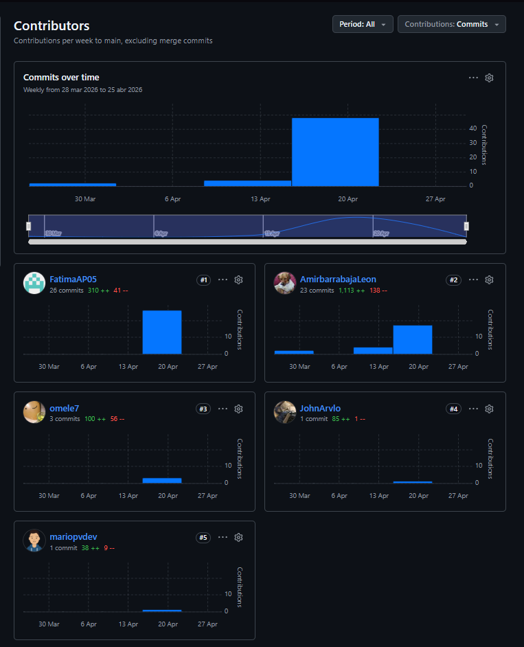
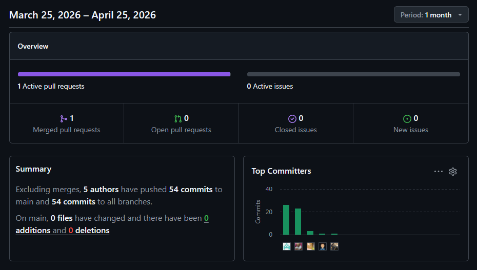

# Conclusiones

## Conclusiones y recomendaciones

### Conclusiones

A partir del análisis realizado durante el desarrollo de AquaEdge, así como de las actividades de investigación, diseño, validación y prototipado ejecutadas a lo largo del proyecto, se obtuvieron las siguientes conclusiones:

**1. Validación del problema y oportunidad de negocio**

La investigación de campo y las entrevistas realizadas permitieron confirmar que la crisis hídrica que afecta a la región de Piura constituye una problemática crítica para los pequeños y medianos agricultores. La dependencia de métodos tradicionales de riego, la ausencia de herramientas de monitoreo y la limitada disponibilidad de agua generan pérdidas económicas significativas y ponen en riesgo la sostenibilidad de las actividades agrícolas. Este escenario valida la necesidad de implementar soluciones tecnológicas orientadas a la optimización del uso del recurso hídrico.

**2. Validación de la propuesta tecnológica**

Los resultados obtenidos evidencian que la combinación de tecnologías IoT, Edge Computing y LoRaWAN constituye una alternativa viable para entornos rurales con conectividad limitada o inexistente. La capacidad del sistema para procesar información localmente y ejecutar decisiones autónomas de riego reduce la dependencia de servicios en la nube y garantiza la continuidad operativa incluso ante interrupciones de comunicación.

**3. Aceptación por parte de los usuarios finales**

Las entrevistas realizadas con agricultores demostraron una alta disposición hacia la adopción de soluciones tecnológicas siempre que estas sean económicas, confiables y fáciles de utilizar. La principal característica valorada por los usuarios fue la capacidad del sistema para operar sin conexión permanente a internet, permitiendo automatizar el riego y reducir el riesgo de pérdida de cultivos durante periodos de escasez hídrica.

**4. Valor para las instituciones y entidades de gestión**

Las validaciones realizadas con representantes de instituciones vinculadas al sector agrario evidenciaron la necesidad de contar con herramientas de monitoreo remoto y auditoría en tiempo real. El Dashboard propuesto por AquaEdge fue percibido como una solución capaz de mejorar la supervisión del uso del agua, optimizar la toma de decisiones y reducir los costos asociados a inspecciones presenciales.

**5. Aplicación de metodologías de Ingeniería de Software**

La utilización de enfoques como Design Thinking, Lean UX, Domain-Driven Design (DDD), Event Storming y metodologías ágiles permitió estructurar el proyecto de manera ordenada, centrada en el usuario y alineada con las necesidades reales del dominio. Esto facilitó la identificación de requerimientos, la definición de bounded contexts y el diseño de una arquitectura escalable y mantenible.

**6. Viabilidad del proyecto AquaEdge**

Los resultados obtenidos durante la etapa de diseño, simulación y validación permiten concluir que AquaEdge posee viabilidad técnica, operativa y funcional para convertirse en una solución de apoyo a la gestión eficiente del agua en el sector agrícola. Asimismo, presenta potencial de escalabilidad hacia otras regiones afectadas por problemas similares de disponibilidad hídrica.

### Recomendaciones

Con el objetivo de fortalecer el alcance y la sostenibilidad de AquaEdge en futuras etapas de desarrollo, se plantean las siguientes recomendaciones:

**1. Incorporar modelos predictivos basados en inteligencia artificial**

Se recomienda integrar algoritmos de Machine Learning que permitan analizar datos históricos de humedad, consumo de agua y condiciones climáticas para generar predicciones más precisas sobre necesidades de riego y posibles escenarios de estrés hídrico.

**2. Integrar servicios meteorológicos especializados**

La conexión con APIs de información climática permitirá complementar las decisiones de riego mediante pronósticos de lluvia, temperatura y humedad ambiental, mejorando la eficiencia del sistema y reduciendo el desperdicio de agua.

**3. Realizar pilotos en entornos reales**

Como siguiente fase del proyecto, se recomienda implementar pruebas piloto en parcelas agrícolas reales de la región Piura para validar el desempeño del sistema bajo condiciones operativas reales y obtener métricas cuantificables de ahorro de agua y mejora productiva.

**4. Fortalecer la autonomía energética de la infraestructura**

Se recomienda incorporar soluciones de energía solar tanto para los nodos IoT como para los gateways LoRaWAN, garantizando un funcionamiento continuo en zonas rurales con acceso limitado a la red eléctrica.

**5. Ampliar las capacidades de monitoreo agrícola**

En futuras versiones del sistema podrían integrarse sensores adicionales para medir variables como pH del suelo, conductividad eléctrica, nutrientes (NPK) y temperatura, proporcionando una visión más completa del estado agronómico de la parcela.

**6. Desarrollar mecanismos avanzados de analítica y reportes**

Se recomienda incorporar dashboards analíticos con indicadores de eficiencia hídrica, productividad agrícola y niveles de riesgo, facilitando la toma de decisiones estratégicas por parte de agricultores, juntas de usuarios e instituciones financieras.

**7. Evaluar estrategias de escalabilidad comercial**

Finalmente, se recomienda explorar alianzas con programas gubernamentales, juntas de usuarios, cooperativas agrícolas y entidades financieras para facilitar la adopción masiva de la solución y maximizar su impacto social y económico.

## Video About-the-Team

# Bibliografía

Agrobanco. (s.f.). Crédito agrícola. Recuperado de: https://www.agrobanco.com.pe/credito-agricola

AgroPerú. (2024). Déficit hídrico amenaza la campaña agrícola 2024-2025. Recuperado de: https://www.agroperu.pe/deficit-hidrico-amenaza-la-campana-agricola-2024-2025/

Becolve. (s.f.). Riego inteligente IoT LoRaWAN. Recuperado de: https://becolve.com/blog/riego-inteligente-iot-lorawan/

CEPEs. (2024). Déficit hídrico vuelve a amenazar a Piura y otras regiones del país. Recuperado de: https://cepes.org.pe/2024/12/03/deficit-hidrico-vuelve-a-amenazar-a-piura-y-otras-regiones-del-pais/

Cooperación Suiza. (2019). Programa Haku Wiñay. Recuperado de: https://www.cooperacionsuiza.pe/wp-content/uploads/2019/06/HAKUYWINAY.pdf

INDECI. (2024). Reporte de peligro inminente por déficit hídrico en Lambayeque. Recuperado de: https://portal.indeci.gob.pe/wp-content/uploads/2024/12/REPORTE-DE-PELIGRO-INMINENTE-N.º-059-2DIC2024-POR-DEFICIT-HÍDRICO-EN-EL-DEPARTAMENTO-DE-LAMBAYEQUE-1.pdf

MINAM – SINIA. (s.f.). Informe técnico sobre recursos hídricos. Recuperado de: https://sinia.minam.gob.pe/sites/default/files/siar-puno/archivos/public/docs/ana0003254.pdf

Ojo Público. (2024). La crisis histórica del agro impacta y amenaza la agricultura familiar. Recuperado de: https://ojo-publico.com/derechos-humanos/la-crisis-historica-del-agro-impacta-y-amenaza-la-agricultura-familiar

RedAgrícola. (s.f.). La crisis hídrica obligó a repensar la agricultura en Piura. Recuperado de: https://redagricola.com/la-crisis-hidrica-obligo-a-repensar-la-agricultura-en-piura/

SMELPRO. (s.f.). Riego con IoT para agricultura. Recuperado de: https://smelpro.com/riego-con-iot-para-agricola/

Tecfresh. (s.f.). Uso del agua en el sector agrícola en Perú. Recuperado de: https://tecfresh.com/en-peru-del-80-del-agua-que-usa-el-sector-agricola-el-30-se-distribuye-bien/

arXiv. (2026). Research paper on IoT / irrigation systems. Recuperado de: https://arxiv.org/pdf/2603.15085

# Anexos

**Anexo 1 — Analíticos**

<figure>
	
	<figcaption style="text-align:center; font-size:12px;">Anexo 1 — Analíticos de GitHub</figcaption>
</figure>

**Anexo 2 — Lista de commits**

<figure>
	
	<figcaption style="text-align:center; font-size:12px;">Anexo 2 — Captura de commits</figcaption>
</figure>

**Anexo 3 — TB1 Analíticos**

<figure>
	
	<figcaption style="text-align:center; font-size:12px;">Anexo 3 — TB1 Analíticos</figcaption>
</figure>

**Anexo 4 — TB1 Commits**

<figure>
	
	<figcaption style="text-align:center; font-size:12px;">Anexo 4 — TB1 Captura de commits</figcaption>
</figure>
